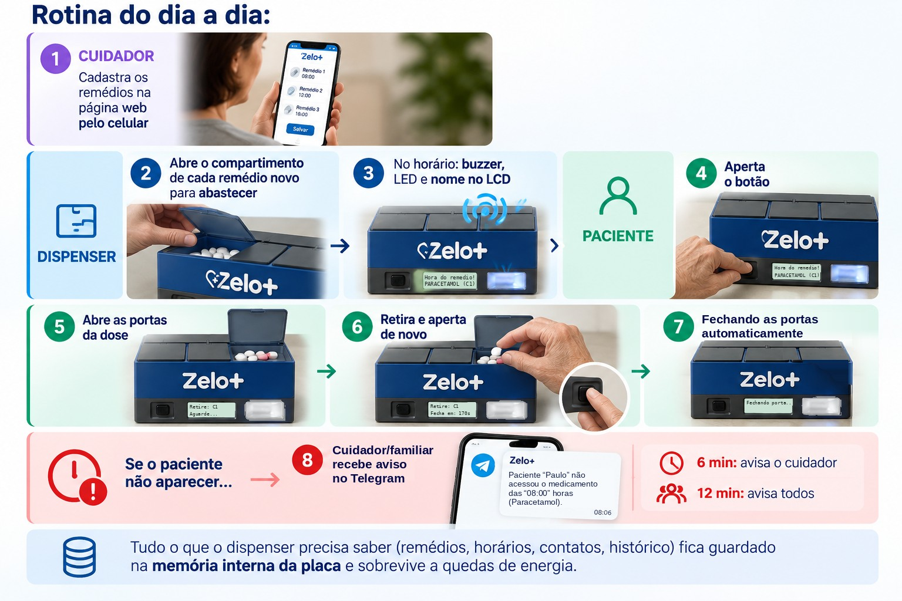
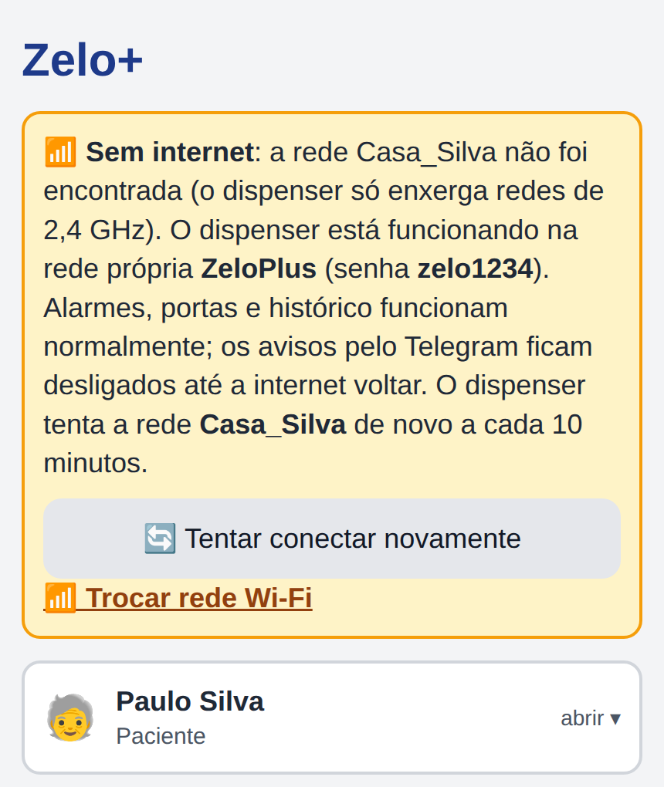
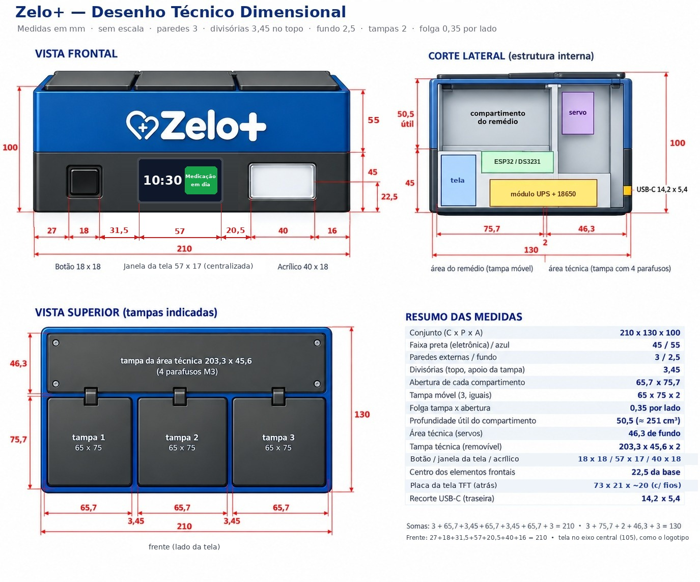
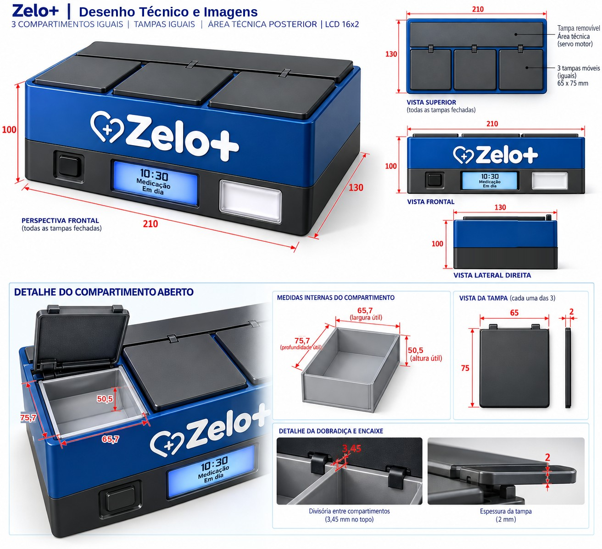
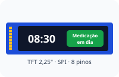
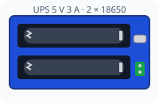
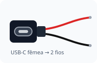

# Zelo+ — Guia do produto

> Este guia apresenta o dispenser inteligente de medicamentos Zelo+: a concepção do
> produto, o desenho técnico do gabinete, o funcionamento do programa (com o **trecho de
> código** de cada etapa; o arquivo completo está em [`src/main.cpp`](src/main.cpp)), a
> montagem para uso autônomo, a lista de componentes, a estimativa de custo de produção
> e as propostas de evolução com inteligência artificial.

<!-- so-github -->


*Imagem de referência — conceito visual do produto final (ilustrativo).*
<!-- /so-github -->

---

## Sumário

- [Parte A — Entendendo o projeto](#parte-a--entendendo-o-projeto)
  - [A1. O que é o Zelo+](#a1-o-que-é-o-zelo)
  - [A2. Materiais e ligações](#a2-materiais-e-ligações)
  - [A3. Ambiente de desenvolvimento](#a3-ambiente-de-desenvolvimento)
  - [A4. Cinco conceitos antes de começar](#a4-cinco-conceitos-antes-de-começar)
  - [A5. A página do Zelo+ (tela completa)](#a5-a-página-do-zelo-tela-completa)
- [Parte B — Desenho técnico do gabinete](#parte-b--desenho-técnico-do-gabinete)
  - [B1. Desenho técnico dimensional](#b1-desenho-técnico-dimensional)
  - [B2. Imagens do produto](#b2-imagens-do-produto)
  - [B3. Critérios de projeto](#b3-critérios-de-projeto)
  - [B4. Onde fica cada componente](#b4-onde-fica-cada-componente)
- [Parte C — O código, passo a passo](#parte-c--o-código-passo-a-passo)
  - [Passo 1 — Bibliotecas e pinos](#passo-1--bibliotecas-e-pinos)
  - [Passo 2 — Estruturas de dados](#passo-2--estruturas-de-dados)
  - [Passo 3 — `setup()`: ligando tudo](#passo-3--setup-ligando-tudo)
  - [Passo 4 — Wi-Fi sem senha no código (captive portal)](#passo-4--wi-fi-sem-senha-no-código-captive-portal)
  - [Passo 5 — Modo normal: relógio pela internet e rotas da página](#passo-5--modo-normal-relógio-pela-internet-e-rotas-da-página)
  - [Passo 6 — Memória permanente (Preferences)](#passo-6--memória-permanente-preferences)
  - [Passo 7 — A página de cadastro](#passo-7--a-página-de-cadastro)
  - [Passo 8 — Salvando o cadastro](#passo-8--salvando-o-cadastro)
  - [Passo 9 — Movendo as portas (servos)](#passo-9--movendo-as-portas-servos)
  - [Passo 10 — O coração: `loop()` e a máquina de estados](#passo-10--o-coração-loop-e-a-máquina-de-estados)
  - [Passo 11 — Conferindo os horários](#passo-11--conferindo-os-horários)
  - [Passo 12 — O alarme tocando](#passo-12--o-alarme-tocando)
  - [Passo 13 — O paciente aperta o botão](#passo-13--o-paciente-aperta-o-botão)
  - [Passo 14 — Abastecer, repor e esvaziar](#passo-14--abastecer-repor-e-esvaziar)
  - [Passo 15 — Avisos pelo Telegram](#passo-15--avisos-pelo-telegram)
  - [Passo 16 — Histórico de doses](#passo-16--histórico-de-doses)
  - [Passo 17 — Escrevendo no LCD](#passo-17--escrevendo-no-lcd)
  - [Passo 18 — Modo de teste](#passo-18--modo-de-teste)
  - [Passo 19 — Relógio DS3231 (próxima etapa)](#passo-19--relógio-ds3231-próxima-etapa)
  - [Passo 20 — Leitura da caixa do remédio por foto (IA)](#passo-20--leitura-da-caixa-do-remédio-por-foto-ia)
- [Parte D — Juntando tudo](#parte-d--juntando-tudo)
  - [D1. Linha do tempo de uma dose](#d1-linha-do-tempo-de-uma-dose)
  - [D2. Referência rápida](#d2-referência-rápida)
- [Parte E — Uso autônomo, sem o laptop](#parte-e--uso-autônomo-sem-o-laptop)
  - [E1. Pré-requisitos e validação](#e1-pré-requisitos-e-validação)
  - [E2. Por que o laptop não é necessário](#e2-por-que-o-laptop-não-é-necessário)
  - [E3. A solução: fonte 5 V/3 A + módulo UPS + bateria 18650](#e3-a-solução-fonte-5-v3-a--módulo-ups--bateria-18650)
  - [E4. Lista de compras](#e4-lista-de-compras)
  - [E5. Montagem passo a passo](#e5-montagem-passo-a-passo)
  - [E6. Teste de falta de energia](#e6-teste-de-falta-de-energia)
  - [E7. Autonomia da bateria](#e7-autonomia-da-bateria)
  - [E8. Falta de energia e de internet](#e8-falta-de-energia-e-de-internet)
  - [E9. Módulo de relógio DS3231](#e9-módulo-de-relógio-ds3231)
  - [E10. Atualizar o programa depois de montado](#e10-atualizar-o-programa-depois-de-montado)
- [Parte F — Lista completa de componentes, com preços](#parte-f--lista-completa-de-componentes-com-preços)
  - [F1. Eletrônica do dispenser](#f1-eletrônica-do-dispenser)
  - [F2. Energia autônoma](#f2-energia-autônoma)
  - [F3. Montagem e ligações](#f3-montagem-e-ligações)
  - [F4. Relógio sem internet (próxima etapa)](#f4-relógio-sem-internet-próxima-etapa)
  - [F5. Ferramentas necessárias (fora do custo)](#f5-ferramentas-necessárias-fora-do-custo)
  - [F6. Resumo do investimento](#f6-resumo-do-investimento)
- [Parte G — Custo de produção (estimativa para viabilidade)](#parte-g--custo-de-produção-estimativa-para-viabilidade)
  - [G1. Premissas e método](#g1-premissas-e-método)
  - [G2. Volume de plástico do gabinete](#g2-volume-de-plástico-do-gabinete)
  - [G3. Gabinete em impressão 3D](#g3-gabinete-em-impressão-3d)
  - [G4. Gabinete em plástico injetado](#g4-gabinete-em-plástico-injetado)
  - [G5. Componentes eletrônicos no atacado](#g5-componentes-eletrônicos-no-atacado)
  - [G6. Custo por unidade em três escalas](#g6-custo-por-unidade-em-três-escalas)
  - [G7. Investimentos iniciais (uma vez só)](#g7-investimentos-iniciais-uma-vez-só)
  - [G8. Preço de venda e viabilidade](#g8-preço-de-venda-e-viabilidade)
  - [G9. Limitações da estimativa](#g9-limitações-da-estimativa)
- [Parte H — Evolução do produto: funcionalidades com inteligência artificial](#parte-h--evolução-do-produto-funcionalidades-com-inteligência-artificial)
  - [H1. Princípios de projeto](#h1-princípios-de-projeto)
  - [H2. Arquitetura proposta](#h2-arquitetura-proposta)
  - [H3. Funcionalidades propostas](#h3-funcionalidades-propostas)
  - [H4. Quadro-resumo dos impactos](#h4-quadro-resumo-dos-impactos)
  - [H5. Impactos gerais da mudança](#h5-impactos-gerais-da-mudança)
  - [H6. Etapas de implantação](#h6-etapas-de-implantação)
  - [H7. Modelo próprio de IA (etapa futura)](#h7-modelo-próprio-de-ia-etapa-futura)
- [Referências](#referências)

---

# Parte A — Entendendo o projeto

## A1. O que é o Zelo+

O Zelo+ é um **dispenser automático de medicamentos** para pacientes (em especial
idosos). Ele tem **3 compartimentos**, cada um com um remédio diferente e com uma
porta movida por um servo motor.

<figure markdown="1">

<figcaption><b>Imagem de referência</b> — conceito visual do produto final (ilustrativo), com o botão à esquerda, a tela no centro e a luz de alerta à direita.</figcaption>
</figure>

<figure markdown="1">

<figcaption><b>Rotina do dia a dia</b> — cuidador, dispenser e paciente, do cadastro dos remédios aos avisos pelo Telegram.</figcaption>
</figure>

## A2. Materiais e ligações

| Componente | Quantidade | Observação |
|---|---|---|
| ESP32 DevKit (30 pinos) | 1 | O "cérebro". Tem Wi-Fi embutido. |
| Servo motor SG90 | 3 | Um por compartimento (porta). |
| Tela TFT 2,25" colorida (ST7789P3, 76 × 284 pontos, ligação SPI) | 1 | Mostra relógio, nome do remédio e avisos, com cores por situação. |
| Buzzer **ativo** | 1 | Apita sozinho quando recebe energia. |
| LED + resistor 220–330 Ω | 1 | Pisca junto com o buzzer. |
| Botão (push-button) | 1 | O paciente aperta para abrir/fechar. |
| Fonte externa 5 V (≥ 2 A) | 1 | Alimenta os servos. |
| Relógio DS3231 + bateria LIR2032 *(próxima etapa)* | 1 | Guarda a hora sem internet ([Passo 19](#passo-19--relógio-ds3231-próxima-etapa)). |
| Protoboard e jumpers | — | Ligações. |

<figure markdown="1">

<figcaption><b>Diagrama de ligações da montagem de bancada.</b> Versão vetorial, que pode ser ampliada sem perda de qualidade: <code>docs/ligacoes.svg</code>.</figcaption>
</figure>

| Ligação | Pino do ESP32 | Detalhe |
|---|---|---|
| Servo compartimento 1 (sinal) | GPIO 13 | +5 V e GND na **fonte externa** |
| Servo compartimento 2 (sinal) | GPIO 14 | +5 V e GND na **fonte externa** |
| Servo compartimento 3 (sinal) | GPIO 27 | +5 V e GND na **fonte externa** |
| Tela TFT — SCL / SDA | GPIO 18 / GPIO 23 | relógio e dados do SPI |
| Tela TFT — RST / DC | GPIO 17 (TX2) / GPIO 16 (RX2) | reinício da tela / dado ou comando |
| Tela TFT — CS / BL | GPIO 26 / GPIO 25 | seleção da tela / luz de fundo |
| Tela TFT — VCC / GND | 3V3 / GND | **nunca no 5 V** |
| Relógio DS3231 — SDA / SCL *(próxima etapa)* | GPIO 21 / GPIO 22 | único no I2C; VCC → 3V3, GND → GND (desenho na [E3](#e3-a-solução-fonte-5-v3-a--módulo-ups--bateria-18650)) |
| Botão | GPIO 5 | outra perna → GND (sem resistor) |
| LED | GPIO 4 | via resistor; perna curta → GND |
| Buzzer (+) | GPIO 15 | (−) → GND |
| Fonte externa (−) | GND do ESP32 | **GND comum obrigatório** |

**Por que uma fonte separada para os servos?** Um servo puxa muita corrente no
momento em que começa a girar. Se ele for ligado no 3V3 do ESP32, a tensão cai e a
placa reinicia. Por isso os servos usam uma fonte de 5 V própria, e o **GND da fonte
é ligado ao GND do ESP32**: sem essa referência comum, o sinal do pino não é
entendido pelo servo.

**Ligação da tela TFT.** O módulo tem 8 pinos: GND, VCC, SCL, SDA, RST, DC, CS e BL.
Apesar dos nomes, **SCL e SDA da tela são do SPI** (relógio e dados), não do I2C: vão
nos GPIO 18 e 23, e não nos GPIO 21 e 22. Na placa, os GPIO 17 e 16 aparecem impressos
como **TX2** e **RX2**. O VCC vai no **3V3**: a tela trabalha com 3,3 V e pode ser
danificada no 5 V. O pino BL acende a luz de fundo; o ESP32 controla o brilho por ele.
O GPIO 19 fica reservado ao SPI, mesmo sem fio, e não deve ser usado para outra peça.

**Por que o GPIO 12 não foi usado?** Ele é um pino de "configuração de
inicialização" do ESP32; se estiver com algo ligado na hora de ligar a placa, ela
pode não iniciar.

## A3. Ambiente de desenvolvimento

- **VSCode** com a extensão **PlatformIO**.
- Placa `esp32dev`, framework **Arduino** (a mesma linguagem do Arduino, em C++).

O arquivo `platformio.ini` diz ao PlatformIO qual placa usar e quais bibliotecas
baixar:

```ini
[env:esp32dev]
platform = espressif32
board = esp32dev
framework = arduino
upload_port = COM3
monitor_speed = 115200
board_build.partitions = huge_app.csv
lib_deps = 
    marcoschwartz/LiquidCrystal_I2C^1.1.4
    madhephaestus/ESP32Servo^3.0.5
    bblanchon/ArduinoJson^7.0.4
    adafruit/RTClib^2.1.4
```

- `upload_port`: porta USB onde a placa aparece no Windows (varia de PC para PC).
- `monitor_speed`: velocidade do **Serial Monitor**, onde a placa escreve mensagens.
- `huge_app.csv`: reserva mais espaço para o programa (a parte de internet segura,
  HTTPS, deixa o firmware grande).
- `lib_deps`: bibliotecas do LCD, dos servos, de leitura de JSON (usada no Telegram)
  e do relógio DS3231 (`RTClib`).

**Para gravar:** ✓ (Build) → → (Upload) → 🔌 (Serial Monitor), na barra azul do
rodapé do VSCode.

## A4. Cinco conceitos antes de começar

1. **`setup()` e `loop()`** — todo programa Arduino tem essas duas funções. O
   `setup()` roda **uma vez** quando a placa liga; o `loop()` roda **para sempre**,
   milhares de vezes por segundo.

2. **`millis()` em vez de `delay()`** — `delay(1000)` congela a placa por 1 segundo
   (ela não lê o botão nem atende a página). Por isso o Zelo+ quase sempre usa
   `millis()`, que devolve "há quantos milissegundos a placa está ligada", e compara
   tempos:
   ```cpp
   if (millis() - ultimaAtualizacao < 1000) return;
   ```
   (se ainda não passou 1 segundo desde a última atualização, sai e tenta de novo
   na próxima volta do `loop()`, sem travar nada).

3. **Máquina de estados** — o dispenser está sempre em **um** estado (aguardando,
   tocando, porta aberta, abastecendo). Em cada estado ele faz coisas diferentes e,
   quando algo acontece, **muda de estado**. Isso deixa o comportamento previsível.

4. **Máscara de bits** — para dizer "compartimentos 1 e 3", o código usa um número
   em que cada **bit** representa um compartimento:
   ```text
   compartimento:   3 2 1
   bits:            1 0 1   = 5  →  compartimentos 1 e 3
   ```
   Assim uma única variável (`uint8_t`) guarda qualquer combinação de compartimentos.

5. **Memória permanente (Preferences/NVS)** — a variável comum some quando a energia
   cai. A biblioteca `Preferences` grava dados na **memória flash** da placa, que não
   se apaga ao desligar (como um pen drive).

## A5. A página do Zelo+ (tela completa)

É a página que o cuidador abre no celular, digitando o IP que aparece no LCD (ex.:
`192.168.15.152`). As imagens abaixo foram geradas **pelo próprio firmware** (a função
`handleRoot()` do Passo 7) com um cadastro de exemplo completo.

| ① Falta configurar o Telegram | ② Tudo configurado | ③ Blocos abertos |
|:---:|:---:|:---:|
|  |  |  |

- **①** A familiar Ana ainda não tem ID do Telegram: aparece um **aviso amarelo no
  topo** e o bloco do Telegram (no fim da página) vem **aberto**, marcando quem falta.
- **②** Com tudo configurado, a página fica curta: o Telegram vira uma linha
  "configurado ✓" no rodapé.
- **③** O que aparece ao tocar: compartimento 1 em edição (nome, botão de foto da
  caixa, horários, dica
  "coloque no compartimento 1 (azul)"), o familiar João aberto, o formulário de um
  **familiar novo** e a **reposição**, com a escolha do remédio pelas cores.

<figure markdown="1">

<figcaption><b>④ Sem internet</b> — página aberta pela rede própria ZeloPlus (parte superior).</figcaption>
</figure>

- **④** Quando a rede salva não conecta ao ligar, o dispenser abre a rede própria
  `ZeloPlus` (Passo 4). No topo da página aparece o **aviso de sem internet**, com o
  motivo (aqui, a rede de casa não foi encontrada), o nome e a senha da rede própria, o
  botão **"Tentar conectar novamente"** e o link **"Trocar rede Wi-Fi"**. O restante da
  página é igual ao da imagem ②: alarmes, portas e histórico funcionam normalmente; só
  os avisos pelo Telegram aguardam a internet.

O visual segue três ideias, pensando em cuidadores e familiares com pouca
familiaridade com tecnologia:

- **Letras e botões grandes**, com bom contraste.
- **Uma cor por compartimento** — 1 **azul**, 2 **verde**, 3 **roxo** — no cartão do
  remédio, na dica de abastecimento, na reposição e no histórico.
- **Menos informação na tela:** remédios, paciente, cuidador e familiares aparecem
  **recolhidos** (só a faixa com o nome); um toque abre os detalhes.

**O que tem em cada bloco:**

| Bloco | Fechado mostra | Aberto mostra | Passo |
|---|---|---|---|
| **Aviso de sem internet** (só na rede própria) | Motivo, nome e senha da rede, "Tentar conectar novamente", "Trocar rede Wi-Fi" | — | 4 |
| **Aviso amarelo** (só se faltar algo) | Quem ainda não recebe avisos + "Configurar agora" | — | 7 |
| **Paciente** | Nome do paciente | Campo para editar o nome | 7 |
| **Remédios 1, 2 e 3** | Número, cor, remédio e horários | Nome, "Foto da caixa do remédio", horários (até 6), dica de onde colocar, "Esvaziar" | 7, 14, 20 |
| **Cuidador(a)** | Nome | Nome e celular | 7, 8 |
| **Familiares** | Nome de cada um | Nome, celular, "Remover"; "+ Cadastrar familiar" no fim | 7 |
| **Salvar alterações** | Botão azul grande | — | 8 |
| **Repor remédio** | Botão laranja | Escolha do remédio (por cor) e confirmação | 14 |
| **Histórico de doses** | % de adesão, contagem e adesão por remédio | "Ver últimas doses": tabela, planilha, apagar | 16 |
| **Trocar rede Wi-Fi** | Link (pede confirmação) | — | 4 |
| **Relógio DS3231** (rodapé) | "conectado" ou "não instalado" | — | 19 |
| **Avisos pelo Telegram** | "configurado ✓" ou "falta configurar" | Token, "Buscar IDs", ID de cada pessoa, teste | 15 |
| **Leitura da caixa por foto** | "configurada ✓" ou "falta a chave da IA" | Chave da API do Gemini, nome do modelo e como obter a chave | 20 |

---

# Parte B — Desenho técnico do gabinete

O gabinete do Zelo+ mede **210 × 130 × 100 mm** (comprimento × profundidade × altura).
Ele tem três compartimentos iguais na frente, uma área técnica na parte de trás (servos)
e uma faixa de eletrônica na base, onde ficam a tela, o botão e a luz de alerta.
Os componentes citados nesta parte são explicados em detalhe nas Partes
[C](#parte-c--o-código-passo-a-passo) (programa) e [E](#parte-e--uso-autônomo-sem-o-laptop)
(energia autônoma e relógio).

## B1. Desenho técnico dimensional

<figure markdown="1">

<figcaption><b>Desenho técnico dimensional do gabinete</b> — vista frontal, corte lateral, vista superior e resumo das medidas (em mm; vistas sem escala).</figcaption>
</figure>

As vistas também estão em escala no arquivo vetorial
[`docs/gabinete.svg`](docs/gabinete.svg) ([PNG](docs/gabinete.png)).

**Dimensões principais: 210 (C) × 130 (P) × 100 (A) mm.**

| Direção | Composição (mm) | Soma |
|---|---|---|
| Largura (vista superior) | 3 + **65,7** + 3,45 + **65,7** + 3,45 + **65,7** + 3 | **210** ✓ |
| Profundidade | 3 + **75,7** (compartimento) + 2 + **46,3** (área técnica) + 3 | **130** ✓ |
| Altura | 2,5 (fundo) + 42,5 (eletrônica) + 2,5 (piso) + **50,5** (compartimento) + 2 (tampa) | **100** ✓ |
| Frente | 27 + **18** (botão) + 31,5 + **57** (janela da tela) + 20,5 + **40** (acrílico) + 16 | **210** ✓ |

| Elemento | Medida (mm) |
|---|---|
| Faixa preta (eletrônica) / faixa azul (compartimentos) | 45 / 55 |
| Abertura de cada compartimento | 65,7 × 75,7 |
| Tampa móvel (3, iguais) | 65 × 75 × 2 (folga de 0,35 por lado) |
| Divisórias entre compartimentos | 2 no corpo, **3,45 no topo** (apoio das tampas) |
| Profundidade útil do compartimento | 50,5 (≈ 251 cm³ cada) |
| Tampa da área técnica (**removível**, 4 parafusos M3) | 203,3 × 45,6 × 2 |
| Botão / janela da tela / acrílico | 18 × 18 / 57 × 17 / 40 × 18, centros a **22,5** da base |
| Centros horizontais (botão / tela / acrílico) | 36 / **105** / 174 |
| Placa da tela TFT (atrás do painel) | 73 × 21 × ~20 (com os conectores dos fios) |
| Área visível da tela | 55,2 × 14,8 (2,25" de diagonal, 284 × 76 pontos) |
| Recorte do USB-C (parede traseira) | 14,2 × 5,4, centro a ~15 da base |

## B2. Imagens do produto

<figure markdown="1">

<figcaption><b>Imagens do produto</b> — perspectiva, vistas e detalhes do compartimento aberto, da dobradiça e do encaixe (medidas em mm; vistas sem escala).</figcaption>
</figure>

## B3. Critérios de projeto

- **Altura de 100 mm:**
  - A proporção fica **210 : 130 : 100** (≈ 2,1 : 1,3 : 1), com a altura em ~48 % da largura: perfil de caixa de mesa, estável e sem cara de "bloco".
  - A faixa preta de 45 mm acomoda a placa da tela (21 mm) com 12 mm de margem acima e abaixo.
  - Cada compartimento fica com **50,5 mm de profundidade útil** (~251 cm³), cerca de 8 vezes o volume de um mês de comprimidos (60 unidades ≈ 30 cm³). É raso o bastante para os dedos alcançarem o fundo.
  - Opcional: um fundo em rampa de 10–15° para a frente deixa os comprimidos mais perto da mão.
- **Frente simétrica:**
  - A janela da tela fica no **eixo central (105 mm)**, alinhada com o logotipo. Ela mede 57 × 17 mm: a área visível (55,2 × 14,8 mm) com cerca de 1 mm de folga de cada lado, para a borda da imagem não ficar escondida atrás do painel.
  - O botão (centro em 36 mm) e o acrílico (centro em 174 mm) ficam cada um no meio do seu lado, **à mesma distância do centro (69 mm)**. Assim os três elementos ficam equilibrados, mesmo com larguras diferentes.
- **Folga das tampas:** para a tampa de 65 × 75 mm ter 0,35 mm de folga de cada lado, a abertura precisa medir 65,7 × 75,7 mm. Por isso as divisórias têm 3,45 mm no topo, onde as tampas se apoiam.
- **Manutenção:** a tampa da área técnica é **removível** (4 parafusos M3), com acesso aos servos, à bateria e ao USB do ESP32 para atualizar o programa (E10).
- **Energia:** o conector USB-C de painel fica na **parede traseira**, dentro da faixa de eletrônica.

## B4. Onde fica cada componente

| Componente | Local no gabinete |
|---|---|
| Tela TFT 2,25" | Faixa preta, atrás da janela central (placa 73 × 21, ~20 de profundidade com os conectores) |
| Botão e LED (atrás do acrílico) | Faixa preta, nas laterais da tela |
| ESP32 e relógio DS3231 | Faixa de eletrônica, sob a área técnica |
| Módulo UPS LX-2BUPS com as baterias 18650 (90 × 42 × 33) | Faixa de eletrônica, deitado sob os compartimentos |
| 3 servos SG90 | Área técnica (46,3 mm de fundo), no alto, junto às dobradiças das tampas |
| Conector USB-C de painel | Parede traseira, ~15 mm acima da base |
| Capacitor 1000 µF | Junto aos servos, na área técnica |

---

# Parte C — O código, passo a passo

## Passo 1 — Bibliotecas e pinos

**O que faz:** carrega as bibliotecas e dá nome aos pinos, para o resto do código
falar em `BUTTON_PIN` em vez de "5".

```cpp
#include <Arduino.h>
#include <WiFi.h>
#include <WiFiClientSecure.h>
#include <HTTPClient.h>
#include <ArduinoJson.h>
#include <WebServer.h>
#include <DNSServer.h>
#include <Preferences.h>
#include <time.h>
#include <Wire.h>
#include <LiquidCrystal_I2C.h>
#include <ESP32Servo.h>
#include <RTClib.h>
#include <esp_sntp.h>

#define BUZZER_PIN 15
#define LED_PIN 4
#define BUTTON_PIN 5
#define NUM_COMPARTIMENTOS 3
#define MAX_HORARIOS 6       // horarios por medicamento
#define MAX_FAMILIARES 5
#define MAX_HISTORICO 60
```

| Biblioteca | Para quê |
|---|---|
| `WiFi`, `WebServer`, `DNSServer` | Conectar à internet e servir a página de cadastro |
| `WiFiClientSecure`, `HTTPClient`, `ArduinoJson` | Falar com o Telegram (HTTPS + JSON) |
| `Preferences` | Memória permanente |
| `time.h` | Relógio (hora certa pela internet) |
| `Wire`, `LiquidCrystal_I2C` | LCD pelo barramento I2C |
| `ESP32Servo` | Controlar os servos |
| `RTClib`, `esp_sntp.h` | Relógio DS3231 e aviso de "hora acertada pela internet" ([Passo 19](#passo-19--relógio-ds3231-próxima-etapa)) |

Os pinos e ângulos de cada servo ficam em **vetores** (listas), um item por
compartimento:

```cpp
const int PINOS_SERVO[NUM_COMPARTIMENTOS] = {13, 14, 27};
// Angulos de cada porta (ajuste aqui se algum mecanismo precisar de outro valor).
const int ANGULO_FECHADO[NUM_COMPARTIMENTOS] = {0, 0, 0};
const int ANGULO_ABERTO[NUM_COMPARTIMENTOS] = {90, 90, 90};
```

> `PINOS_SERVO[0]` é o compartimento **1** (em programação, a contagem começa
> em zero). Esse detalhe aparece no código inteiro: índice `c` = compartimento `c + 1`.

Por fim, os **objetos** que representam cada peça:

```cpp
LiquidCrystal_I2C lcd(0x27, 16, 2);
Servo servos[NUM_COMPARTIMENTOS];
WebServer server(80);
DNSServer dnsServer;
Preferences preferences;
Preferences prefsCadastro;
Preferences prefsHistorico;
```

- `lcd(0x27, 16, 2)`: LCD no endereço I2C `0x27`, 16 colunas, 2 linhas.
- `server(80)`: servidor web na porta 80 (a porta padrão dos navegadores).
- Três `Preferences`, uma para cada "gaveta" da memória: Wi-Fi, cadastro e histórico.

## Passo 2 — Estruturas de dados

**O que faz:** define como o programa guarda um **contato** e um **medicamento**.

```cpp
struct Contato {
  String nome;
  String telefone;
  String chatId;
};

// Medicamento guardado num compartimento fixo (indice 0..2 = compartimento 1..3).
struct Medicamento {
  String nome;
  int totalHorarios = 0;
  int hora[MAX_HORARIOS];
  int minuto[MAX_HORARIOS];
  bool jaDisparado[MAX_HORARIOS];
};

String nomePaciente = "";
Medicamento medicamentos[NUM_COMPARTIMENTOS];
Contato cuidador;
Contato familiares[MAX_FAMILIARES];
```

- `struct` agrupa várias informações sob um nome só — como uma ficha.
- `medicamentos[3]`: a **posição no vetor é o compartimento**. O remédio em
  `medicamentos[1]` está sempre no compartimento 2. É isso que "prende" cada
  remédio ao seu compartimento.
- `jaDisparado[]`: impede que o mesmo horário toque duas vezes no mesmo minuto.
- `chatId`: número que o Telegram usa para identificar cada pessoa (Passo 15).

Os **estados** da máquina de estados:

```cpp
enum Estado { AGUARDANDO, TOCANDO, PORTA_ABERTA_ESTADO, ABASTECENDO };
Estado estadoAtual = AGUARDANDO;
```

E as variáveis da **dose atual** (usam máscara de bits, conceito 4):

```cpp
uint8_t doseMascara = 0;
String horarioDose = "";
String nomesDose = "";
unsigned long alarmeIniciadoEm = 0;
int nivelAvisoEnviado = 0;   // 0 = nenhum, 1 = cuidador avisado, 2 = todos alertados
bool dosePendente = false;   // alarme terminou sem acesso; botao ainda abre os compartimentos
```

Duas funções pequenas ajudam a trabalhar com isso:

```cpp
bool temBit(uint8_t mascara, int i) {
  return (mascara >> i) & 1;
}

bool medicamentoAtivo(int c) {
  return medicamentos[c].nome != "" && medicamentos[c].totalHorarios > 0;
}
```

- `temBit(5, 0)` → verdadeiro (compartimento 1 está na máscara `101`).
- `medicamentoAtivo(c)`: um compartimento só conta se tiver nome **e** horário.

## Passo 3 — `setup()`: ligando tudo

**O que faz:** roda uma vez ao ligar. Configura pinos, posiciona as portas,
liga o LCD, **lê a memória** e tenta conectar no Wi-Fi.

```cpp
  pinMode(BUZZER_PIN, OUTPUT);
  pinMode(LED_PIN, OUTPUT);
  pinMode(BUTTON_PIN, INPUT_PULLUP);
  digitalWrite(BUZZER_PIN, LOW);
  digitalWrite(LED_PIN, LOW);

  for (int c = 0; c < NUM_COMPARTIMENTOS; c++) {
    servos[c].setTimerWidth(RESOLUCAO_SERVO);  // precisa vir antes do attach
    servos[c].attach(PINOS_SERVO[c], PULSO_0_GRAU, PULSO_180_GRAUS);
    servos[c].write(ANGULO_FECHADO[c]);
    delay(500);
  }
```

- `OUTPUT`: o ESP32 **manda** energia no pino (buzzer, LED).
- `INPUT_PULLUP`: o pino fica "puxado" para 3,3 V por um resistor **interno**. Quando
  o botão é apertado, ele liga o pino ao GND e a leitura vira `LOW`. Por isso o botão
  não precisa de resistor externo, e "apertado" é `digitalRead(BUTTON_PIN) == LOW`.
- O `for` percorre os 3 servos, liga cada um no seu pino e fecha a porta, **um de cada
  vez**, com meio segundo de intervalo. Ao receber o primeiro sinal, o servo corre para a
  posição fechada e puxa um pico de corrente; os três juntos, na mesma fonte de 5 V do
  ESP32, derrubariam a tensão e a placa reiniciaria.

Em seguida liga o LCD e **procura o relógio DS3231** (se ele não estiver instalado, o
programa só anota isso e segue — detalhes no [Passo 19](#passo-19--relógio-ds3231-próxima-etapa)):

```cpp
  lcd.init();
  lcd.backlight();
  lcd.print("Iniciando...");

  iniciarRelogioRTC();
```

Depois, carrega a memória e decide o modo de Wi-Fi:

```cpp
  prefsCadastro.begin("cadastro", false);
  carregarCadastro();
  prefsHistorico.begin("historico", false);
  carregarHistorico();

  preferences.begin("wifi", false);
  String ssidSalvo = preferences.getString("ssid", "");
  String senhaSalva = preferences.getString("pass", "");
```

```cpp
  if (WiFi.status() == WL_CONNECTED) {
    iniciarModoNormal();
  } else if (ssidSalvo != "") {
    // Rede salva fora do ar, fora de alcance ou com senha recusada: o dispenser
    // abre a rede propria e continua funcionando (hora pelo DS3231 ou pelo celular).
    iniciarModoLocal(descreverFalhaWiFi(WiFi.status()));
  } else {
    iniciarModoConfig();
  }
```

- Se existe rede salva e a conexão funciona → **modo normal** (Passo 5).
- Se existe rede salva, mas ela **não conectou** (fora do ar, fora de alcance, só em
  5 GHz ou com a senha recusada) → **rede própria automática**: o dispenser abre a rede
  `ZeloPlus` e continua funcionando sem internet (Passo 4).
- Se **nenhuma rede foi salva** → **modo de configuração** (Passo 4).

## Passo 4 — Wi-Fi sem senha no código (captive portal)

**O que faz:** quando a placa não sabe em qual Wi-Fi entrar, ela **cria a sua
própria rede** chamada `ZeloPlus-Config`. Ao conectar o celular nela, a página de
configuração abre sozinha (igual ao Wi-Fi de aeroporto).

```cpp
void iniciarModoConfig() {
  modoConfig = true;

  WiFi.disconnect();  // para de tentar a rede salva, senao a busca de redes falha
  WiFi.mode(WIFI_AP_STA);
  WiFi.softAPConfig(apIP, apIP, IPAddress(255, 255, 255, 0));
  WiFi.softAP("ZeloPlus-Config");

  dnsServer.start(DNS_PORT, "*", apIP);
```

- `WiFi.disconnect()`: interrompe as tentativas de conexão à rede salva (por exemplo,
  a rede de casa quando o dispenser está em outro local). Sem isso, a busca de redes
  falharia e a lista da página viria vazia.
- `softAP`: transforma o ESP32 em um **ponto de acesso** (roteador).
- `dnsServer.start(..., "*", apIP)`: responde **qualquer** endereço digitado com o IP
  da placa (`192.168.4.1`). É esse "truque" que faz o celular abrir a página sozinho.

A página lista as redes encontradas (o ESP32 opera apenas em **2,4 GHz**; redes de
5 GHz não aparecem) e oferece um campo para digitar o nome da rede, útil para redes
ocultas. Quando o cuidador escolhe a rede e digita a senha, a placa testa e, se der
certo, **grava** e reinicia:

```cpp
  if (WiFi.status() == WL_CONNECTED) {
    preferences.putString("ssid", ssid);
    preferences.putString("pass", senha);
```

```cpp
    delay(3000);
    ESP.restart();
```

Da próxima vez que ligar, o `setup()` encontra a rede salva e vai direto para o
modo normal. O link "Trocar rede Wi-Fi" da página apaga essa rede
(`preferences.remove("ssid")`) e reinicia no modo de configuração. Manter o
**botão apertado ao ligar** também leva direto ao modo de configuração, sem tentar a
rede salva.

**Uso sem internet (rede própria).** Em locais sem internet, como uma sala de aula ou
de apresentação, a página de configuração oferece o botão **"Usar sem internet"**. O
dispenser passa a funcionar na própria rede `ZeloPlus-Config`, no endereço
`http://192.168.4.1`, e acerta o relógio com a hora do aparelho conectado:

```cpp
void handleModoLocal() {
  uint32_t segundos = strtoul(server.arg("epoch").c_str(), nullptr, 10);
  if (segundos >= HORA_MINIMA_VALIDA) {
    struct timeval agora = { (time_t)segundos, 0 };
    settimeofday(&agora, nullptr);
    if (rtcPresente) rtc.adjust(DateTime(segundos));
  }
```

- `epoch`: a hora do celular, em segundos, preenchida pelo navegador
  (`Date.now()`) no momento do toque no botão.
- `settimeofday`: acerta o relógio interno do ESP32; se houver DS3231, ele também é
  acertado.

Nesse modo funcionam a página, o cadastro, os alarmes, as portas, o histórico e a
reposição. Os avisos pelo **Telegram** não são enviados, pois dependem de internet.
Sem o DS3231, a hora se perde ao desligar o dispenser e precisa ser informada de novo
pelo mesmo botão.

**Rede própria automática.** Quando já existe uma rede salva, mas ela não conecta ao
ligar, o dispenser não para: ele abre sozinho a rede **`ZeloPlus`**, protegida pela
senha **`zelo1234`**, e segue no modo normal. O motivo da falha fica registrado para o
aviso da página:

```cpp
String descreverFalhaWiFi(wl_status_t situacao) {
  if (situacao == WL_NO_SSID_AVAIL) {
    return "a rede " + redeSalva + " não foi encontrada (o dispenser só enxerga redes de 2,4 GHz)";
  }
  if (situacao == WL_CONNECT_FAILED) {
    return "a rede " + redeSalva + " recusou a conexão (confira a senha)";
  }
  return "não foi possível conectar à rede " + redeSalva;
}
```

```cpp
void iniciarModoLocal(const String& motivo) {
  modoLocal = true;
  nomeRedeLocal = NOME_REDE_LOCAL;
  motivoSemInternet = motivo;
  WiFi.setAutoReconnect(false); // novas tentativas so no horario certo (manterRedeLocal)
  WiFi.disconnect();
  WiFi.mode(WIFI_AP_STA);
  WiFi.softAPConfig(apIP, apIP, IPAddress(255, 255, 255, 0));
  WiFi.softAP(NOME_REDE_LOCAL, SENHA_REDE_LOCAL);
  dnsServer.start(DNS_PORT, "*", apIP);
  registrarPortalCativo();
  Serial.println("Sem internet: " + motivo);
  iniciarModoNormal();
}
```

- O LCD mostra `Rede ZeloPlus` / `senha zelo1234` e, em seguida, `Pagina:` /
  `192.168.4.1`. Ao conectar o celular à rede `ZeloPlus`, a página do dispenser abre
  sozinha.
- No topo da página aparece um **aviso** com o motivo, o nome e a senha da rede e o
  botão **"Tentar conectar novamente"**, além do link "Trocar rede Wi-Fi".
- Se o dispenser não souber a hora (sem internet e sem DS3231), a página envia a hora
  do celular assim que é aberta (rota `/acertar-hora`), e os alarmes passam a
  funcionar.

**Novas tentativas.** Na rede própria, o dispenser tenta a rede salva **a cada 10
minutos**, sem travar o programa:

```cpp
void manterRedeLocal() {
  static unsigned long ultimaTentativaLocal = millis();
  if (tentandoRede) {
    wl_status_t situacao = WiFi.status();
    if (situacao == WL_CONNECTED) {
      sairModoLocal();
      return;
    }
    if (millis() - tentativaIniciadaEm < DURACAO_TENTATIVA) return;
    tentandoRede = false;
    motivoSemInternet = descreverFalhaWiFi(situacao);
    WiFi.disconnect(); // so a conexao com a rede salva; a rede propria continua
    ultimaTentativaLocal = millis();
    Serial.println("Ainda sem internet: " + motivoSemInternet);
    return;
  }
  if (redeSalva == "") return;
  if (millis() - ultimaTentativaLocal < INTERVALO_NOVA_TENTATIVA) return;
  if (WiFi.softAPgetStationNum() > 0) return;
  iniciarTentativaRede();
}
```

- `softAPgetStationNum()`: número de aparelhos conectados à rede `ZeloPlus`. A tentativa
  automática espera ninguém estar conectado, porque o ESP32 tem um único rádio e, ao
  procurar a rede salva, derrubaria a conexão de quem está usando a página.
- O botão **"Tentar conectar novamente"** faz a mesma tentativa na hora, avisando antes
  que a conexão com a rede `ZeloPlus` pode cair.
- Quando a rede salva conecta (`sairModoLocal`), a rede `ZeloPlus` é desligada, o LCD
  mostra o novo IP e o Telegram volta a funcionar.

## Passo 5 — Modo normal: relógio pela internet e rotas da página

**O que faz:** acerta o relógio pela internet, mostra o IP no LCD e diz ao servidor
qual função atende cada endereço da página.

```cpp
const char* ntpServer = "pool.ntp.org";
const long gmtOffset_sec = -10800; // Brasília (GMT-3)
const int daylightOffset_sec = 0;
```

```cpp
  sntp_set_time_sync_notification_cb(aoSincronizarNTP);
  configTime(gmtOffset_sec, daylightOffset_sec, ntpServer);
```

- **NTP** é um serviço da internet que informa a hora exata. `-10800` segundos =
  3 horas a menos que o horário mundial (UTC) = horário de Brasília.
- A primeira linha pede ao NTP para **avisar** (chamando `aoSincronizarNTP`) toda vez
  que acertar a hora. É esse aviso que faz o programa gravar a hora no DS3231
  (Passo 19).

Em seguida o LCD mostra o **IP** da página ou, na rede própria (Passo 4), o nome e a
senha da rede e o endereço `192.168.4.1`:

```cpp
  lcd.clear();
  if (modoLocal) {
    // Visor: nome e senha da rede propria, depois o endereco da pagina.
    escreverLinhaLCD(0, "Rede " + nomeRedeLocal);
    escreverLinhaLCD(1, nomeRedeLocal == NOME_REDE_LOCAL ? "senha " + String(SENHA_REDE_LOCAL) : "sem senha");
    delay(4000);
    escreverLinhaLCD(0, "Pagina:");
    escreverLinhaLCD(1, "192.168.4.1");
    Serial.println("Sem internet: rede " + nomeRedeLocal + ", acesse http://192.168.4.1");
  } else {
    lcd.print("IP do sistema:");
    lcd.setCursor(0, 1);
    lcd.print(WiFi.localIP());
    Serial.print("Acesse: http://");
    Serial.println(WiFi.localIP());
  }
```

As **rotas** ligam um endereço a uma função:

```cpp
  server.on("/", handleRoot);
  server.on("/salvar", HTTP_POST, handleSalvar);
  server.on("/abrir-manual", HTTP_POST, handleAbrirManual);
  server.on("/esvaziar", HTTP_POST, handleEsvaziar);
  server.on("/testar-mensagens", HTTP_POST, handleTestarMensagens);
  server.on("/telegram-ids", HTTP_POST, handleTelegramIds);
  server.on("/ler-caixa", HTTP_POST, handleLerCaixa, receberFoto);
  server.on("/historico.csv", handleHistoricoCSV);
  server.on("/limpar-historico", HTTP_POST, handleLimparHistorico);
  server.on("/trocar-wifi", handleTrocarWifi);
  server.on("/tentar-wifi", HTTP_POST, handleTentarWifi);
  server.on("/acertar-hora", HTTP_POST, handleAcertarHora);
  if (!servidorNoAr) {
    server.begin();
    servidorNoAr = true;
  }
```

| Endereço | O que acontece |
|---|---|
| `/` | Mostra a página de cadastro (Passo 7) |
| `/salvar` | Recebe o formulário e grava (Passo 8) |
| `/abrir-manual` | Abre um compartimento para reposição (Passo 14) |
| `/esvaziar` | Esvazia um compartimento (Passo 14) |
| `/testar-mensagens`, `/telegram-ids` | Telegram (Passo 15) |
| `/ler-caixa` | Leitura da caixa do remédio por foto (Passo 20) |
| `/tentar-wifi`, `/acertar-hora`, `/trocar-wifi` | Rede própria: nova tentativa, hora pelo celular e troca de rede (Passo 4) |
| `/historico.csv`, `/limpar-historico` | Histórico (Passo 16) |

## Passo 6 — Memória permanente (Preferences)

**O que faz:** grava e lê o cadastro na memória flash, para ele sobreviver a
quedas de energia.

Cada compartimento tem suas chaves: `m0_` (compartimento 1), `m1_`, `m2_`.

```cpp
void salvarMedicamento(int c) {
  const Medicamento& m = medicamentos[c];
  String p = prefixoMedicamento(c);
  uint8_t horas[MAX_HORARIOS];
  uint8_t minutos[MAX_HORARIOS];
  for (int i = 0; i < m.totalHorarios; i++) {
    horas[i] = (uint8_t)m.hora[i];
    minutos[i] = (uint8_t)m.minuto[i];
  }
  prefsCadastro.putString((p + "_nome").c_str(), m.nome);
  prefsCadastro.putUChar((p + "_tot").c_str(), (uint8_t)m.totalHorarios);
  if (m.totalHorarios > 0) {
    prefsCadastro.putBytes((p + "_hr").c_str(), horas, m.totalHorarios);
    prefsCadastro.putBytes((p + "_mn").c_str(), minutos, m.totalHorarios);
  }
}
```

- `putString` grava texto; `putUChar` grava um número pequeno (0–255);
  `putBytes` grava uma lista de bytes (as horas e os minutos).
- Exemplo do que fica gravado para "Losartana às 08:00 e 20:00" no compartimento 1:
  `m0_nome = "Losartana"`, `m0_tot = 2`, `m0_hr = [8, 20]`, `m0_mn = [0, 0]`.

Na leitura, o programa **confere** se os dados fazem sentido antes de usar:

```cpp
  int validos = 0;
  for (int i = 0; i < total; i++) {
    if (horas[i] > 23 || minutos[i] > 59) continue;
    horaDestino[validos] = horas[i];
    minutoDestino[validos] = minutos[i];
    disparadoDestino[validos] = false;
    validos++;
  }
  return validos;
```

**Migração:** a versão anterior (um compartimento só) gravava o remédio em chaves
diferentes. Na primeira vez que a versão nova liga, ela copia esse remédio para o
compartimento 1 e apaga as chaves antigas:

```cpp
void migrarCadastroAntigo() {
  if (prefsCadastro.isKey("m0_nome") || !prefsCadastro.isKey("remedio")) return;

  Medicamento& m = medicamentos[0];
  m.nome = prefsCadastro.getString("remedio", "");
  m.nome.trim();
  m.totalHorarios = lerHorarios("total", "horas", "minutos", m.hora, m.minuto, m.jaDisparado);
  salvarMedicamento(0);
```

- `trim()` tira espaços do começo e do fim do nome. Versões antigas podiam gravar
  "Losartana " (com espaço), e sem essa limpeza o sistema achava que o remédio tinha
  mudado e abria o compartimento sem necessidade.

## Passo 7 — A página de cadastro

**O que faz:** quando o navegador abre o IP da placa, a função `handleRoot()`
**monta o HTML** (o texto da página) e envia. O visual foi pensado para quem tem
pouca familiaridade com tecnologia: **letras e botões grandes**, **uma cor por
compartimento** e **blocos recolhidos** — só o essencial aparece; um toque abre os
detalhes.

**1) Uma cor por compartimento.** Três listas guardam a cor de cada um (use
etiquetas das mesmas cores na caixa do dispenser):

```cpp
const char* COR_COMPARTIMENTO[NUM_COMPARTIMENTOS] = {"#2563eb", "#16a34a", "#9333ea"};
const char* FUNDO_COMPARTIMENTO[NUM_COMPARTIMENTOS] = {"#eff6ff", "#f0fdf4", "#faf5ff"};
const char* NOME_COR[NUM_COMPARTIMENTOS] = {"azul", "verde", "roxo"};
```

**2) Blocos recolhidos.** O HTML tem um elemento pronto para isso: `<details>`
mostra só o `<summary>` (a "faixa") e esconde o resto até alguém tocar. Cada
compartimento é um `<details>` com a sua cor; na faixa aparecem número, remédio e
horários:

```cpp
  String html = "<details class='comp' style='--cor:" + String(COR_COMPARTIMENTO[c]) + ";--fundo:" +
                String(FUNDO_COMPARTIMENTO[c]) + "'" + (aberto ? " open" : "") + "><summary>";
  html += marcaCompartimento(c, 44);
  if (medicamentoAtivo(c)) {
    html += "<span><b>" + escaparHTML(m.nome) + "</b><small>Compartimento " + n + " (" + NOME_COR[c] + ") &middot; " +
            horariosTexto(m) + "</small></span>";
  } else {
    html += "<span><b>Compartimento " + n + "</b><small>" + NOME_COR[c] + " &middot; vazio &middot; toque para cadastrar</small></span>";
  }
```

- `--cor` e `--fundo` são **variáveis de CSS**: o mesmo estilo (`.comp`) pinta a
  borda e o fundo de cada cartão com a cor do seu compartimento.
- `marcaCompartimento()` desenha a bolinha colorida com o número (ela também aparece
  na reposição e no histórico).
- O compartimento 1 só vem aberto no primeiro uso (nenhum remédio cadastrado).

Dentro do cartão, a **dica de onde colocar o remédio** repete número e cor:

```cpp
  html += "&#128230; Coloque <b>" + escaparHTML(m.nome) + "</b> no <b>compartimento " + n + " (" + NOME_COR[c] + ")</b></div>";
```

Resultado: 📦 Coloque **Losartana** no **compartimento 1 (azul)**. A dica muda
**enquanto o cuidador digita**, com um pequeno código JavaScript que roda no
navegador:

```cpp
  html += "function atualizarDica(c) {";
  html += "  var nome = document.getElementById('m' + c + '_nome').value.trim();";
  html += "  var dica = document.getElementById('dica-' + c);";
  html += "  dica.style.display = nome ? 'block' : 'none';";
```

**3) Pessoas recolhidas.** Cuidador e familiares aparecem **só pelo nome**; tocando,
abrem nome e celular. O familiar novo fica atrás do botão "+ Cadastrar familiar":

```cpp
  html += "<summary><span style='font-size:28px'>" + String(icone) + "</span><span><b>";
  html += contato.nome != "" ? escaparHTML(contato.nome) : String(familiar ? "Novo familiar" : "Cuidador(a)");
```

Cada familiar ocupa uma "vaga" (`fam0` a `fam4`). Ao cadastrar, o navegador procura a
primeira vaga livre; ao remover, apaga o ID do Telegram daquela vaga — assim um
familiar novo nunca herda o ID de quem saiu:

```cpp
  html += "    if (usados.indexOf('fam' + i) >= 0) continue;";
  html += "    var modelo = document.getElementById('modelo-familiar').innerHTML.split('famX').join('fam' + i);";
```

**4) Telegram só quando precisa.** O bloco do Telegram fica no **fim da página**,
depois de "Trocar rede Wi-Fi". Ele só aparece **aberto** (e com um aviso no topo)
enquanto faltar o token ou o ID de alguém — por exemplo, logo depois de cadastrar um
familiar novo. Configurado, vira uma linha discreta "configurado ✓":

```cpp
bool telegramPendente(String* faltando) {
  bool pendente = (tokenTelegram == "");
  if (cuidador.nome != "" && cuidador.chatId == "") {
    pendente = true;
```

Os campos desse bloco ficam **fora** do formulário principal, mas são enviados junto
graças ao atributo `form='cadastro'`:

```cpp
  html += "</label><input type='text' inputmode='numeric' form='cadastro' name='" + prefixo + "_chat' id='chat-" + prefixo +
```

**5) Troca de remédio num compartimento já usado** — antes de enviar, o navegador
compara o nome antigo (guardado em `data-original`) com o novo e pede confirmação:

```cpp
  html += "    if (antigo && novo && antigo.toLowerCase() != novo.toLowerCase()) {";
  html += "      if (!confirm('O compartimento ' + (c + 1) + ' (' + CORES[c] + ') tinha ' + antigo + '. Retire todos os comprimidos antigos antes de colocar ' + novo + '. Confirmar troca?')) return false;";
```

> **Segurança:** todo texto digitado passa por `escaparHTML()` antes de entrar na
> página. Assim, um nome como `D'Ávila` ou `<b>` não quebra o HTML.
>
> ```cpp
> case '<': saida += "&lt;"; break;
> ```

## Passo 8 — Salvando o cadastro

**O que faz:** `handleSalvar()` recebe o formulário, **valida** tudo e só então grava.

**Como a página envia o cadastro:** o botão **Salvar** não usa o envio clássico de
formulário. A página envia os dados com `fetch`, como nos demais comandos (repor,
esvaziar, Telegram). A página do dispenser é servida por `http://` na rede local, e o
envio clássico por `http://` faz o navegador exibir o aviso "as informações que você
está prestes a enviar não estão protegidas". Com `fetch`, esse aviso não aparece:

```cpp
  html += "function enviarCadastro(e) {";
  html += "  e.preventDefault();";
  html += "  if (!confirmarTrocas()) return false;";
  html += "  var form = document.getElementById('cadastro');";
  html += "  fetch('/salvar', {method:'POST', body: new URLSearchParams(new FormData(form))})";
  html += "    .then(function(r){ if (r.ok) { location.href = '/'; return; } return r.text().then(function(t){ alert(t); }); })";
  html += "    .catch(function(){ alert('Não foi possível salvar. Verifique a conexão com o dispenser.'); });";
  html += "  return false;";
  html += "}";
```

- `e.preventDefault()` cancela o envio clássico; `FormData` junta os mesmos campos
  que o formulário enviaria (inclusive os que ficam fora dele, ligados por
  `form='cadastro'`).
- Se o dispenser aceitar (resposta de sucesso), a página é recarregada com os dados
  novos; se recusar (por exemplo, cuidador sem celular), a mensagem aparece num alerta
  e nada do que foi digitado se perde.

1. **Cuidador é obrigatório:**

```cpp
  if (novoCuidador.nome == "" || novoCuidador.telefone == "") {
    server.send(400, "text/plain; charset=utf-8", "O cuidador é obrigatório: preencha nome e celular.");
    return;
  }
```

2. **Cada remédio precisa de horário, e ao menos um remédio precisa existir:**

```cpp
    if (novos[c].nome != "" && novos[c].totalHorarios == 0) {
```

```cpp
  if (ativos == 0) {
    server.send(400, "text/plain; charset=utf-8", "Cadastre ao menos um medicamento. Volte e corrija.");
    return;
  }
```

3. **Descobre quais compartimentos receberam remédio novo** e os coloca numa
   **fila de abastecimento** (máscara de bits):

```cpp
    if (novo != "" && novo != antigo) filaAbastecimento |= (uint8_t)(1 << c);
    if (novo == "") filaAbastecimento &= (uint8_t)~(1 << c);
    medicamentos[c] = novos[c];
```

- `|= (1 << c)` **liga** o bit do compartimento `c` ("este precisa abrir").
- `&= ~(1 << c)` **desliga** o bit.
- Se só os horários mudaram, `novo == antigo` e nada entra na fila → a porta não abre.

4. **Grava tudo** e devolve o navegador para a página:

```cpp
  salvarCadastro();

  server.sendHeader("Location", "/");
  server.send(303);
```

A abertura das portas **não** acontece aqui: quem cuida disso é o `loop()` (Passo 10),
um compartimento de cada vez.

## Passo 9 — Movendo as portas (servos)

**O que faz:** abre e fecha as portas **devagar e sem trancos**. Cada movimento dura
7 s: a porta começa lenta, acelera no meio e freia ao chegar.

```cpp
// Duracao de cada movimento de porta (abrir ou fechar), em milissegundos.
// Aumente para deixar as portas mais lentas.
const unsigned long TEMPO_MOVIMENTO_PORTA = 7000;

// Largura do pulso do servo em 0 e em 180 graus (padrao do SG90/MG90).
const int PULSO_0_GRAU = 544;
const int PULSO_180_GRAUS = 2400;

// Resolucao do sinal dos servos: 16 bits dao cerca de 0,3 us por unidade (o
// padrao, 10 bits, so tem cerca de 20 us, quase 2 graus).
const int RESOLUCAO_SERVO = 16;

int pulsoDoAngulo(float angulo) {
  return PULSO_0_GRAU + (int)round(angulo * (PULSO_180_GRAUS - PULSO_0_GRAU) / 180.0);
}

// Move a porta devagar e sem trancos: comeca lento, acelera no meio e freia no
// fim (curva de cosseno). Um passo a cada 20 ms, o intervalo do sinal do servo.
// Exige os servos em 5 V: com tensao baixa eles nao tem forca para os avancos
// pequenos, param zumbindo e depois saltam.
void moverPorta(int c, int de, int para) {
  const int passos = TEMPO_MOVIMENTO_PORTA / 20;
  for (int i = 1; i <= passos; i++) {
    float t = (float)i / passos;          // 0 -> 1 ao longo do movimento
    float suave = (1 - cos(t * PI)) / 2;  // 0 -> 1, lento no inicio e no fim
    servos[c].writeMicroseconds(pulsoDoAngulo(de + (para - de) * suave));
    delay(20);
  }
}
```

- **Passos:** 7.000 ms ÷ 20 ms = **350 posições** por movimento. O servo recebe uma
  nova posição a cada pulso do seu sinal (a cada 20 ms).
- **Curva suave:** `(1 − cos(t·π)) / 2` vai de 0 a 1 com início e fim lentos. Na
  abertura, a porta está em ~4° após 1 s, em 45° na metade do tempo e chega a 90°
  aos 7 s. A velocidade máxima, no meio do curso, fica em cerca de 20° por segundo.
  Isso evita o impacto da tampa no fim do curso e reduz o pico de corrente na partida
  do motor.
- **Resolução do sinal:** o servo entende a posição pela largura do pulso, de 544 µs
  (0°) a 2.400 µs (180°), cerca de 10 µs por grau. Com 16 bits (`RESOLUCAO_SERVO`),
  o ESP32 ajusta o pulso em frações de microssegundo, e os avanços pequenos do início
  e do fim chegam ao servo sem arredondamento. A resolução precisa ser definida antes
  do `attach` (Passo 3).
- **Alimentação:** o movimento lento depende dos servos em **5 V**, com corrente
  suficiente (A2). Com tensão baixa, o motor não tem força para os avanços pequenos:
  para zumbindo e depois salta de uma vez.
- **Ajuste:** para mudar a velocidade, basta alterar `TEMPO_MOVIMENTO_PORTA`
  (ex.: 9000 para 9 s, mais lento; 5000 para 5 s, mais rápido).

```cpp
void abrirCompartimento(int c) {
  moverPorta(c, ANGULO_FECHADO[c], ANGULO_ABERTO[c]);
}

void fecharCompartimento(int c) {
  moverPorta(c, ANGULO_ABERTO[c], ANGULO_FECHADO[c]);
}
```

Para abrir **vários** compartimentos com um único toque, sem que dois servos se
movam juntos (o que sobrecarregaria a fonte), eles abrem **um depois do outro**:

```cpp
// Abre os compartimentos marcados, um logo apos o outro.
void abrirCompartimentos(uint8_t mascara) {
  for (int c = 0; c < NUM_COMPARTIMENTOS; c++) {
    if (temBit(mascara, c)) abrirCompartimento(c);
  }
}
```

Como `abrirCompartimento()` só termina depois que a porta chegou em 90°, o próximo
servo só começa quando o anterior parou.

## Passo 10 — O coração: `loop()` e a máquina de estados

**O que faz:** a cada volta, atende a página web, confere os horários e executa o
que o **estado atual** manda.

```cpp
void loop() {
  if (modoConfig) {
    dnsServer.processNextRequest();
  }
  server.handleClient();

  if (modoConfig) {
    return;
  }

  manterWiFi();
  gravarHoraNoRTC();
  verificarHorarios();

  switch (estadoAtual) {
```

- `manterWiFi()` e `gravarHoraNoRTC()` cuidam do relógio e da reconexão (Passo 19).
  As duas voltam na hora quando não há nada a fazer, então não atrasam o alarme.

**Mapa dos estados:**

```text
                    horário chegou
   ┌────────────┐ ───────────────────► ┌──────────┐
   │ AGUARDANDO │                      │ TOCANDO  │
   │  (relógio) │ ◄─── 12 min sem ──── │ (alarme) │
   └────────────┘      acesso          └──────────┘
     │   ▲   ▲    (dose pendente)            │ botão
     │   │   │                               ▼
     │   │   │  fechou              ┌──────────────────────┐
     │   │   └───────────────────── │ PORTA_ABERTA_ESTADO  │
     │   │                          │ (paciente retirando) │
     │   │ fechou                   └──────────────────────┘
     ▼   │
   ┌─────────────┐
   │ ABASTECENDO │  remédio novo, reposição ou esvaziar
   └─────────────┘
```

No estado **AGUARDANDO**, a ordem de prioridade é:

```cpp
    case AGUARDANDO:
      if (dosePendente && digitalRead(BUTTON_PIN) == LOW) {
        abrirParaPaciente();
        break;
      }
      // Prioridade: alarme em espera; depois abastecimento de compartimento novo.
      if (mascaraEmEspera != 0) {
        uint8_t mascara = mascaraEmEspera;
        mascaraEmEspera = 0;
        iniciarAlarme(mascara, horarioEmEspera);
        break;
      }
      if (filaAbastecimento != 0) {
```

1. Dose pendente + botão → abre para o paciente.
2. Algum horário esperando → começa o alarme.
3. Algum compartimento novo na fila → abre para abastecer.
4. Nada disso → mostra o relógio.

## Passo 11 — Conferindo os horários

**O que faz:** uma vez por segundo, compara a hora atual com os horários de cada
remédio. Funciona **em qualquer estado**.

```cpp
  for (int c = 0; c < NUM_COMPARTIMENTOS; c++) {
    if (!medicamentoAtivo(c)) continue;
    Medicamento& m = medicamentos[c];
    for (int i = 0; i < m.totalHorarios; i++) {
      if (m.jaDisparado[i] || timeinfo.tm_hour != m.hora[i] || timeinfo.tm_min != m.minuto[i]) continue;
      m.jaDisparado[i] = true;
      if (mascaraEmEspera == 0) horarioEmEspera = formatarHorario(m.hora[i], m.minuto[i]);
      mascaraEmEspera |= (uint8_t)(1 << c);
    }
  }
```

- Quando bate o horário, o compartimento entra na **máscara de espera**.
- **Dois remédios no mesmo horário** entram na mesma máscara → viram **um único
  alarme**.
- Se o dispenser estiver ocupado (ex.: cuidador repondo outro compartimento), o
  horário **fica esperando** e toca assim que ele voltar a `AGUARDANDO`.
- `jaDisparado` impede de tocar de novo no mesmo minuto; ele é "rearmado" quando o
  minuto muda:

```cpp
        if (timeinfo.tm_min != medicamentos[c].minuto[i]) medicamentos[c].jaDisparado[i] = false;
```

## Passo 12 — O alarme tocando

**O que faz:** `iniciarAlarme()` prepara a dose e muda para `TOCANDO`.

```cpp
void iniciarAlarme(uint8_t mascara, const String& horario) {
  estadoAtual = TOCANDO;
  doseMascara = mascara;
  horarioDose = horario;
  nomesDose = juntarNomes(mascara);
  alarmeIniciadoEm = millis();
  nivelAvisoEnviado = 0;
  dosePendente = false;
```

- `nomesDose` guarda o texto "Losartana e Metformina" para as mensagens.
- `alarmeIniciadoEm` marca o instante do início: todos os tempos são contados a
  partir dele.

**Ciclo do som** — 1 minuto tocando, 1 minuto em silêncio:

```cpp
      bool minutoDeSom = ((decorrido / CICLO_ALARME) % 2) == 0;
      if (!minutoDeSom) {
        if (ledBuzzerLigado) desligarLedBuzzer();
        break;
      }

      if (millis() - ultimoToggleAlarme >= 150) {
        ultimoToggleAlarme = millis();
        ledBuzzerLigado = !ledBuzzerLigado;
        digitalWrite(LED_PIN, ledBuzzerLigado ? HIGH : LOW);
        digitalWrite(BUZZER_PIN, ledBuzzerLigado ? HIGH : LOW);
      }
```

- `decorrido / CICLO_ALARME` = quantos minutos se passaram (0, 1, 2, …).
- `% 2 == 0` → minutos pares (0, 2, 4…) tocam; ímpares ficam em silêncio.
- Dentro do minuto de som, LED e buzzer **invertem a cada 150 ms** (bip-bip-bip).

**Avisos** — aos 6 minutos para o cuidador, aos 12 para todos:

```cpp
      if (decorrido >= TEMPO_PRIMEIRO_AVISO && nivelAvisoEnviado == 0) {
        desligarLedBuzzer();
        escreverLinhaLCD(1, "Avisando cuidad.");
        avisarPrimeiroAtraso();
        nivelAvisoEnviado = 1;
      }
```

```cpp
      if (decorrido >= TEMPO_ALERTA_FINAL) {
        desligarLedBuzzer();
        lcd.clear();
        escreverLinhaLCD(0, "Avisando familia");
        atualizarDose(DOSE_SEM_ACESSO, decorrido);
        alertarSemAcesso();
        nivelAvisoEnviado = 2;
```

```cpp
        dosePendente = true;
        lcd.clear();
        estadoAtual = AGUARDANDO;
```

- `nivelAvisoEnviado` evita mandar o mesmo aviso duas vezes.
- Depois dos 12 minutos o alarme **para**, mas a dose fica **pendente**: se o
  paciente aparecer mais tarde, o botão ainda abre os compartimentos.

## Passo 13 — O paciente aperta o botão

**O que faz:** registra o acesso, desliga o alarme e **abre todos os
compartimentos da dose**, um após o outro.

```cpp
void abrirParaPaciente() {
  unsigned long decorrido = millis() - alarmeIniciadoEm;
  atualizarDose(decorrido < TEMPO_PRIMEIRO_AVISO ? DOSE_NO_HORARIO : DOSE_ATRASADA, decorrido);
  esquecerRegistrosDose();

  desligarLedBuzzer();
  dosePendente = false;

  lcd.clear();
  escreverLinhaLCD(0, "Retire: " + listaCompartimentos(doseMascara));
  escreverLinhaLCD(1, "Abrindo...");
  abrirCompartimentos(doseMascara);

  mascaraAberta = doseMascara;
  estadoAtual = PORTA_ABERTA_ESTADO;
  portaAbertaEm = millis();

  avisarAcessoAposAviso();
}
```

- Antes do 1º aviso → "tomada no horário"; depois → "tomada com atraso" (Passo 16).
- Se já tinha avisado alguém, `avisarAcessoAposAviso()` manda "Paulo acessou o
  dispenser às 15:27", para a família ficar tranquila.

**Fechando — trava de 7 segundos:** logo depois de abrir, o dedo do paciente
ainda pode estar no botão. Para não fechar sem querer, o botão só vale depois de 7 s.
Se ninguém apertar, fecha sozinho após 3 minutos:

```cpp
      bool travaLiberada = (millis() - portaAbertaEm >= TRAVA_BOTAO);
      bool fechar = (travaLiberada && digitalRead(BUTTON_PIN) == LOW) ||
                    (millis() - portaAbertaEm >= TEMPO_PORTA_ABERTA);

      if (fechar) {
        lcd.clear();
        escreverLinhaLCD(0, "Fechando porta..");
        fecharCompartimentos(mascaraAberta);
        mascaraAberta = 0;
```

## Passo 14 — Abastecer, repor e esvaziar

Os três casos usam a **mesma função**, que abre **um** compartimento para o cuidador
e só muda o texto do LCD:

```cpp
void iniciarAbastecimento(int c, ModoAbastecimento modo) {
  compartimentoAbastecendo = c;
  modoAbastecimento = modo;

  String titulo;
  if (modo == ABAST_REPOR) titulo = "Repor compart." + String(c + 1);
  else if (modo == ABAST_ESVAZIAR) titulo = "Esvaziar comp." + String(c + 1);
  else titulo = "Abast. compart." + String(c + 1);
```

**a) Abastecimento guiado (remédio novo):** o `loop()` pega o **primeiro**
compartimento da fila, tira ele da fila e abre. Quando a porta fecha, o estado volta
para `AGUARDANDO` e o próximo da fila abre — um de cada vez:

```cpp
        for (int c = 0; c < NUM_COMPARTIMENTOS; c++) {
          if (!temBit(filaAbastecimento, c)) continue;
          filaAbastecimento &= (uint8_t)~(1 << c);
          iniciarAbastecimento(c, ABAST_NOVO);
          break;
        }
```

**b) Reposição:** na página, o cuidador **escolhe o remédio** (os botões de opção só
mostram os cadastrados), confirma, e o navegador envia o número do compartimento:

```cpp
  html += "  var corpo = new URLSearchParams(); corpo.append('c', reporEscolhido);";
  html += "  fetch('/abrir-manual', {method:'POST', body: corpo}).then(function(r){";
```

A placa confere se o pedido é válido e se está livre, e abre **só aquele**:

```cpp
void handleAbrirManual() {
  int c = server.arg("c").toInt();
  if (!server.hasArg("c") || c < 0 || c >= NUM_COMPARTIMENTOS || !medicamentoAtivo(c)) {
    server.send(400, "text/plain", "Compartimento invalido");
    return;
  }
  if (!dispenserLivre()) {
    server.send(409, "text/plain", "Sistema ocupado no momento");
    return;
  }

  server.send(200, "text/plain", "OK");
  iniciarAbastecimento(c, ABAST_REPOR);
}
```

**c) Esvaziar:** apaga o remédio do compartimento e, se o cuidador pediu, abre para
retirar as sobras:

```cpp
  medicamentos[c].nome = "";
  medicamentos[c].totalHorarios = 0;
  filaAbastecimento &= (uint8_t)~(1 << c);
  salvarMedicamento(c);
```

## Passo 15 — Avisos pelo Telegram

**Por que Telegram?** É gratuito, oficial e funciona com uma simples requisição pela
internet. (O WhatsApp gratuito via CallMeBot ficou sem vagas; o WhatsApp oficial é
pago e exige aprovação da Meta.)

**Configuração (uma vez):** o cuidador cria um bot no **BotFather**, cola o **token**
na página; cada pessoa abre o bot e toca em **Iniciar**; o botão "Buscar IDs" mostra
o `chatId` de cada uma.

**Enviar uma mensagem** é fazer um pedido HTTPS para a API do Telegram:

```cpp
  String url = "https://api.telegram.org/bot" + token + "/" + metodo;
  if (!http.begin(cliente, url)) {
    Serial.println("Telegram: falha ao iniciar conexao");
    return -1;
  }
  http.addHeader("Content-Type", "application/x-www-form-urlencoded");
  int codigo = http.POST(corpo);
```

```cpp
  String corpo = "chat_id=" + codificarURL(contato.chatId) + "&text=" + codificarURL(texto);
  int codigo = chamarTelegram(tokenTelegram, "sendMessage", corpo);
```

- `codificarURL()` troca espaços e acentos por códigos (`%20`, `%C3%A3`…), porque o
  endereço/corpo do pedido só aceita alguns caracteres.
- A resposta `200` significa "entregue ao Telegram".

**As mensagens:**

```cpp
void avisarPrimeiroAtraso() {
  enviarParaCuidador("Zelo+: Paciente “" + nomePaciente + "” não acessou o medicamento das “" +
                     horarioDose + "” horas (" + nomesDose + ").");
}

void alertarSemAcesso() {
  enviarParaTodos("Zelo+: Paciente “" + nomePaciente + "” não foi até o dispenser no horário das “" +
                  horarioDose + "” (" + nomesDose + ").");
}
```

| Momento | Quem recebe | Exemplo |
|---|---|---|
| 6 min sem acesso | Cuidador | Zelo+: Paciente "Paulo" não acessou o medicamento das "15:26" horas (Losartana). |
| 12 min sem acesso | Cuidador + familiares | Zelo+: Paciente "Paulo" não foi até o dispenser no horário das "15:26" (Losartana e Metformina). |
| Acesso depois de um aviso | Quem foi avisado | Zelo+: Paulo acessou o dispenser às 15:27 (dose de Losartana das 15:26). |

**Buscar IDs:** a função `handleTelegramIds()` pede ao Telegram as últimas mensagens
recebidas pelo bot (`getUpdates`) e usa a **ArduinoJson** para ler só o que
interessa (id e nome de cada pessoa):

```cpp
  JsonDocument filtro;
  JsonObject chatFiltro = filtro["result"][0]["message"]["chat"].to<JsonObject>();
  chatFiltro["id"] = true;
  chatFiltro["first_name"] = true;
  chatFiltro["last_name"] = true;
  chatFiltro["username"] = true;
```

O **filtro** economiza memória: a resposta do Telegram tem muitos campos, mas a placa
guarda apenas esses quatro.

## Passo 16 — Histórico de doses

**O que faz:** cada remédio de cada alarme vira um **registro** com data, situação e
atraso. Serve para calcular a **adesão ao tratamento**.

```cpp
struct RegistroDose {
  uint32_t inicio;         // horario do disparo (segundos desde 1970)
  uint16_t atrasoSeg;      // tempo ate o acesso
  uint8_t status;
  uint8_t compartimento;   // 0..2
  char remedio[20];        // nome do medicamento no momento da dose
};
```

```cpp
enum StatusDose : uint8_t {
  DOSE_PENDENTE = 0,    // alarme tocando (ou placa reiniciou antes de concluir)
  DOSE_NO_HORARIO = 1,  // acesso antes do primeiro aviso ao cuidador
  DOSE_ATRASADA = 2,    // acesso depois do primeiro aviso (inclusive apos o alerta final)
  DOSE_SEM_ACESSO = 3   // alerta final enviado e ninguem acessou
};
```

**Buffer circular:** a placa guarda as **60 doses mais recentes**. Quando enche, a
próxima sobrescreve a mais antiga — como uma fila que dá a volta:

```cpp
int registrarInicioDose(int compartimento) {
  int idx = proximoHistorico;
```

```cpp
  proximoHistorico = (proximoHistorico + 1) % MAX_HISTORICO;
  if (totalHistorico < MAX_HISTORICO) totalHistorico++;
  return idx;
}
```

- `% MAX_HISTORICO` (resto da divisão) faz a posição voltar a 0 depois da 59.

Para ler do mais recente para o mais antigo:

```cpp
int indiceHistorico(int k) {
  return (proximoHistorico - 1 - k + 2 * MAX_HISTORICO) % MAX_HISTORICO;
}
```

**Adesão** = doses tomadas (no horário + com atraso) ÷ doses concluídas, nos últimos
7 dias. O arredondamento é feito somando metade do divisor:

```cpp
int percentual(int parte, int total) {
  return (parte * 100 + total / 2) / total;
}
```

A página mostra a adesão geral e por remédio, a tabela das 20 doses mais recentes e
o link **Baixar histórico (CSV)**, que abre no Excel/Google Planilhas:

```cpp
  String csv = "data;horario;medicamento;compartimento;situacao;atraso_minutos\r\n";
```

## Passo 17 — Escrevendo no LCD

**O problema:** o LCD 16x2 não tem letras acentuadas. "Medicação" apareceria com
símbolos estranhos. **A solução:** duas técnicas combinadas.

**1. Caracteres especiais desenhados no LCD.** O LCD permite criar até 8 caracteres
próprios, cada um desenhado numa grade de 5 × 8 pontos (cada linha da grade é um número
binário: `1` = ponto aceso). O Zelo+ cria o **ç** e o **ã**, que aparecem na tela de
espera:

```cpp
const uint8_t LCD_CEDILHA = 1;
const uint8_t LCD_A_TIL = 2;
uint8_t DESENHO_CEDILHA[8] = {0b00000, 0b01110, 0b10000, 0b10000, 0b10001, 0b01110, 0b00100, 0b01100};
uint8_t DESENHO_A_TIL[8] = {0b01101, 0b10010, 0b01110, 0b00001, 0b01111, 0b10001, 0b01111, 0b00000};
```

```text
  ç (código 1)      ã (código 2)
  · · · · ·         · █ █ · █
  · █ █ █ ·         █ · · █ ·
  █ · · · ·         · █ █ █ ·
  █ · · · ·         · · · · █
  █ · · · █         · █ █ █ █
  · █ █ █ ·         █ · · · █
  · · █ · ·         · █ █ █ █
  · █ █ · ·         · · · · ·
```

Os desenhos são gravados no LCD uma vez, ao ligar (no `setup()`):

```cpp
  lcd.createChar(LCD_CEDILHA, DESENHO_CEDILHA);
  lcd.createChar(LCD_A_TIL, DESENHO_A_TIL);
```

**2. As outras letras acentuadas perdem o acento.** Em UTF-8 (o formato do texto), as
letras acentuadas usam **2 bytes**, e o primeiro é sempre `0xC3`. O segundo byte diz
qual é a letra. O "ç" (`0xA7`) e o "ã" (`0xA3`) viram os caracteres especiais; as
outras viram a letra sem acento:

```cpp
    if (c == 0xC3 && i + 1 < texto.length()) {
      uint8_t original = (uint8_t)texto[++i];
      if (!maiusculas && original == 0xA7) { saida += (char)LCD_CEDILHA; continue; }
      if (!maiusculas && original == 0xA3) { saida += (char)LCD_A_TIL; continue; }
      uint8_t d = original | 0x20; // 0x80-0x9F (maiusculas) -> minusculas
      char base = '?';
      if (d >= 0xA0 && d <= 0xA5) base = 'A';
      else if (d == 0xA7) base = 'C';
      else if (d >= 0xA8 && d <= 0xAB) base = 'E';
```

Os **nomes dos remédios** são mostrados em **maiúsculas** (parâmetro `maiusculas`), o que
facilita a leitura: `"Losartana Potássica"` → `"LOSARTANA POTASS"` (cortado em 16
colunas).

E uma função que **sempre preenche a linha inteira**, apagando restos de textos
anteriores:

```cpp
void escreverLinhaLCD(int linha, const String& texto) {
  String t = textoLCD(texto);
  while (t.length() < 16) t += ' ';
  lcd.setCursor(0, linha);
  lcd.print(t);
}
```

Na **tela de espera**, a linha 1 mostra a hora centralizada e a linha 2, a situação das
doses:

```cpp
  // Linha 1: hora e minuto, centralizados.
  char horaBuffer[6];
  strftime(horaBuffer, sizeof(horaBuffer), "%H:%M", &timeinfo);
  escreverLinhaLCD(0, String("     ") + horaBuffer);

  int ativos = totalMedicamentosAtivos();
  if (dosePendente) {
    escreverLinhaLCD(1, "Dose pendente!");
  } else if (ativos > 0) {
    escreverLinhaLCD(1, "Medicação em dia");
  } else {
    escreverLinhaLCD(1, "Sem remédio");
  }
```

| Situação | Linha 1 | Linha 2 |
|---|---|---|
| Aguardando | `10:30` (centralizado) | `Medicação em dia` |
| Alarme | `Hora do remedio!` | `LOSARTANA (C1)` (alterna a cada 2 s) |
| Retirada | `Retire: C1 C2` | `Fecha em: 170s` |
| Abastecer / Repor | `Abast. compart.2` / `Repor compart.2` | `METFORMINA` |
| Dose pendente | `15:40` (centralizado) | `Dose pendente!` |
| Nenhum remédio cadastrado | hora (centralizada) | `Sem remedio` |
| Hora desconhecida (sem internet e sem DS3231) | `Acerte a hora` | `pelo celular` (LED piscando) |
| Rede própria ao ligar (Passo 4) | `Rede ZeloPlus` / `Pagina:` | `senha zelo1234` / `192.168.4.1` |

Quando a hora não é conhecida, os alarmes não podem disparar. Para que a situação não
passe despercebida, a tela de espera pede o acerto e o LED pisca:

```cpp
  if (!getLocalTime(&timeinfo, 10)) {
    avisoHoraAtivo = true;
    escreverLinhaLCD(0, "Acerte a hora");
    escreverLinhaLCD(1, "pelo celular");
    digitalWrite(LED_PIN, digitalRead(LED_PIN) == HIGH ? LOW : HIGH);
    return;
  }
```

## Passo 18 — Modo de teste

Esperar 12 minutos a cada teste seria lento. Uma única linha troca todos os tempos:

```cpp
#define MODO_TESTE 1

#if MODO_TESTE
const unsigned long CICLO_ALARME = 5UL * 1000UL;
const unsigned long TEMPO_PRIMEIRO_AVISO = 30UL * 1000UL;
const unsigned long TEMPO_ALERTA_FINAL = 60UL * 1000UL;
#else
const unsigned long CICLO_ALARME = 60UL * 1000UL;
const unsigned long TEMPO_PRIMEIRO_AVISO = 6UL * 60UL * 1000UL;
const unsigned long TEMPO_ALERTA_FINAL = 12UL * 60UL * 1000UL;
#endif
```

- `#if` é resolvido **na compilação**: só um dos blocos vai para a placa.
- Com `MODO_TESTE 1`: aviso aos 30 s, alerta aos 60 s, som 5 s / silêncio 5 s.
- **Antes do uso real**, trocar para `#define MODO_TESTE 0` e gravar de novo.
- O `UL` ("unsigned long") evita que a conta estoure: `12 * 60 * 1000` passa do
  limite de um `int` em algumas placas.

## Passo 19 — Relógio DS3231 (próxima etapa)

**O que faz:** se o **módulo de relógio DS3231** estiver ligado, o dispenser sabe a
hora **mesmo sem internet**. Sem o módulo, nada muda: a hora continua vindo da
internet (Passo 5). O **mesmo programa** serve para os dois casos, então o módulo pode
ser ligado depois, sem gravar o programa de novo.

**Por que existe:** o relógio interno do ESP32 **zera quando a placa desliga**. Ao
religar, ele só volta a saber a hora quando a internet responde. Se a energia voltar
com o roteador ainda desligado, os alarmes não tocariam. O DS3231 tem **bateria
própria** (LIR2032) e continua contando o tempo com o dispenser desligado.

**Ligação:** no barramento I2C do ESP32 — SDA → GPIO 21, SCL → GPIO 22, VCC → 3V3,
GND → GND (diagrama na [E3](#e3-a-solução-fonte-5-v3-a--módulo-ups--bateria-18650);
detalhes do módulo na [E9](#e9-módulo-de-relógio-ds3231)). O relógio, no endereço `0x68`,
é a única peça nesses fios: a tela usa o SPI, em outros pinos.

**1. As variáveis do relógio**

```cpp
// ---------- RELOGIO DS3231 (opcional) ----------
// Modulo de relogio ligado no I2C, junto com o LCD (endereco 0x68). Guarda a hora
// certa mesmo sem internet e sem energia. Sem o modulo, tudo funciona como antes,
// com a hora vinda da internet (NTP).
RTC_DS3231 rtc;
bool rtcPresente = false;             // o modulo respondeu no I2C ao ligar
bool horaDoRtc = false;               // a hora atual veio do DS3231 ao ligar
volatile bool ntpSincronizou = false; // avisado pelo NTP a cada acerto de hora
const uint32_t HORA_MINIMA_VALIDA = 1704067200UL; // 01/01/2024: antes disso, hora invalida
```

- `rtc` é o objeto que conversa com o módulo (biblioteca `RTClib`, da Adafruit).
- `HORA_MINIMA_VALIDA` é 1º de janeiro de 2024, contado em **segundos desde 1970**
  (o jeito que computadores guardam datas). Uma hora anterior a isso só pode estar
  errada — por exemplo, um módulo novo que nunca foi acertado.
- `volatile` avisa o compilador de que a variável pode mudar "por fora" do `loop()`:
  quem a muda é o NTP, que roda em paralelo.

**2. Ao ligar: procurar o módulo e usar a hora dele**

```cpp
void iniciarRelogioRTC() {
  rtcPresente = rtc.begin();
  if (!rtcPresente) {
    Serial.println("DS3231 nao encontrado - usando so a internet");
    return;
  }
  if (rtc.lostPower()) {
    Serial.println("DS3231 sem hora valida - aguardando a internet");
    return;
  }
  uint32_t segundos = rtc.now().unixtime();
  if (segundos < HORA_MINIMA_VALIDA) {
    Serial.println("DS3231 com data antiga - aguardando a internet");
    return;
  }
  struct timeval agora = { (time_t)segundos, 0 };
  settimeofday(&agora, nullptr);
  horaDoRtc = true;
  Serial.println("DS3231: hora carregada do relogio");
}
```

- `rtc.begin()` "chama" o endereço `0x68`. **Sem o módulo, ninguém responde** e a
  função devolve `false` em uma fração de segundo: o programa anota e segue.
- `rtc.lostPower()` avisa se o módulo **perdeu a hora** (nunca foi acertado ou ficou
  sem bateria). Nesse caso o programa não confia nele e espera a internet.
- `settimeofday()` acerta o **relógio interno do ESP32** com a hora do módulo. Daí em
  diante, `getLocalTime()` (usado no relógio do LCD e na conferência dos horários)
  funciona normalmente, com ou sem internet.

**3. Com internet: manter o módulo sempre certo**

```cpp
// Chamada pelo NTP (fora do loop) sempre que a hora e acertada pela internet.
void aoSincronizarNTP(struct timeval* tv) {
  ntpSincronizou = true;
}
```

```cpp
void gravarHoraNoRTC() {
  if (!ntpSincronizou) return;
  ntpSincronizou = false;
  if (!rtcPresente) return;
  time_t agora = time(nullptr);
  if ((uint32_t)agora < HORA_MINIMA_VALIDA) return;
  rtc.adjust(DateTime((uint32_t)agora));
  Serial.println("DS3231: hora gravada (vinda da internet)");
}
```

- O NTP acerta a hora ao conectar e depois **a cada hora**, mais ou menos. A cada
  acerto, `aoSincronizarNTP` só levanta uma "bandeira".
- Quem grava no módulo é `gravarHoraNoRTC()`, chamada pelo `loop()` (Passo 10). Assim a
  gravação nunca acontece no meio de uma escrita no LCD, que usa os mesmos fios.
- `rtc.adjust()` grava a hora e **apaga o aviso de hora perdida**: no próximo
  religamento, `lostPower()` já responde que a hora é confiável.
- O módulo guarda a hora **mundial (UTC)**; o fuso de Brasília é aplicado pelo
  `configTime()` na hora de mostrar. Por isso a hora não "anda" 3 horas ao religar.

**4. Sem internet: continuar tentando o Wi-Fi**

```cpp
void manterWiFi() {
  static unsigned long ultimaTentativa = 0;
  static bool estavaConectado = true;
  if (modoLocal) {
    manterRedeLocal();
    return;
  }
  bool conectado = (WiFi.status() == WL_CONNECTED);
  if (conectado && !estavaConectado) {
    Serial.print("Wi-Fi reconectado. Acesse: http://");
    Serial.println(WiFi.localIP());
  }
  estavaConectado = conectado;
  if (conectado || millis() - ultimaTentativa < 30000) return;
  ultimaTentativa = millis();
  WiFi.reconnect();
}
```

- Se a conexão **cair com o dispenser em funcionamento**, tenta a rede salva **a cada
  30 s**, sem travar o programa (o alarme continua funcionando enquanto isso).
- Se o dispenser **ligou sem a rede salva**, ele está na rede própria e as tentativas
  são feitas a cada 10 minutos por `manterRedeLocal()` (Passo 4).
- Quando conecta, a página volta a abrir **no mesmo IP**, o Telegram volta a funcionar e
  o NTP acerta a hora (e o DS3231 é regravado).

**5. Na página: o relógio foi encontrado?**

No rodapé, abaixo de "Trocar rede Wi-Fi", aparece o estado do módulo:

```cpp
  html += "<p class='rodape' style='font-size:15px;color:#6b7280;margin-top:0'>&#128339; Relógio DS3231: ";
  html += rtcPresente ? "conectado" : "não instalado (hora pela internet)";
  html += "</p>";
```

**Resumo: o que acontece ao ligar**

| Situação ao ligar | O que o programa faz |
|---|---|
| **Sem o módulo** | Segue como antes: hora pela internet. Página: "não instalado". |
| **Módulo novo** (nunca acertado) | Espera a internet; no primeiro acerto, **grava a hora no módulo**. |
| **Módulo com hora, com internet** | Usa a hora do módulo na hora; o NTP confere e regrava a cada acerto. |
| **Módulo com hora, sem internet** | Rede própria `ZeloPlus` (Passo 4) com a hora do módulo: **alarmes funcionam**; rede salva tentada a cada 10 minutos. |
| **Nenhuma rede cadastrada** | Modo de configuração (Passo 4), como antes. |

As mensagens do Serial Monitor de cada situação estão na [E9](#e9-módulo-de-relógio-ds3231).

> **Instalar o módulo depois:** desligue o dispenser da energia, ligue os 4 fios e
> religue. Não é preciso gravar o programa de novo. O módulo só é procurado **ao
> ligar**; por isso o religamento é necessário.

> A biblioteca `RTClib` está no `platformio.ini`
> (`adafruit/RTClib^2.1.4`). O PlatformIO baixa sozinho no próximo **Build**.

---

## Passo 20 — Leitura da caixa do remédio por foto (IA)

**O que faz:** no cadastro, o botão **"Foto da caixa do remédio"** abre a câmera do
celular. A foto é enviada ao dispenser, que consulta um modelo de inteligência
artificial com visão (Gemini, do Google). O modelo lê o **nome** e a
**concentração** impressos na embalagem e, se estiverem visíveis, os dígitos do
**código de barras**. O cuidador confere o resultado e só então o nome é preenchido.
É a primeira funcionalidade da [Parte H](#parte-h--evolução-do-produto-funcionalidades-com-inteligência-artificial)
(H3.1).

**Por que existe:** digitar o nome do remédio é a etapa do cadastro mais sujeita a
erro, especialmente a concentração (50 mg × 100 mg). A leitura da própria embalagem
reduz esse risco e simplifica o uso.

**Fluxo completo:**

| Etapa | Onde acontece | O que acontece |
|---|---|---|
| 1. Foto | Celular | A câmera abre pelo campo de arquivo da página, que funciona na página local (sem HTTPS). |
| 2. Redução | Celular | A página reduz a foto para até 900 px e ~100 KB (JPEG), pois a memória do ESP32 é limitada. |
| 3. Envio | Celular → ESP32 | A foto chega em pedaços (`receberFoto`) e é guardada numa única área de memória. |
| 4. Consulta | ESP32 → IA | O ESP32 monta o pedido e envia a foto em base64, convertida durante o envio. |
| 5. Resposta | IA → ESP32 → Celular | O modelo devolve um JSON com nome, concentração e código; o ESP32 repassa à página. |
| 6. Confirmação | Celular | A página mostra o que foi lido; o nome só é preenchido se o cuidador confirmar. |

**1. O botão na página (reduzindo a foto no celular)**

```cpp
  html += "<button type='button' class='secundario' onclick='tirarFoto(" + String(c) + ")'>&#128247; Foto da caixa do remédio</button>";
  html += "<input type='file' accept='image/*' capture='environment' id='foto-" + String(c) + "' style='display:none' onchange='enviarFoto(" + String(c) + ", this)'>";
```

```cpp
  html += "function comprimirFoto(img, lado, qualidade, pronto) {";
  html += "  var escala = Math.min(1, lado / Math.max(img.width, img.height));";
  ...
  html += "  tela.toBlob(function(foto) {";
  html += "    if (foto.size > 100000 && lado > 500) { comprimirFoto(img, Math.round(lado * 0.8), 0.6, pronto); return; }";
  html += "    pronto(foto);";
  html += "  }, 'image/jpeg', qualidade);";
```

- `capture='environment'`: abre direto a câmera traseira do celular.
- `comprimirFoto`: redesenha a foto menor num `canvas`; se ainda passar de 100 KB,
  tenta de novo com 80 % do tamanho.

**2. Recebendo a foto no ESP32, em pedaços**

```cpp
void receberFoto() {
  HTTPUpload& envio = server.upload();
  if (envio.status == UPLOAD_FILE_START) {
    descartarFoto();
    fotoRecusada = false;
  } else if (envio.status == UPLOAD_FILE_WRITE) {
    ...
    uint8_t* maior = (uint8_t*)realloc(fotoRecebida, fotoTamanho + envio.currentSize);
    ...
    memcpy(fotoRecebida + fotoTamanho, envio.buf, envio.currentSize);
    fotoTamanho += envio.currentSize;
  }
}
```

- A foto nunca é copiada duas vezes: o ESP32 tem pouco mais de 300 KB de memória de
  trabalho, e parte dela já é usada pelo Wi-Fi e pela conexão segura.

**3. O pedido à IA**

O pedido segue a API do Gemini, método `generateContent` (GOOGLE, 2026a). A classe `CorpoPedidoIA`
envia, em sequência, o início do JSON, a foto convertida em base64 no momento do envio
e o fim do JSON, que traz as instruções e o formato da resposta:

```cpp
const char* PEDIDO_IA_INICIO =
    "{\"contents\":[{\"parts\":[{\"inline_data\":{\"mime_type\":\"image/jpeg\",\"data\":\"";
```

```cpp
  String endereco = "https://generativelanguage.googleapis.com/v1beta/models/" + modeloIA + ":generateContent";
  if (http.begin(cliente, endereco)) {
    http.addHeader("Content-Type", "application/json");
    http.addHeader("x-goog-api-key", chaveIA);
```

| Parâmetro | Função |
|---|---|
| `modeloIA` | Modelo do Gemini com visão; o padrão é `gemini-3.5-flash`, e o nome pode ser trocado na página sem gravar o programa de novo. |
| `inline_data` | A foto da embalagem, em JPEG codificado em base64. |
| `responseMimeType` e `responseSchema` | Obrigam a resposta a vir em JSON com os campos `nome`, `concentracao`, `codigo_barras` e `legivel`. |
| `x-goog-api-key` | Chave de acesso criada no Google AI Studio. |

As instruções enviadas junto com a foto pedem ao modelo que **transcreva exatamente o
que está impresso** e que **não deduza o nome a partir do código de barras**. Se o nome
não estiver legível, o campo volta vazio e `legivel` volta como falso.

**4. Conferindo a resposta**

```cpp
  if (!(leitura["legivel"] | false) || nome == "") {
    if (codigoBarras != "") {
      responderLeitura("Código de barras lido (" + codigoBarras + "), mas o nome do remédio não aparece na foto. "
                       "Fotografe a frente da caixa, onde o nome está escrito.");
    } else {
      responderLeitura("Não foi possível ler o nome do remédio. Tente uma foto mais próxima, com boa luz.");
    }
    return;
  }
```

A foto só do código de barras não basta para preencher o nome: o código identifica o
produto apenas quando consultado numa base de dados de medicamentos (lista da CMED,
[H3.1](#h3-funcionalidades-propostas)), consulta que fica para a etapa seguinte. Por
isso a leitura usa o nome impresso na embalagem.

**5. A chave da IA**

A chave de acesso do Gemini é criada gratuitamente no **Google AI Studio**
(aistudio.google.com, opção "Get API key") e cadastrada no quadro **"Leitura da caixa
por foto"**, no fim da página, do mesmo jeito que o token do Telegram (Passo 15): fica
na memória do dispenser e nunca é mostrada na página. No mesmo quadro fica o nome do
modelo usado.

| Mensagem na página | Significado |
|---|---|
| "Cadastre antes a chave da IA..." | A chave ainda não foi salva. |
| "Sem internet: a leitura por foto precisa de conexão..." | O dispenser está sem internet (por exemplo, na rede própria). |
| "Chave da IA recusada..." | Chave inválida ou revogada. |
| "Modelo de IA não encontrado..." | O nome do modelo não existe mais; conferir no Google AI Studio e corrigir no quadro. |
| "Limite de uso da IA atingido por agora..." | Limite da camada gratuita alcançado; basta tentar mais tarde. |
| "O serviço de IA está ocupado..." | Instabilidade momentânea; basta repetir. |
| "Código de barras lido (...), mas o nome do remédio não aparece na foto." | Fotografar a frente da caixa. |

**Custo de uso:** a leitura usa a **camada gratuita** da API do Gemini, que não exige
cartão de crédito e tem limites de pedidos por minuto e por dia (GOOGLE, 2026b). Como a
leitura acontece só no cadastro e na troca de remédio, algumas vezes por mês, o uso fica
muito abaixo desses limites e o custo é zero.

**Privacidade:** apenas a foto da embalagem é enviada; o nome do paciente e os horários
não saem do dispenser (princípio de [H1](#h1-princípios-de-projeto)). Nos termos da
camada gratuita, o conteúdo enviado pode ser usado pelo Google para melhorar seus
produtos (GOOGLE, 2026b). Por isso a foto deve mostrar só a embalagem, sem receitas,
nomes ou documentos. Numa versão comercial, a camada paga, cujo conteúdo não é usado
dessa forma, ou um modelo próprio (H7) evitam essa limitação.

**Ensaios da leitura por foto:**

| Ensaio | Resultado esperado |
|---|---|
| Foto da frente da caixa, com boa luz | Nome e concentração corretos; campo preenchido só após confirmar |
| Toque em "Cancelar" na confirmação | Campo permanece como estava ("Leitura descartada") |
| Foto só do código de barras | Mensagem pedindo a foto da frente da caixa, com o código lido |
| Foto desfocada ou escura | Mensagem pedindo nova foto; nenhum nome preenchido |
| Chave não cadastrada | Aviso para cadastrar a chave, sem abrir a câmera |
| Dispenser sem internet | Mensagem de falta de internet |

# Parte D — Juntando tudo

## D1. Linha do tempo de uma dose

Exemplo: **Losartana (compartimento 1)** e **Metformina (compartimento 2)** às
**15:26**, modo real.

| Hora | O que acontece | Onde no código |
|---|---|---|
| 15:26:00 | `verificarHorarios()` coloca C1 e C2 na máscara de espera | Passo 11 |
| 15:26:00 | `loop()` em `AGUARDANDO` chama `iniciarAlarme(0b011, "15:26")`; cria 2 registros "tocando" | Passos 10, 12, 16 |
| 15:26–15:27 | Buzzer e LED bip-bip; LCD alterna `LOSARTANA (C1)` / `METFORMINA (C2)` | Passos 12, 17 |
| 15:27–15:28 | Silêncio (botão continua valendo) | Passo 12 |
| 15:32 | Sem acesso → Telegram para o cuidador | Passos 12, 15 |
| 15:33 | Paciente aperta o botão → registros "com atraso (7 min)"; abre C1, depois C2 | Passo 13 |
| 15:33 | Telegram "Paulo acessou o dispenser às 15:33" para o cuidador | Passo 15 |
| 15:33:07 | Trava liberada; LCD `Fecha em: 173s` | Passo 13 |
| 15:34 | Paciente aperta → fecha C1, depois C2 → `AGUARDANDO` | Passo 13 |

Se o paciente **não** aparecer até 15:38 (12 min): alerta para todos, registros "sem
acesso", LCD `Dose pendente!`, e o botão ainda abre os dois compartimentos depois.

## D2. Referência rápida

**Tempos**

| Constante | Modo real | Modo teste |
|---|---|---|
| `CICLO_ALARME` | 1 min | 5 s |
| `TEMPO_PRIMEIRO_AVISO` | 6 min | 30 s |
| `TEMPO_ALERTA_FINAL` | 12 min | 60 s |
| `TRAVA_BOTAO` | 7 s | 7 s |
| `TEMPO_PORTA_ABERTA` / `TEMPO_ABASTECIMENTO` | 3 min | 3 min |
| Nova tentativa de Wi-Fi (sem internet) | 30 s | 30 s |

**Barramentos de comunicação**

| Peça | Barramento | Pinos do ESP32 |
|---|---|---|
| Tela TFT 2,25" (ST7789P3) | SPI | GPIO 18 (SCL), 23 (SDA), 17 (RST), 16 (DC), 26 (CS), 25 (BL) |
| Relógio DS3231 *(próxima etapa)* | I2C, endereço `0x68` | GPIO 21 (SDA), 22 (SCL) |

**Memória (Preferences)**

| Gaveta (namespace) | Chaves |
|---|---|
| `wifi` | `ssid`, `pass` |
| `cadastro` | `nome` (paciente), `m0_*`/`m1_*`/`m2_*` (remédios), `cuid_*`, `fam0_*`…`fam4_*`, `tg_token` |
| `historico` | `regs2` (registros), `total`, `prox` |

**Limites**

| O quê | Máximo |
|---|---|
| Compartimentos/remédios | 3 |
| Horários por remédio | 6 |
| Familiares | 5 |
| Doses no histórico | 60 |


---

# Parte E — Uso autônomo, sem o laptop

> Esta parte descreve a montagem do dispenser para funcionamento independente do
> computador: alimentação pela tomada, com bateria para as faltas de energia. Ela é
> aplicada depois da validação do protótipo em bancada (E1). Durante o desenvolvimento
> e os ensaios, utiliza-se a **montagem de bancada** da seção
> [A2](#a2-materiais-e-ligações): ESP32 alimentado pela USB do computador e servos na
> fonte de 5 V separada.

## E1. Pré-requisitos e validação

A passagem para a montagem autônoma segue as etapas abaixo, na ordem:

| Etapa | Procedimento | Critério de aprovação |
|---|---|---|
| 1. Ensaios funcionais em bancada | Histórico (dose no horário, com atraso, sem acesso e exportação CSV); aviso de 60 s pelo Telegram a cuidador e familiares; abastecimento guiado; reposição por remédio; dois remédios no mesmo horário; migração do cadastro; página no celular | Comportamento igual ao descrito nas Partes C e D, em todos os casos |
| 2. Tempos definitivos | `#define MODO_TESTE 0` no `src/main.cpp` (Passo 18), seguido de compilação e gravação | A mensagem `ATENCAO: MODO_TESTE ativo` não aparece no Serial Monitor |
| 3. Operação assistida | 24 horas de funcionamento com os horários reais de medicação, ainda alimentado pelo computador | Nenhuma falha de alarme, abertura de porta ou aviso |
| 4. Endereço fixo na rede | Reserva de DHCP no roteador para o endereço do dispenser | O endereço da página se mantém após o roteador reiniciar |
| 5. Identificação das portas | Etiquetas nas cores da página: 1 azul, 2 verde, 3 roxo | Cores iguais às do cadastro |

## E2. Por que o laptop não é necessário

O programa fica **gravado na memória flash** do ESP32 e roda sozinho sempre que a placa
recebe energia. Durante os testes, o laptop faz só duas coisas:

1. **Fornece energia** pela porta USB.
2. **Mostra as mensagens** da placa no Serial Monitor (útil para testar, dispensável no
   uso).

Para funcionar sem o laptop, basta trocar a **fonte de energia**. O código não muda.

## E3. A solução: fonte 5 V/3 A + módulo UPS + bateria 18650

Esta é a **única montagem recomendada** para o uso autônomo do Zelo+:

```text
 Tomada ─► Fonte 5 V/3 A ─► USB-C fêmea ─(2 fios)─► módulo UPS LX-2BUPS ◄─► 18650 (1 ou 2)
                                                           │
                                                   saída: 5 V estáveis
                                                           │
                ┌──────────────────────────────────────────┼──────────────┐
           VIN do ESP32                                3 servos       capacitor 1000 µF
                └─────────────────── GND comum em tudo ───────────────────┘
```

<figure markdown="1">

<figcaption><b>Diagrama de ligações da montagem autônoma</b> (fonte 5 V/3 A, módulo UPS LX-2BUPS, bateria 18650, tela TFT e relógio DS3231). Versão vetorial: <code>docs/ligacoes-autonomo.svg</code>.</figcaption>
</figure>

**Como funciona:** o **LX-2BUPS** é um módulo **UPS** (fonte de alimentação
ininterrupta) para baterias 18650. Numa placa só, ele carrega a bateria, eleva a tensão
para 5 V e troca de fonte sem desligar o dispenser.

| Situação | O que o módulo UPS faz |
|---|---|
| **Com energia da rua** | Alimenta o dispenser com os 5 V da fonte e, ao mesmo tempo, **carrega a bateria** |
| **Falta energia** | Passa para a bateria **sem interrupção** e **eleva de 3,7 V para 5 V**: o dispenser continua ligado |
| **Energia volta** | Volta a usar a fonte e recarrega a bateria |

| Característica | Valor |
|---|---|
| Entrada | 5 V, pela porta USB-C ou pelos terminais **5V+ / 5V−** |
| Saída | **5 V / 3 A** (pico de 4 A, 20 W), eficiência de até 96 % |
| Baterias | **1 ou 2 × 18650 de topo plano**, em suportes na própria placa (ligadas em paralelo) |
| Corrente de carga | 1 A |
| Proteções | sobrecarga, sobrecorrente, descarga profunda e temperatura |
| Dimensões | 90 × 42 × 33 mm |

- A bateria 18650 fica entre 3,0 V (vazia) e 4,2 V (cheia). **Quem entrega os 5 V** ao
  ESP32 e aos servos é o próprio módulo, por isso a tensão da saída não varia com a
  carga da bateria.
- Os dois suportes da placa ligam as baterias **em paralelo** (a tensão continua a de
  uma célula; a capacidade soma). Com **duas baterias**, a autonomia **dobra**.
- A saída de **3 A** tem folga: o dispenser consome no pico ~0,6 A (um servo em
  movimento de cada vez), e a fonte de 3 A cobre a carga da bateria (1 A) e o
  dispenser ao mesmo tempo.

**A entrada de energia: conector USB-C fêmea de painel.** O carregador (fonte) é
encaixado num **conector USB-C fêmea** preso na parede da caixa do dispenser. Desse
conector saem **2 fios** (vermelho e preto) que vão aos **terminais de entrada 5V+ / 5V−
do módulo UPS**. O ESP32 não usa esse conector: ele recebe os 5 V pela **saída do módulo
UPS → pino VIN**.

**Atenção aos resistores de 5,1 kΩ:** fontes USB-C só liberam os 5 V quando o aparelho
ligado a elas se identifica, por meio de um **resistor de 5,1 kΩ no pino CC**. Por isso:

- Prefira o conector cujo anúncio diga **"com resistor 5,1 kΩ / 5K1"** ou **"compatível
  com carregador tipo C (C–C)"**.
- **Teste ao receber:** ligue a fonte no conector e meça os 2 fios com o multímetro. Deve
  marcar **cerca de 5 V**. Se marcar **0 V**, o conector não tem os resistores e a fonte
  não entrega energia: o dispenser não liga.
- **Plano B:** use um **módulo USB-C fêmea de 6 pinos** (VBUS, GND, CC1, CC2, D+, D−) e
  solde **um resistor de 5,1 kΩ do CC1 ao GND** e **outro do CC2 ao GND**. Os pinos D+ e
  D− ficam sem ligação.

## E4. Lista de compras

> Esta é a lista **só da parte de energia**. A lista **completa do dispenser**, com
> ilustrações e preços estimados, está na [Parte F](#parte-f--lista-completa-de-componentes-com-preços).

| # | Item | Qtd | Especificação / observação |
|---|---|---|---|
| 1 | **Fonte de tomada 5 V / 3 A** | 1 | Saída **USB-C**, 5 V, 3 A (15 W). Preferir marca conhecida, com certificação Inmetro. |
| 2 | **Módulo UPS LX-2BUPS** | 1 | "Fonte UPS carregador de bateria 18650 com 2 slots, USB-C 5V 3A". Tem os **suportes das baterias** na própria placa, entrada 5V+/5V− e saída 5 V. |
| 3 | **Bateria 18650 de topo plano** | 1 ou 2 | Li-ion 3,7 V, **2.500–3.000 mAh reais** (Samsung, LG, Sony/Murata, Panasonic). **Topo plano (flat-top)**, para encaixar nos suportes do módulo. Desconfiar de "9.800 mAh". Duas baterias dobram a autonomia. |
| 4 | **Conector USB-C fêmea de painel com 2 fios** | 1 | Preso na caixa; a fonte encaixa nele. Os **2 fios** (vermelho/preto) vão aos terminais de entrada **5V+ / 5V−** do módulo UPS. De preferência **com resistores 5,1 kΩ no CC** (ver acima). |
| 5 | **Capacitor eletrolítico 1000 µF / 16 V** | 1 | Entre +5 V e GND, perto dos servos. Tem polaridade (faixa "−" no GND). |
| 6 | **Fio 22 AWG** vermelho e preto | ~1 m cada | Saída do módulo UPS → VIN do ESP32 e servos. |
| 7 | **Placa perfurada** ou barramento de bornes | 1 | Para fazer os "trilhos" de +5 V e GND com solda (mais firme que protoboard para uso contínuo). |
| 8 | **Termo-retrátil** sortido | 1 kit | Isolar as emendas soldadas. |
| 9 | **Multímetro** | 1 | Conferir polaridade e os 5 V da saída **antes** de ligar o ESP32. |
| 10 | Ferro de solda + estanho | — | Para os terminais do módulo UPS, a placa perfurada e as emendas. |
| 11 | *Módulo relógio DS3231 + bateria LIR2032* (próxima etapa) | 1 | Ver [E9](#e9-módulo-de-relógio-ds3231): mantém a hora certa sem internet. |

> Se o módulo tiver também uma **saída USB**, ela entrega os mesmos 5 V; para o
> dispenser, use os **terminais de saída** com fios: a ligação fica firme e não depende
> de um conector que pode se soltar.

## E5. Montagem passo a passo

> Monte **sem a bateria e sem a fonte ligadas**. Só energize nas etapas indicadas.

1. **Conector de entrada:** fixe o conector USB-C fêmea na caixa e ligue os 2 fios nos
   terminais de **entrada** do módulo UPS: **vermelho → 5V+** e **preto → 5V−**. Isole
   com termo-retrátil. Antes, faça o teste dos 5 V no conector (ver E3).
2. **Saída:** ligue um fio vermelho na **saída 5 V (+)** do módulo e um preto na **saída
   GND (−)** e leve até a placa perfurada, formando os **trilhos de +5 V e GND**.
3. **Baterias:** encaixe 1 ou 2 baterias 18650 de topo plano nos suportes do módulo,
   respeitando o **+** e o **−** marcados na placa.
4. **Teste sem o ESP32:** ligue a fonte na tomada. Com o multímetro, meça os trilhos:
   devem marcar **entre 4,9 V e 5,2 V**. Desligue tudo.
5. **Capacitor:** solde o capacitor de 1000 µF entre os trilhos, **perto dos servos**
   (faixa "−" no GND).
6. **Servos:** fio **vermelho** de cada servo no trilho de +5 V, **marrom** no GND. Os
   fios de sinal continuam nos GPIO 13, 14 e 27.
7. **ESP32:** trilho de +5 V → pino **VIN**; trilho de GND → pino **GND** do ESP32.
   **Não ligue o cabo USB do ESP32** — a energia entra só pelo VIN.
8. **Resto da montagem** (tela TFT, botão, LED, buzzer): igual à bancada. A tela
   continua no **3V3** do ESP32, nunca no trilho de 5 V.
9. **Ligar:** fonte na tomada. A tela deve mostrar "Iniciando...", depois o endereço
   da página, depois o relógio.

## E6. Teste de falta de energia

Com o dispenser funcionando (relógio no LCD):

1. **Tire a fonte da tomada.** O dispenser deve **continuar ligado**, agora pela bateria.
2. Observe o LCD:
   - Se o relógio **continua normal**, a troca foi perfeita.
   - Se aparecer **"Iniciando..."**, o ESP32 reiniciou no instante da troca. Nada se
     perde (cadastro, horários e histórico ficam salvos) e ele volta sozinho em poucos
     segundos. Para evitar, confira se o capacitor está perto dos servos e firme.
3. **Recoloque a fonte.** O dispenser segue ligado e a bateria volta a carregar (os LEDs
   do módulo indicam a carga).
4. Faça um **alarme de teste** com o dispenser na bateria (servo abrindo e fechando),
   para confirmar que a bateria aguenta o pico dos servos.

**Outros cuidados com o módulo UPS:**

- Se a bateria **se esgotar** numa falta longa, o módulo corta a saída quando ela chega
  a **2,6 V** e religa sozinho quando a recarga passa de **3 V**, com a energia da rua
  de volta.
- A carga é de **1 A**: uma bateria vazia leva cerca de 3 h para encher (duas baterias,
  cerca de 6 h). O dispenser funciona normalmente durante a carga.
- Carregando e alimentando ao mesmo tempo, o módulo **esquenta um pouco**: deixe-o com
  ventilação dentro da caixa.

## E7. Autonomia da bateria

Conta para **uma 18650 real de 2.500–3.000 mAh**:

| Etapa | Valor |
|---|---|
| Energia da bateria | 2.500 mAh × 3,7 V ≈ **9,3 Wh** |
| Perda na elevação para 5 V (~85%) | sobram ≈ **7,9 Wh** |
| Consumo médio do dispenser (ESP32 com Wi-Fi, LCD, servos parados) | ≈ **0,75 a 1 W** |
| **Autonomia sem energia da rua (1 bateria)** | **≈ 8 a 10 horas** |
| **Autonomia com 2 baterias** | **≈ 16 a 20 horas** |

Os servos se mexem só alguns segundos por dia e quase não pesam na conta. Para saber
o número real da sua bateria: carregue até o fim, tire da tomada e anote quanto tempo o
dispenser fica ligado.

## E8. Falta de energia e de internet

| Situação | O que acontece |
|---|---|
| **Falta energia (até ~8–10 h com 1 bateria; ~16–20 h com 2)** | O dispenser **continua funcionando pela bateria**. Os alarmes tocam; o Telegram depende de a internet (roteador) também estar ligada. |
| **Falta energia por mais tempo** (bateria acaba) | O dispenser desliga. Cadastro, horários e histórico **ficam salvos**; horários que passarem desligado **não tocam** depois. |
| **Energia volta, com internet** | Liga sozinho, conecta no Wi-Fi, acerta a hora e volta ao normal; a bateria recarrega. |
| **Energia volta, sem internet — sem o DS3231** | O dispenser abre a rede própria `ZeloPlus` (senha `zelo1234`). **Sem hora certa, os alarmes não tocam:** o LCD mostra `Acerte a hora` / `pelo celular` e o LED pisca. Basta conectar o celular à rede `ZeloPlus` e abrir a página: a hora do celular é enviada e os alarmes voltam. A rede salva é tentada a cada 10 minutos. |
| **Energia volta, sem internet — com o DS3231** | O dispenser abre a rede própria `ZeloPlus` com a hora do relógio: **os alarmes tocam normalmente**. A rede salva é tentada a cada 10 minutos; o Telegram volta junto com a internet. |
| **Internet cai, energia ok** | O relógio interno continua contando: **os alarmes tocam normalmente**. Só as mensagens do Telegram não saem. |

## E9. Módulo de relógio DS3231

> **Já suportado pelo programa** ([Passo 19](#passo-19--relógio-ds3231-próxima-etapa)).
> A instalação do módulo é a **próxima etapa da montagem** e é **necessária ao
> produto**: com ele, o dispenser **sabe a hora mesmo sem internet**, inclusive depois
> de a bateria acabar e a energia voltar. Enquanto o módulo não é instalado, o programa
> funciona com a hora da internet ou do celular.

**Por que o relógio interno do ESP32 não basta:** o ESP32 tem um relógio interno que
conta a hora com boa precisão (cerca de 1 a 2 segundos por dia) **enquanto está
energizado**, e o módulo UPS o mantém ligado nas quedas de energia comuns. Esse
relógio, porém, não tem bateria própria: se a alimentação for totalmente interrompida
(baterias esgotadas, aparelho desligado ou gravação do programa), a hora se perde.
Gravar o horário na memória interna não resolve, porque a placa não tem como saber
por quanto tempo ficou desligada. O DS3231 cobre exatamente esse caso.

| Situação | Sem o DS3231 | Com o DS3231 |
|---|---|---|
| Queda de energia com a bateria 18650 carregada | Hora mantida | Hora mantida |
| Sem internet, dispenser sempre ligado | Hora mantida | Hora mantida |
| Desligamento total e religamento **com** internet | Hora acertada pela internet em segundos | Hora mantida |
| Desligamento total e religamento **sem** internet | Hora desconhecida: LCD mostra `Acerte a hora` e o LED pisca até a hora ser acertada pelo celular | Hora mantida; alarmes funcionando |

Como se trata de um dispositivo de medicação, a última situação representaria doses
perdidas; por isso o módulo integra o produto final.

**O que é:** uma plaquinha com um relógio de alta precisão e uma **bateria tipo moeda**.
Ela continua contando o tempo por anos, mesmo com o dispenser desligado.

| Característica | Valor |
|---|---|
| Precisão | ±2 ppm (cerca de 1 minuto por ano) |
| Comunicação | I2C, endereço `0x68` (única peça no I2C; a tela usa o SPI) |
| Alimentação | 3,3 V (pino 3V3 do ESP32) |
| Bateria | LIR2032 (recarregável) — ver aviso abaixo |
| Preço aproximado | R$ 26 a R$ 31 (ver [F4](#f4-relógio-sem-internet-próxima-etapa)) |

**Ligação:** nos pinos I2C do ESP32 (GPIO 21 e 22), que ficam só para o relógio. O VCC
sai do mesmo 3V3 que alimenta a tela (etiqueta **3V3** no diagrama da seção E3).

| DS3231 | ESP32 |
|---|---|
| VCC | 3V3 |
| GND | GND |
| SDA | GPIO 21 |
| SCL | GPIO 22 |

> Muitos módulos DS3231 vêm com um circuito que tenta **recarregar** a bateria. Com
> uma **CR2032 comum (não recarregável)**, isso pode estragar a bateria. Use uma
> **LIR2032** (recarregável) ou peça para alguém retirar o resistor/diodo de carga do
> módulo.

**Como o programa usa o módulo** (código completo no [Passo 19](#passo-19--relógio-ds3231-próxima-etapa)):

1. **Ao ligar:** procura o DS3231. Se ele tiver uma hora válida, acerta o relógio do
   ESP32 na hora, sem esperar a internet. Os alarmes passam a funcionar imediatamente.
2. **Com internet:** a cada acerto de hora pelo NTP (ao conectar e depois a cada ~1 h),
   **grava a hora certa no DS3231**, para ele nunca se afastar da hora certa.
3. **Sem internet:** segue pelo DS3231. Os alarmes funcionam normalmente; o Wi-Fi é
   tentado a cada 10 minutos (rede própria, Passo 4) e só o Telegram espera a internet
   voltar.
4. **Sem o módulo:** o programa percebe na hora de ligar e segue como antes.

**Instalar o módulo:**

1. **Desligue o dispenser da energia** (fonte e baterias do módulo UPS).
2. Coloque a **LIR2032** no módulo e ligue os 4 fios: VCC → 3V3, GND → GND, SDA →
   GPIO 21, SCL → GPIO 22.
3. Religue **com internet**. No Serial Monitor deve aparecer
   `DS3231 sem hora valida - aguardando a internet` e, em seguida,
   `DS3231: hora gravada (vinda da internet)`. Na página, o rodapé mostra
   **"Relógio DS3231: conectado"**.

**Mensagens no Serial Monitor**

| Mensagem | Significado |
|---|---|
| `DS3231 nao encontrado - usando so a internet` | Módulo ausente ou mal ligado (confira SDA/SCL). |
| `DS3231 sem hora valida - aguardando a internet` | Módulo novo ou bateria LIR2032 descarregada. |
| `DS3231: hora carregada do relogio` | Hora certa já ao ligar. |
| `DS3231: hora gravada (vinda da internet)` | O NTP acertou a hora e o módulo foi atualizado. |
| `Sem internet: rede ZeloPlus, acesse http://192.168.4.1` | Ligou sem a rede salva; funcionando na rede própria, pela hora do relógio. |

**Ensaios do relógio:**

| Ensaio | Resultado esperado |
|---|---|
| Página aberta com o módulo instalado | Rodapé mostra "Relógio DS3231: conectado" |
| Religamento sem internet (roteador desligado) | LCD mostra `Rede ZeloPlus` / `senha zelo1234`, depois `192.168.4.1` e, em seguida, a hora correta |
| Horário de dose com o roteador desligado | O alarme toca no horário |
| Retorno da internet | Em até 10 minutos (ou na hora, pelo botão "Tentar conectar novamente") o dispenser reconecta, desliga a rede `ZeloPlus` e mostra o IP no LCD; a página e o Telegram voltam a funcionar |
| Religamento sem o módulo | Rodapé mostra "não instalado"; hora obtida pela internet |

## E10. Atualizar o programa depois de montado

A montagem autônoma não impede atualizações:

1. **Desconecte a saída do módulo UPS do VIN** do ESP32 (solte o fio do VIN ou use um borne
   que se possa abrir). **Nunca ligue o USB e o VIN ao mesmo tempo.**
2. Ligue o **USB do ESP32 no laptop** e grave a versão nova (Build → Upload), como na
   bancada.
3. Tire o USB, **religue o fio do VIN** e o dispenser volta a funcionar pela fonte e pela
   bateria.

---

# Parte F — Lista completa de componentes, com preços

Relação dos componentes necessários para montar o Zelo+ na **versão autônoma** (tomada +
bateria, Parte E). As ilustrações são desenhos simplificados para identificar cada peça.

> **Sobre os preços:** valores pesquisados em lojas brasileiras de eletrônica em
> **setembro de 2026** (ver [Referências](#referências)). Itens marcados com **\*** não tiveram
> o preço exibido em loja nacional na pesquisa: o valor é uma **estimativa** a partir de
> preços internacionais convertidos. Preços mudam com frequência e **não incluem frete**.
> Ferramentas **não** entram na conta (ver [F5](#f5-ferramentas-necessárias-fora-do-custo)).

## F1. Eletrônica do dispenser

| Componente e códigos | Ilustração | Função | Preço de referência |
|---|:---:|---|---|
| **Placa ESP32 DevKit V1 — 30 pinos** · 1 un.<br>ESP32-WROOM-32 · chip ESP32-D0WD-V3 · USB CP2102 |  | O "cérebro": roda o programa, cria a página web, conecta no Wi-Fi e manda os avisos. | R$ 54,90 |
| **Micro servo SG90 9 g** · 3 un.<br>TowerPro SG90 · 180° · 1,6 kgf·cm · 4,8–6 V |  | Abre e fecha a porta de cada compartimento (um servo por compartimento). | R$ 13,33–16,90 cada<br>**R$ 40–51** (3 un.) |
| **Tela TFT 2,25" colorida (IPS)** · 1 un.<br>ST7789P3 · 76 × 284 pontos · SPI · 8 pinos · 3,3 V |  | Mostra o relógio, o nome do remédio e os avisos (abrindo, fechando, dose pendente), com cores por situação. | R$ 21,93–23,84 **\*** |
| **Buzzer ativo 5 V** · 1 un.<br>12 mm · "auto-oscilante" · 3,5–5 V |  | Apita no horário do remédio (alarme sonoro). | R$ 2,50 |
| **LED difuso 5 mm vermelho** · 1 un. |  | Pisca junto com o buzzer (alarme visual). | R$ 0,15 |
| **Resistor 220 Ω, ¼ W** · pacote com 10<br>faixas: vermelho-vermelho-marrom-dourado |  | Limita a corrente do LED para ele não queimar (usa 1; sobram reservas). | R$ 0,90 (10 un.) |
| **Chave táctil (push button) 12×12 mm com capa** · kit com 10 |  | O botão que o paciente aperta para abrir e fechar os compartimentos (usa 1). | R$ 10,20 (10 un.) |

## F2. Energia autônoma

| Componente e códigos | Ilustração | Função | Preço de referência |
|---|:---:|---|---|
| **Fonte de tomada 5 V / 3 A, saída USB-C** · 1 un.<br>bivolt · 15 W · com certificação Inmetro |  | Energia da rua para o dispenser e para carregar a bateria. | R$ 35,98–50 |
| **Módulo UPS LX-2BUPS** · 1 un.<br>5 V / 3 A · entrada USB-C e 5V+/5V− · 2 suportes 18650 na placa |  | Carrega a bateria e mantém 5 V estáveis, com ou sem energia da rua, sem interrupção na troca. | R$ 60,00 |
| **Bateria Li-ion 18650** · 1 un. (2 para dobrar a autonomia)<br>Onistek ON-18650 · 3,7 V · rótulo 3.800 mAh (real provável 1.500–2.500 mAh) |  | Mantém o dispenser ligado se faltar energia (~4–10 h, conforme a capacidade real). | R$ 17,15 |
| **Conector USB-C fêmea de painel, com 2 fios** · 1 un.<br>"jack USB tipo C fêmea com rabicho 2 fios" · 5 V · ≥ 2,5 A · de preferência com resistores 5,1 kΩ |  | Entrada de energia na caixa: a fonte encaixa nele e os 2 fios vão à entrada **5V+ / 5V−** do módulo UPS. | R$ 12–30 |
| **Resistor 5,1 kΩ, ¼ W** · pacote com 10 *(plano B: só se usar o módulo USB-C de 6 pinos)*<br>faixas: verde-marrom-vermelho-dourado |  | Um em cada pino CC (CC1 e CC2) até o GND: faz a fonte USB-C liberar os 5 V. | R$ 0,60 (10 un.) |
| **Capacitor eletrolítico 1000 µF / 16 V** · 1 un.<br>105 °C · tem polaridade (faixa "−") |  | Absorve o pico de corrente dos servos e evita que o ESP32 reinicie. | R$ 0,73–3 |

## F3. Montagem e ligações

| Componente e códigos | Ilustração | Função | Preço de referência |
|---|:---:|---|---|
| **Placa perfurada ilhada 7×9 cm** · 1 un.<br>fenolite ou fibra de vidro |  | Base firme, soldada, para os trilhos de +5 V e GND (mais durável que protoboard). | R$ 3,90–12,50 |
| **Jumpers macho/fêmea 20 cm** · 1 kit (40 un.) |  | Ligações entre o ESP32, a tela, os servos e a placa. | R$ 8,90 |
| **Fio flexível 22 AWG** · vermelho e preto, ~2 m de cada |  | Ligações de energia: saída do módulo UPS → VIN e servos. | R$ 1,20–3 por metro<br>**R$ 5–12** (4 m) |
| **Tubo termo-retrátil** · 1 kit sortido |  | Isola as emendas soldadas (evita curto-circuito). | R$ 16,88–43 |
| **Cabo USB-A → micro-USB (dados)** · 1 un. |  | Gravar e atualizar o programa pelo laptop. | a partir de R$ 11,69 |

## F4. Relógio sem internet (próxima etapa)

Componentes da próxima etapa da montagem, **necessários ao produto final** (ver
[E9](#e9-módulo-de-relógio-ds3231)). O custo é apresentado à parte da soma do protótipo.

| Componente e códigos | Ilustração | Função | Preço de referência |
|---|:---:|---|---|
| **Módulo RTC DS3231** · 1 un.<br>DS3231 + EEPROM AT24C32 · I2C 0x68 · 3,3–5 V |  | Guarda a hora certa mesmo sem internet e sem energia (ver E9). | R$ 26–30,91 |
| **Bateria LIR2032 (recarregável)** · 1 un.<br>3,6 V · tipo moeda |  | Alimenta o relógio do DS3231 quando o dispenser está desligado. | R$ 11,90–28,50 |

## F5. Ferramentas necessárias (fora do custo)

As ferramentas **não entram na soma** do projeto: são de uso geral e costumam ser
emprestadas ou já existir em casa ou no laboratório da escola. Mesmo assim, são
**necessárias** para a montagem autônoma, que tem soldas em peças pequenas.

| Ferramenta | Ilustração | Para quê | Modelo recomendado e ajustes |
|---|:---:|---|---|
| **Ferro de solda com ajuste de temperatura** |  | Soldar os fios do conector USB-C, das ligações do módulo UPS e da placa perfurada. | **Estação ou ferro com controle de temperatura**, 50–60 W, faixa ~200–480 °C (ex.: **Hikari HK-936B** ou **Yaxun 936**).<br>• **Temperatura:** **320–350 °C** para os pontos pequenos (pinos, resistores, terminais); até **370 °C** para os fios 22 AWG e os trilhos da placa.<br>• **Ponta:** cônica fina (0,5–1 mm) ou chanfrada pequena (~1,6 mm).<br>• Evite ferros simples **sem ajuste** (ex.: linhas "60 W" comuns, que passam de 500 °C): o excesso de calor pode **soltar as ilhas** da placa perfurada e danificar a bateria se encostar nela. |
| **Estanho (solda) 60/40 com fluxo, 0,5 mm** |  | Material da solda. | Fio **0,5 mm** (fino, próprio para peças pequenas), liga **60/40** com **fluxo resinoso** (ex.: **Cobix 0,5 mm RA T2**, carretel pequeno de 250 g ou tubinho). |
| **Multímetro digital** |  | Conferir os 5 V da saída e a polaridade **antes** de ligar o ESP32. | Modelo básico com **tensão DC** e **teste de continuidade** (bip) (ex.: **Hikari HM-1001** ou **Minipa ET-1002**). |
| **Acessórios de bancada** | — | Preparar fios e corrigir erros. | Suporte com esponja para o ferro (costuma vir com a estação) · **alicate de corte rente** pequeno · **decapador** para fio 22 AWG · **malha dessoldadora** ou sugador · pinça · "terceira mão" com lupa (opcional) · isqueiro ou soprador para o termo-retrátil. |
| **Segurança** | — | — | **Óculos de proteção**, ambiente **ventilado** (fumaça do fluxo) e **lavar as mãos** depois de usar estanho com chumbo. Nunca soldar com a bateria encaixada no suporte. |

## F6. Resumo do investimento

| Grupo | Faixa de preço |
|---|---|
| F1. Eletrônica do dispenser | R$ 131 – 146 |
| F2. Energia autônoma *(com a bateria)* | R$ 126 – 161 |
| F3. Montagem e ligações | R$ 46 – 96 |
| **Total para montar o dispenser** | **≈ R$ 303 – 403** |
| F4. Relógio sem internet (próxima etapa, à parte) | + R$ 38 – 60 |

**Não inclui:** ferramentas (F5), frete e a estrutura física do dispenser (caixa, portas e
divisórias dos compartimentos), que depende do material escolhido (MDF, acrílico ou
impressão 3D). O custo da caixa em impressão 3D e em plástico injetado, e o custo por
unidade em produção, estão nas Partes [B](#parte-b--desenho-técnico-do-gabinete) (desenho técnico) e [G](#parte-g--custo-de-produção-estimativa-para-viabilidade) (custos).

**Observações sobre os componentes:**

- **ESP32, bateria e fonte** são os componentes com maior incidência de imitações no
  mercado; recomenda-se adquiri-los de fornecedores especializados em eletrônica.
- Uma bateria 18650 genuína tem no máximo cerca de 3.500 mAh; valores como "9.800 mAh" ou
  "12.000 mAh" no rótulo indicam produto falsificado.
- Resistores, botões e termo-retrátil são vendidos em pacotes; o preço indicado é o do
  pacote.

---

# Parte G — Custo de produção (estimativa para viabilidade)

> **Natureza desta parte:** estimativa para avaliar a **viabilidade** de
> produzir o Zelo+ em série. **Data-base: setembro de 2026.** Não é orçamento: os
> valores são faixas (mínimo–máximo) calculadas a partir de premissas declaradas, e
> cada número pode ser refeito trocando a premissa correspondente. As medidas do
> gabinete são as do desenho técnico (Parte B).
> As fontes dos valores estão na seção [Referências](#referências).

<figure markdown="1">

<figcaption><b>Imagem de referência</b> — conceito visual do produto final (ilustrativo). Não é o protótipo atual.</figcaption>
</figure>

## G1. Premissas e método

**Custo por unidade** = componentes + gabinete + ferragens + montagem + embalagem +
**investimentos amortizados** (investimento ÷ quantidade produzida).

| Premissa | Valor adotado | Origem |
|---|---|---|
| Data-base | setembro de 2026 | — |
| Câmbio | **US$ 1 = R$ 5,16** | cotação de 24/09/2026 (faixa de 52 semanas: R$ 4,88–5,61) |
| Fator de nacionalização (componentes importados) | **1,8 ×** o preço de fábrica em dólar | frete e seguro (~8–10 %) + imposto de importação (0–16 %) + IPI + PIS/COFINS + ICMS; simplificação de ordem de grandeza |
| Custo de US$ 1 de componente posto no Brasil | 5,16 × 1,8 = **R$ 9,29** | cálculo |
| Energia elétrica | **R$ 0,849/kWh** | tarifa residencial média projetada pela Aneel para 2026 |
| Mão de obra de montagem | **R$ 20/h** | salário de montador + encargos (~70 %) ÷ 176 h/mês |
| Volumes analisados | **100**, **1.000** e **10.000** unidades | lote piloto, pequena série, série |
| Arredondamento | valores finais arredondados ao real | — |

## G2. Volume de plástico do gabinete

Com as medidas do desenho técnico (Parte B), o volume de plástico é a soma de área × espessura de
cada parte:

| Parte | Conta (mm) | Volume |
|---|---|---|
| Paredes externas | perímetro 680 × altura 100 × 3,0 | 204,0 cm³ |
| Fundo | 210 × 130 × 2,5 | 68,2 cm³ |
| Piso dos compartimentos | 204 × 75,7 × 2,5 | 38,6 cm³ |
| Divisórias entre compartimentos | 2 × 75,7 × 50,5 × 2,0 + apoio das tampas (2 × 75,7 × 5 × 1,45) | 16,4 cm³ |
| Divisória da área técnica | 204 × 50,5 × 2,0 | 20,6 cm³ |
| 3 tampas móveis | 3 × 65 × 75 × 2,0 | 29,2 cm³ |
| Tampa da área técnica | 203,3 × 45,6 × 2,0 | 18,5 cm³ |
| Detalhes (dobradiças, fixações, moldura da tela, logotipo) | + 12 % | 47,5 cm³ |
| **Total** | | **≈ 443 cm³** |

| Material | Densidade | Massa da peça pronta |
|---|---|---|
| PLA (impressão 3D) | 1,24 g/cm³ | 443 × 1,24 = **≈ 549 g** (+ 8 % de perdas = **593 g** de filamento) |
| ABS (injeção) | 1,05 g/cm³ | 443 × 1,05 = **≈ 465 g** |

## G3. Gabinete em impressão 3D

**Equipamento de referência:** impressora de mesa **300 × 300 mm** (ex.: Creality K1 Max,
~R$ 6.776). O gabinete de 210 × 130 mm cabe inteiro na mesa.

| Item | Conta (cenário médio) | Valor |
|---|---|---|
| Tempo de impressão | 549 g ÷ 30 g/h | 18,3 h |
| Filamento PLA | 0,593 kg × R$ 110/kg | R$ 65,28 |
| Energia | 18,3 h × 0,20 kW × R$ 0,849 | R$ 3,11 |
| Depreciação da impressora | 18,3 h × (R$ 6.776 ÷ 5.000 h de vida útil) | R$ 24,82 |
| Manutenção (bicos, mesa, correias) | 18,3 h × R$ 0,30 | R$ 5,49 |
| Reserva para falhas de impressão | 10 % dos itens acima | R$ 9,87 |
| Acabamento (retirar suportes, lixar) | 0,5 h × R$ 20 | R$ 10,00 |
| **Total por gabinete** | | **R$ 118,57** |

**Faixa:** de **R$ 100** (filamento a R$ 90/kg, 35 g/h, 15,7 h) até **R$ 157** (R$ 140/kg,
20 g/h, 27,5 h).

- **Conferência:** sem o acabamento, o custo dá **R$ 0,20 por grama**, dentro da faixa de
  custo real de produção citada pelo mercado para 2026 (R$ 0,18–0,30/g).
- **Capacidade:** a ~18,3 h por gabinete, uma impressora produz **~380 gabinetes/ano**
  (80 % do tempo em uso). Para 1.000 unidades/ano são necessárias ~3 impressoras.
- **Quando usar:** lote piloto e pequena série. Não há investimento em molde, e o
  desenho pode mudar a qualquer momento.

## G4. Gabinete em plástico injetado

**Moldes necessários** (aço P20, que aguenta a produção em série; valores de mercado
para o Brasil em 2026):

| Molde | Peça | Investimento estimado |
|---|---|---|
| 1 | Corpo azul (compartimentos, divisórias, área técnica) | R$ 75–130 mil |
| 2 | Base preta (recortes da tela, botão, acrílico e USB-C) | R$ 50–90 mil |
| 3 | Molde "família": 3 tampas móveis + tampa técnica | R$ 40–75 mil |
| — | Projeto do molde (DFM) e ajustes de teste | R$ 15–30 mil |
| | **Total em aço** | **R$ 180–325 mil** |
| | Alternativa em **alumínio** (~5–10 mil injeções; ~50 % do custo do aço, mais o DFM) | **R$ 98–178 mil** |

*A referência de mercado é de R$ 25–70 mil para o molde de uma peça pequena e simples,
de uma cavidade. O corpo e a base do Zelo+ são peças médias, com divisórias, recortes e
nervuras, por isso as faixas acima são maiores.*

**Custo de injetar um gabinete** (sem o molde):

| Item | Conta | Mínimo | Máximo |
|---|---|---|---|
| Resina ABS | 0,465 kg × 1,05 (canal de injeção) × R$ 13–18/kg | R$ 6,35 | R$ 8,79 |
| Pigmento (masterbatch azul e preto, 2 %) | 9,8 g × R$ 35/kg | R$ 0,34 | R$ 0,34 |
| Hora-máquina (injetora + operador + energia) | ciclos de 50 + 45 + 35 s = 130 s × R$ 150–250/h × 1,05 (refugo) | R$ 5,69 | R$ 9,48 |
| Logotipo "Zelo+" (tampografia) | por peça | R$ 1,00 | R$ 2,00 |
| Inspeção | por conjunto | R$ 0,50 | R$ 0,50 |
| **Total por gabinete** | | **R$ 13,88** | **R$ 21,11** |

**Com o molde amortizado** (investimento ÷ quantidade + custo de injeção):

| Quantidade | Molde de alumínio | Molde de aço |
|---|---|---|
| 500 | R$ 209–376 | R$ 374–671 |
| 1.000 | R$ 111–199 | R$ 194–346 |
| 2.000 | R$ 63–110 | R$ 104–184 |
| 5.000 | R$ 33–57 | R$ 50–86 |
| 10.000 | R$ 24–39 | R$ 32–54 |

**Ponto de equilíbrio (impressão 3D × injeção):**

```text
 quantidade = investimento no molde ÷ (custo 3D − custo injetado)

 diferença por unidade: de R$ 100 − 21 = R$ 79  até  R$ 157 − 14 = R$ 143

 molde de alumínio: R$  98–178 mil ÷ R$ 79–143  ≈   680 a 2.240 unidades
 molde de aço:      R$ 180–325 mil ÷ R$ 79–143  ≈ 1.260 a 4.100 unidades
```

**Conclusão:** **Abaixo de ~1.000 unidades, a impressão 3D é mais barata. Acima de ~4.000, o molde
de aço compensa com folga.**

## G5. Componentes eletrônicos no atacado

Preços de fábrica em dólar para lotes de ~500–1.000 unidades, multiplicados por
R$ 9,29 (G1). A fonte é comprada no Brasil, porque precisa da certificação do Inmetro.

**Cenário 1 — os mesmos módulos do protótipo**

| Componente | US$ (fábrica) | R$ posto no Brasil |
|---|---|---|
| ESP32 DevKit V1 | 2,50–3,50 | 23,22–32,51 |
| 3 servos SG90 | 2,10–3,00 | 19,50–27,86 |
| Tela TFT 2,25" (ST7789P3) | 1,36–1,50 | 12,63–13,94 |
| Buzzer, LED, resistor e botão | 0,20–0,35 | 1,86–3,25 |
| Módulo UPS LX-2BUPS | 3,00–5,00 | 27,87–46,45 |
| Bateria 18650 | 1,50–2,50 | 13,93–23,22 |
| Conector USB-C de painel | 0,25–0,50 | 2,32–4,64 |
| Capacitor 1000 µF | 0,05 | 0,46 |
| Placa, fios e termo-retrátil | 0,80–1,50 | 7,43–13,93 |
| Relógio DS3231 + LIR2032 | 0,90–1,50 | 8,36–13,93 |
| Fonte 5 V/3 A USB-C (Inmetro, compra nacional) | — | 15,00–22,00 |
| **Total** | | **R$ 132,59–202,20** |

**Cenário 2 — placa de circuito própria** (ESP32, carregador, USB-C, relógio, buzzer,
botão e LED numa única placa, montada pela fábrica)

| Componente | R$ posto no Brasil |
|---|---|
| Módulo ESP32-WROOM-32E | 18,58–24,15 |
| Placa + montagem automática (circuito de carga e UPS, USB-C, relógio, buzzer, botão, LED) | 27,86–51,08 |
| Tela TFT 2,25" (ST7789P3) | 12,63–13,94 |
| 3 servos SG90 | 19,50–27,86 |
| Bateria 18650 + suporte | 14,86–25,08 |
| Cabos internos | 2,79–5,57 |
| Fonte 5 V/3 A USB-C (Inmetro) | 15,00–22,00 |
| **Total** | **R$ 111,23–169,68** |

As peças custam praticamente o mesmo nos dois cenários. O ganho da placa própria está na
**montagem** (de ~55 para ~20 min por unidade), na **confiabilidade** (sem fios soltos) e
no **tamanho**.

Protótipo (Parte F, varejo) × produção (atacado): **R$ 303–403 → R$ 133–202** (cenário 1)
ou **R$ 111–170** (cenário 2), cerca de **50 a 60 % menos**.

## G6. Custo por unidade em três escalas

| Item | Lote piloto — 100 un. | Pequena série — 1.000 un. | Série — 10.000 un. |
|---|---|---|---|
| Arranjo | módulos + impressão 3D | placa própria + impressão 3D | placa própria + injeção (aço) |
| Componentes | R$ 159–243 ¹ | R$ 111–170 | R$ 111–170 |
| Gabinete | R$ 100–157 | R$ 100–157 | R$ 14–21 |
| Ferragens (parafusos, pinos das portas, pés, visor da tela) | R$ 5–9 | R$ 5–9 | R$ 5–9 |
| Montagem e teste | 55 min → R$ 18 | 20 min → R$ 7 | 20 min → R$ 7 |
| Embalagem e manual | R$ 8–14 | R$ 6–12 | R$ 6–12 |
| Projeto da placa (R$ 5–20 mil) amortizado | — | R$ 5–20 | R$ 0,50–2 |
| Moldes de aço (R$ 180–325 mil) amortizados | — | — | R$ 18–33 |
| **Custo de fabricação** | **R$ 290–441** | **R$ 234–375** | **R$ 161–254** |
| Homologação Anatel (R$ 10–30 mil) amortizada | R$ 100–300 | R$ 10–30 | R$ 1–3 |
| **Custo total por unidade** | **R$ 390–741** | **R$ 244–405** | **R$ 162–257** |

¹ Componentes do cenário 1 com acréscimo de 20 % por comprar lotes pequenos.

**Leitura dos resultados:**

- Na série, o **gabinete** cai de R$ 100–157 (impressão 3D) para R$ 14–21 (injeção), e a
  eletrônica passa a ser o principal custo.
- No lote piloto, a **homologação** pesa mais que qualquer peça. Por isso ela só faz
  sentido quando já existe plano de produzir em quantidade.
- Entre 1.000 e ~4.000 unidades, a escolha entre impressão 3D, molde de alumínio e molde
  de aço depende da quantidade prevista (ponto de equilíbrio na G4).

## G7. Investimentos iniciais (uma vez só)

| Investimento | Valor estimado | Necessário a partir de |
|---|---|---|
| Projeto e protótipos da placa de circuito | R$ 5–20 mil | pequena série |
| Homologação Anatel (produto com Wi-Fi) | R$ 10–30 mil | qualquer venda |
| Impressoras 3D para ~1.000 un./ano (~3 × R$ 6.776) | ≈ R$ 20 mil | pequena série (se produção própria) |
| Moldes de injeção (aço) | R$ 180–325 mil | série |
| Consulta de enquadramento na Anvisa | variável | antes da venda |

## G8. Preço de venda e viabilidade

Produtos de hardware costumam chegar ao consumidor por **2,5 a 4 vezes o custo de
fabricação**. Essa margem cobre impostos sobre a venda, distribuição, garantia,
assistência técnica e lucro.

| Escala | Custo total por unidade | Preço de venda estimado (× 2,5 a × 4) |
|---|---|---|
| Lote piloto (100) | R$ 390–741 | R$ 980–2.960 |
| Pequena série (1.000) | R$ 244–405 | R$ 610–1.620 |
| Série (10.000) | R$ 162–257 | **R$ 400–1.030** |

**Síntese:** em série, o Zelo+ ficaria na faixa de **R$ 400 a R$ 1.030**
para o consumidor. O **custo de entrada** (moldes, placa própria e homologação) fica
entre **R$ 195 mil e R$ 375 mil**, e só se paga com volumes a partir de alguns milhares
de unidades. Antes disso, o caminho viável é o **lote piloto em impressão 3D**, que exige
pouco investimento.

## G9. Limitações da estimativa

- **Dimensões:** as medidas são as do desenho técnico (Parte B). Mudanças no desenho (espessuras,
  nervuras, rampa no fundo) alteram o volume de plástico e os custos do gabinete.
- **Preços:** são faixas de mercado, não cotações. Os moldes, em especial, exigem
  orçamento com o desenho 3D final.
- **Câmbio:** variou de R$ 4,88 a R$ 5,61 em 52 semanas (±9 %), o que afeta direto o
  custo dos componentes.
- **Impostos:** o fator de 1,8 é uma simplificação; o valor real depende do regime
  tributário da empresa e da classificação fiscal de cada peça.
- **Durabilidade:** para uso diário por anos, recomenda-se trocar o SG90 pelo **MG90S**
  (engrenagem de metal): **+R$ 3–5 por servo**.
- **Não incluídos:** frete até o cliente, marketing, impostos sobre a venda e custos
  administrativos. Bateria de lítio tem regras próprias de transporte.
- **Anvisa:** é preciso confirmar se um dispenser com alarme de medicação se enquadra
  como dispositivo médico. Se sim, custos e prazos aumentam.

---

# Parte H — Evolução do produto: funcionalidades com inteligência artificial

Esta parte reúne propostas de novas funcionalidades baseadas em **inteligência
artificial (IA)**, definidas a partir do funcionamento do protótipo e dos ensaios
práticos. As propostas priorizam o que pode ser feito **sem novos módulos ou
sensores**, aproveitando o celular do cuidador, a página do Zelo+, o histórico de doses
e o bot do Telegram já existentes. A única exceção, a voz para o paciente (H3.11),
exige um módulo de áudio e foi mantida por seu impacto na acessibilidade.

## H1. Princípios de projeto

Todas as propostas seguem quatro princípios:

| Princípio | Aplicação no Zelo+ |
|---|---|
| **A decisão é sempre do cuidador** | A IA sugere, confere e alerta. Nenhuma alteração de cadastro, dose ou horário é feita sem confirmação, e cada confirmação fica registrada no histórico. |
| **Fonte oficial antes da IA** | Sempre que existir uma base oficial, ela é consultada primeiro: código de barras (EAN) na lista de preços da CMED e posologia no Bulário Eletrônico da Anvisa. A IA lê, organiza e compara, mas não substitui essas fontes. |
| **Funções essenciais independentes** | Alarme, portas, botão, fechamento automático e histórico continuam funcionando sem internet e sem IA. As funções de IA acrescentam recursos, sem se tornar ponto de falha. |
| **Privacidade dos dados de saúde** | Dados de saúde são dados pessoais sensíveis (BRASIL, 2018, art. 11). Só o mínimo necessário é enviado à IA (por exemplo, a foto da caixa, sem o nome do paciente), com consentimento e possibilidade de exclusão. |

## H2. Arquitetura proposta

O ESP32 não tem memória nem capacidade de processamento para executar modelos de
visão ou de linguagem. As funções de IA passam por um **serviço intermediário na
nuvem**, que concentra as chamadas aos modelos e às bases oficiais:

```text
 Celular do cuidador          Serviço Zelo+ na nuvem          Provedores
 (página / Telegram)   ───►   (regras, chaves)        ───►    modelo de IA
  foto, código de barras,            │                 └──►   CMED e Bulário Anvisa
  áudio, perguntas                   ▼
                              ESP32 do dispenser
                              (cadastro, alarmes, portas, histórico)
```

- **Página do Zelo+:** ganha o botão "Tirar foto", que abre a câmera do celular e
  envia a imagem. Esse recurso funciona na página local, sem exigir conexão segura
  (HTTPS).
- **Serviço na nuvem:** guarda as chaves de acesso aos modelos de IA, que nunca ficam
  na placa nem na página, e aplica as regras de conferência.
- **ESP32:** continua responsável pela rotina do dispenser. Recebe do serviço apenas
  cadastros já confirmados pelo cuidador e envia o histórico para os relatórios.

No protótipo, a leitura da caixa por foto (H3.1, [Passo 20](#passo-20--leitura-da-caixa-do-remédio-por-foto-ia))
já funciona sem o serviço intermediário: o ESP32 consulta o modelo de IA diretamente,
com a chave guardada na memória do dispenser, como o token do Telegram. Na versão
comercial, essa chamada passa a ser feita pelo serviço na nuvem.

## H3. Funcionalidades propostas

### H3.1 Cadastro do medicamento por código de barras ou foto

| Item | Descrição |
|---|---|
| **Proposta** | No cadastro, em vez de digitar, o cuidador escaneia o código de barras ou fotografa a caixa. O sistema preenche nome, princípio ativo, concentração e forma farmacêutica, e o cuidador confirma. |
| **Atuação da IA** | Quando o código de barras não é lido (embalagem danificada, medicamento manipulado), um modelo de visão lê o texto da caixa e extrai os mesmos dados, além de **lote e validade**. |
| **Fontes de dados** | Código EAN-13 da embalagem, cruzado com a lista de preços da CMED, que traz o EAN de cada apresentação registrada (ANVISA, 2026b). |
| **Impacto para o usuário** | Elimina erros de digitação e de concentração no cadastro e torna o uso mais simples para cuidadores com pouca familiaridade com tecnologia. |
| **Impacto no projeto** | Sem hardware novo. Página: botão de foto e tela de confirmação. Serviço na nuvem: leitura do código, consulta à CMED e chamada ao modelo de visão. |
| **Situação** | A leitura do nome e da concentração pela foto já está implementada no protótipo ([Passo 20](#passo-20--leitura-da-caixa-do-remédio-por-foto-ia)). A consulta do código de barras à CMED é a etapa seguinte. |

### H3.2 Conferência na reposição

| Item | Descrição |
|---|---|
| **Proposta** | No abastecimento e na reposição, o cuidador escaneia a caixa nova. Se o produto ou a concentração forem diferentes do cadastrado (por exemplo, Losartana 50 mg no cadastro e Losartana 100 mg na caixa nova), o sistema exibe um alerta **antes de abrir a porta**. |
| **Atuação da IA** | Mesma leitura da H3.1, comparando a embalagem nova com o cadastro. Também avisa sobre **validade vencida ou próxima do vencimento**. |
| **Fontes de dados** | EAN e CMED; texto da embalagem. |
| **Impacto para o usuário** | Evita o erro de dosagem na troca de embalagem, um dos mais comuns no uso doméstico. |
| **Impacto no projeto** | Sem hardware novo. Firmware: a abertura para reposição passa a aguardar a conferência ou a confirmação do cuidador. |

### H3.3 Verificação do intervalo pela bula

| Item | Descrição |
|---|---|
| **Proposta** | Após o cadastro, o sistema compara os horários programados com a posologia usual da bula e aponta diferenças, por exemplo: "a bula indica uso a cada 12 h; o cadastro tem 08:00 e 14:00". |
| **Atuação da IA** | Um modelo de linguagem lê a seção de posologia da bula e a converte em intervalos comparáveis aos do cadastro. |
| **Fontes de dados** | Bulário Eletrônico da Anvisa (ANVISA, 2026a). |
| **Impacto para o usuário** | Aumenta a segurança sem tirar a autonomia: a mensagem informa a diferença e recomenda conferir a receita, pois o médico pode prescrever posologia diferente da usual. O sistema não bloqueia nem corrige o cadastro. |
| **Impacto no projeto** | Sem hardware novo. Serviço na nuvem: consulta à bula e comparação. Página: aviso junto ao medicamento. |

### H3.4 Cadastro a partir da receita médica

| Item | Descrição |
|---|---|
| **Proposta** | O cuidador fotografa a receita. O sistema propõe o cadastro completo: medicamentos, doses, frequência e horários distribuídos (por exemplo, "a cada 12 h" → 08:00 e 20:00). |
| **Atuação da IA** | Modelo de visão com leitura de texto impresso e manuscrito. Trechos ilegíveis ou ambíguos são marcados como "confirmar" e nunca preenchidos por suposição. |
| **Fontes de dados** | Imagem da receita; CMED para confirmar o nome do medicamento. |
| **Impacto para o usuário** | Reduz o cadastro de vários medicamentos a uma foto e uma revisão. |
| **Impacto no projeto** | Sem hardware novo. Página: tela de revisão item a item antes de salvar. |

### H3.5 Alertas de interação e de cuidados de horário

| Item | Descrição |
|---|---|
| **Proposta** | Com os medicamentos cadastrados, o sistema aponta interações conhecidas e cuidados de horário, por exemplo: medicamento que deve ser tomado em jejum, ou que precisa de intervalo em relação a outro. |
| **Atuação da IA** | Modelo de linguagem consultando as bulas dos medicamentos cadastrados, com a fonte indicada em cada alerta. |
| **Fontes de dados** | Bulário Eletrônico da Anvisa. |
| **Impacto para o usuário** | Leva ao cuidador informações que costumam passar despercebidas. Os alertas recomendam levar a dúvida ao médico ou ao farmacêutico. |
| **Impacto no projeto** | Sem hardware novo. Exige redação cuidadosa dos alertas e registro de quando o cuidador os viu. |

### H3.6 Relatório de adesão ao tratamento

| Item | Descrição |
|---|---|
| **Proposta** | Resumo semanal enviado pelo Telegram e relatório para levar à consulta médica, por exemplo: "92 % das doses no horário; as doses da noite atrasam em média 35 min; uma dose não retirada na quinta-feira". |
| **Atuação da IA** | Um modelo de linguagem transforma o histórico de doses em texto claro e destaca tendências. |
| **Fontes de dados** | Histórico de doses já registrado pelo Zelo+. |
| **Impacto para o usuário** | Dá ao cuidador e ao médico uma visão objetiva da adesão, informação que normalmente depende da memória do paciente. |
| **Impacto no projeto** | Sem hardware novo. Firmware: envio periódico do histórico ao serviço. |

### H3.7 Assistente do cuidador no Telegram

| Item | Descrição |
|---|---|
| **Proposta** | O cuidador conversa com o Zelo+ em linguagem natural, por texto ou áudio: "O remédio da noite foi tomado?", "Quantas doses de Losartana restam?", "Mude o Omeprazol para as 7 h". |
| **Atuação da IA** | Modelo de linguagem com transcrição de voz, com acesso somente aos dados do dispenser. Pedidos de alteração exigem confirmação explícita antes de serem aplicados. |
| **Fontes de dados** | Cadastro e histórico do Zelo+. |
| **Impacto para o usuário** | Acesso rápido às informações sem abrir a página, inclusive para cuidadores com dificuldade de digitação. |
| **Impacto no projeto** | Sem hardware novo; usa o bot do Telegram já existente. Serviço na nuvem: recepção das mensagens e controle das permissões. |

### H3.8 Lembrete adaptativo e detecção de risco

| Item | Descrição |
|---|---|
| **Proposta** | O sistema aprende a rotina do paciente e reage a mudanças de padrão, por exemplo: avisar o cuidador mais cedo quando o paciente passa a atrasar as doses, ou sinalizar três dias seguidos de atraso na dose da noite. |
| **Atuação da IA** | Modelo estatístico de padrão de comportamento, leve o bastante para rodar no próprio ESP32. |
| **Fontes de dados** | Horários de alarme e de retirada registrados no histórico. |
| **Impacto para o usuário** | Permite agir antes que atrasos se tornem doses perdidas. Mudança súbita de padrão pode indicar alteração no estado de saúde e merece atenção. |
| **Impacto no projeto** | Sem hardware novo. Firmware: cálculo do padrão e novos avisos no Telegram. |

### H3.9 Previsão de estoque e aviso de compra

| Item | Descrição |
|---|---|
| **Proposta** | O sistema calcula quando cada medicamento vai acabar e avisa com 5 a 7 dias de antecedência, junto com a lista de compras. |
| **Atuação da IA** | A leitura da embalagem (H3.1) informa a quantidade de comprimidos; a previsão combina esse dado com o consumo registrado. |
| **Fontes de dados** | Leitura da embalagem; abastecimentos e doses do histórico. |
| **Impacto para o usuário** | Evita a interrupção do tratamento por falta do medicamento. |
| **Impacto no projeto** | Sem hardware novo. Firmware: contagem de doses por compartimento. |

### H3.10 Explicação simples do medicamento

| Item | Descrição |
|---|---|
| **Proposta** | Para cada medicamento cadastrado, um resumo curto em linguagem acessível: para que serve, se deve ser tomado com ou sem alimento e quais sinais merecem atenção. |
| **Atuação da IA** | Modelo de linguagem resumindo a bula, sempre com indicação da fonte. |
| **Fontes de dados** | Bulário Eletrônico da Anvisa. |
| **Impacto para o usuário** | Aumenta a compreensão do tratamento por cuidadores leigos. |
| **Impacto no projeto** | Sem hardware novo. Página: campo informativo em cada medicamento. |

### H3.11 Voz para o paciente

| Item | Descrição |
|---|---|
| **Proposta** | No horário da dose, além do alarme sonoro, o Zelo+ fala uma mensagem, por exemplo: "Dona Maria, hora da Losartana, compartimento azul". |
| **Atuação da IA** | Síntese de voz. As frases são geradas uma única vez, no cadastro, e gravadas na memória da placa; a reprodução não depende de internet. |
| **Fontes de dados** | Nome do paciente, nome do medicamento e cor do compartimento. |
| **Impacto para o usuário** | Grande ganho de acessibilidade para pacientes com baixa visão, e reforço de qual compartimento abrir. |
| **Impacto no projeto** | **Hardware novo:** módulo amplificador I2S MAX98357A (a partir de R$ 59,90, conforme TECH SUL ELETRÔNICOS, 2026) e alto-falante pequeno, ligados a três pinos livres do ESP32. Gabinete: furação para o alto-falante. |

## H4. Quadro-resumo dos impactos

| Funcionalidade | Hardware novo | Firmware | Página | Serviço na nuvem | Benefício principal |
|---|:---:|:---:|:---:|:---:|---|
| H3.1 Cadastro por código de barras ou foto | — | baixo | sim | sim | Cadastro sem erros |
| H3.2 Conferência na reposição | — | médio | sim | sim | Evita troca de dosagem |
| H3.3 Intervalo pela bula | — | — | sim | sim | Alerta de posologia |
| H3.4 Cadastro pela receita | — | baixo | sim | sim | Cadastro rápido |
| H3.5 Interações e horários | — | — | sim | sim | Segurança do tratamento |
| H3.6 Relatório de adesão | — | baixo | — | sim | Informação para a consulta |
| H3.7 Assistente no Telegram | — | baixo | — | sim | Acesso por texto e voz |
| H3.8 Lembrete adaptativo | — | médio | — | — | Prevenção de doses perdidas |
| H3.9 Previsão de estoque | — | baixo | sim | — | Tratamento sem interrupção |
| H3.10 Explicação do medicamento | — | — | sim | sim | Compreensão do tratamento |
| H3.11 Voz para o paciente | amplificador e alto-falante | médio | — | geração das frases | Acessibilidade |

## H5. Impactos gerais da mudança

| Aspecto | Impacto |
|---|---|
| **Arquitetura** | Inclusão de um serviço na nuvem entre o dispenser e os modelos de IA. O Zelo+ passa de dispositivo isolado a sistema conectado. |
| **Custo de operação** | Hospedagem do serviço e uso dos modelos de IA, cobrado por chamada. Com poucas fotos e mensagens por semana, o custo por usuário tende a ser baixo, mas deve ser cotado com o provedor escolhido e considerado no preço de venda (Parte G). |
| **Dependência de internet** | Apenas as funções de IA dependem de internet; a rotina de doses segue funcionando sem conexão (H1). |
| **Segurança da informação** | Chaves de acesso somente no serviço, comunicação cifrada entre o serviço e os provedores, e controle de quem pode consultar e alterar os dados de cada dispenser. |
| **Proteção de dados** | Dados de saúde são dados pessoais sensíveis e exigem consentimento, finalidade definida, envio mínimo de dados e possibilidade de exclusão (BRASIL, 2018). |
| **Regulação** | Funções que apoiam decisões sobre medicamentos podem enquadrar o software como dispositivo médico, o que exige avaliação de classe de risco e notificação ou registro na Anvisa antes da comercialização (ANVISA, 2022). |
| **Manutenção** | Atualização periódica das bases oficiais (a lista da CMED é atualizada mensalmente) e acompanhamento da qualidade das respostas dos modelos. |

## H6. Etapas de implantação

| Etapa | Funcionalidades | Justificativa |
|---|---|---|
| **1ª** | H3.1, H3.2 e H3.6 | Evitam os erros mais graves (cadastro e troca de dosagem), usam apenas o celular e são fáceis de demonstrar. |
| **2ª** | H3.4 e H3.7 | Grande ganho de praticidade, aproveitando o bot do Telegram já existente. |
| **3ª** | H3.3, H3.5, H3.8, H3.9 e H3.10 | Alto valor, mas exigem validação cuidadosa dos alertas e mais tempo de histórico. |
| **Com hardware** | H3.11 | Único item com compra de componente; maior impacto na acessibilidade do paciente. |
| **Futura (cerca de 12 meses)** | H7 | Modelo de IA próprio, desenvolvido pela equipe, para reduzir a dependência de serviços comerciais. |

## H7. Modelo próprio de IA (etapa futura)

As funcionalidades de leitura e interpretação (H3.1 a H3.5 e H3.10) usam, nesta fase,
modelos comerciais acessados pela internet. Como etapa futura, com horizonte de cerca de
um ano, propõe-se o desenvolvimento de um **modelo de IA próprio**, simples e
especializado nas tarefas do Zelo+, para que o produto funcione sem depender desses
serviços.

| Aspecto | Proposta |
|---|---|
| **Objetivo** | Ler o nome e a concentração na embalagem e identificar o medicamento sem serviços de terceiros. |
| **Abordagem** | Em vez de um modelo generativo de grande porte, um conjunto de etapas simples: localização do texto na foto, reconhecimento dos caracteres (OCR) e comparação aproximada com os nomes da lista da CMED, que corrige erros de leitura. |
| **Onde roda** | No celular do cuidador (dentro do navegador) ou num pequeno servidor local. O ESP32 não tem capacidade para executar o modelo (H2), mas continua responsável pela rotina de doses. |
| **Dados** | Base de fotos de embalagens reunida pela equipe e rotulada com nome e concentração, sem dados de pacientes. |
| **Avaliação** | Taxa de acerto do nome e da concentração num mesmo conjunto de fotos, comparada à do modelo comercial, usado como referência (linha de base). |
| **Ganhos** | Custo de uso zero, nenhuma imagem enviada a terceiros (privacidade), independência de limites e mudanças de serviços externos, e domínio da tecnologia pela equipe. |

O lembrete adaptativo (H3.8) já segue essa linha: é um modelo estatístico próprio, leve
o bastante para rodar no ESP32.

---

# Referências

Fontes consultadas para os preços, as especificações dos componentes, os parâmetros
de custo utilizados nas Partes F e G, a documentação do serviço de IA usado no Passo 20
e as bases oficiais e normas citadas na Parte H (consulta em setembro e outubro de 2026).

<div class="referencias" markdown="1">

AGÊNCIA NACIONAL DE VIGILÂNCIA SANITÁRIA (ANVISA). **Perguntas & respostas: RDC nº 657, de 24 de março de 2022**: software como dispositivo médico. Brasília, DF: Anvisa, 2022. Disponível em: <https://www.gov.br/anvisa/pt-br/assuntos/noticias-anvisa/2022/software-como-dispositivo-medico-perguntas-e-respostas/perguntas-respostas-rdc-657-de-2022-v1-01-09-2022.pdf>. Acesso em: 29 set. 2026.

AGÊNCIA NACIONAL DE VIGILÂNCIA SANITÁRIA (ANVISA). **Bulário eletrônico**. Brasília, DF: Anvisa, 2026a. Disponível em: <https://consultas.anvisa.gov.br/#/bulario/>. Acesso em: 29 set. 2026.

AGÊNCIA NACIONAL DE VIGILÂNCIA SANITÁRIA (ANVISA). Câmara de Regulação do Mercado de Medicamentos (CMED). **Listas de preços de medicamentos**. Brasília, DF: Anvisa, 2026b. Disponível em: <https://www.gov.br/anvisa/pt-br/assuntos/medicamentos/cmed/precos>. Acesso em: 29 set. 2026.

ALIBABA.COM. **2.25inch 76x284 ST7789 SPI TFT LCD display screen**. Disponível em: <https://www.alibaba.com/product-detail/2-25inch-76x284-ST7789-SPI-TFT_1601541631656.html>. Acesso em: 6 out. 2026.

AMAZON.COM.BR. **Placa breakout USB tipo C fêmea, 6 pinos**. Disponível em: <https://www.amazon.com.br/naughtystarts-pe%C3%A7as-breakout-conector-direito/dp/B0B19TP2MX>. Acesso em: 27 set. 2026.

BAÚ DA ELETRÔNICA. **Rolo de solda estanho 500 g, 0,5 mm, Cobix**. Disponível em: <https://www.baudaeletronica.com.br/produto/rolo-de-solda-estanho-500g-05mm-cobix.html>. Acesso em: 27 set. 2026.

BRASIL. **Lei nº 13.709, de 14 de agosto de 2018**. Lei Geral de Proteção de Dados Pessoais (LGPD). Brasília, DF: Presidência da República, 2018. Disponível em: <https://www.planalto.gov.br/ccivil_03/_ato2015-2018/2018/lei/l13709.htm>. Acesso em: 29 set. 2026.

CASA DA ROBÓTICA. **Ferro de solda Hikari SC-60, 60 W**. Disponível em: <https://www.casadarobotica.com/prototipagem-e-ferramentas/prototipagem/soldas/ferro-de-solda-hk-plus-hikari-profissional-sc-60w-220v>. Acesso em: 27 set. 2026.

CHEN HSONG BRASIL. **Custo da hora-homem-máquina para operadores de injetoras**. Disponível em: <https://chenhsong.com.br/news/custo-da-hora-homem-maquina-para-operadores-de-injetoras/>. Acesso em: 27 set. 2026.

CURTO CIRCUITO. **Servo motor 9 g SG90**. Disponível em: <https://curtocircuito.com.br/servo-motor-9g-sg90.html>. Acesso em: 27 set. 2026.

EBAY. **2.25 inch TFT LCD display screen module ST7789 76 × 284 full view SPI screen**. Disponível em: <https://www.ebay.com/itm/316958165706>. Acesso em: 6 out. 2026.

ELETROGATE. **Jumpers macho-fêmea, 40 unidades de 20 cm**. Disponível em: <https://www.eletrogate.com/jumpers-macho-femea-40-unidades-de-20-cm>. Acesso em: 27 set. 2026.

ELETROGATE. **LED difuso 5 mm vermelho**. Disponível em: <https://www.eletrogate.com/led-difuso-5mm-vermelho>. Acesso em: 27 set. 2026.

ELETROGATE. **Módulo WiFi ESP32 Bluetooth, 30 pinos**. Disponível em: <https://www.eletrogate.com/modulo-wifi-esp32-bluetooth-30-pinos>. Acesso em: 27 set. 2026.

ELETROGATE. **Resistor 220 Ω, 1/4 W, 10 unidades**. Disponível em: <https://www.eletrogate.com/resistor-220r-1-4w-10-unidades>. Acesso em: 27 set. 2026.

ELETROGATE. **Resistor 5,1 kΩ, 1/4 W, 10 unidades**. Disponível em: <https://www.eletrogate.com/resistor-5k1-1-4w-10-unidades>. Acesso em: 27 set. 2026.

FERMARC. **Placa de circuito perfurada face simples, 7 × 9 cm**. Disponível em: <https://www.fermarc.com/placa-de-circuito-perfurada-face-simples-7x9>. Acesso em: 27 set. 2026.

FERRO DE SOLDA PROFISSIONAL. **Ferros de solda com controle de temperatura**. Disponível em: <https://ferrodesoldaprofissional.com.br/ferro-de-solda/>. Acesso em: 27 set. 2026.

GALPÃO DAS MÁQUINAS. **Como calcular o custo por peça na impressão 3D**. Disponível em: <https://galpaodasmaquinas.com.br/blog/plastico/custo-peca-impressora-3d/>. Acesso em: 27 set. 2026.

GOOGLE. **Gemini API: generating content**. Mountain View: Google, 2026a. Disponível em: <https://ai.google.dev/api/generate-content>. Acesso em: 29 set. 2026.

GOOGLE. **Gemini API: billing**. Mountain View: Google, 2026b. Disponível em: <https://ai.google.dev/gemini-api/docs/billing>. Acesso em: 29 set. 2026.

HESTORE. **LX2-BUPS-5V: boost charging module, UPS function, 2 × 18650, 15 W, 5 V, 3 A, USB-C**. Disponível em: <https://www.hestore.eu/en/prod_10048959.html>. Acesso em: 28 set. 2026.

INFOMONEY. **Aneel projeta alta média de 8% para tarifas de consumidores de energia elétrica**. Disponível em: <https://www.infomoney.com.br/economia/aneel-projeta-alta-media-de-8-para-tarifas-de-consumidores-de-energia-eletrica/>. Acesso em: 27 set. 2026.

INFOMONEY. **O que esperar do dólar em setembro? Veja até onde a moeda pode ir**. Disponível em: <https://www.infomoney.com.br/mercados/o-que-esperar-do-dolar-em-setembro-veja-ate-onde-a-moeda-pode-ir/>. Acesso em: 27 set. 2026.

KABUM. **Impressora 3D Creality K1 Max**. Disponível em: <https://www.kabum.com.br/produto/495704/impressora-3d-creality-k1-max-velocidade-maxima-600mm-s-1202080002>. Acesso em: 27 set. 2026.

LC FERRAGENS. **Multímetro digital Hikari HM-1000**. Disponível em: <https://www.lcferragens.com.br/produto/multimetro-hikari-digital-hm-1000/>. Acesso em: 27 set. 2026.

LEROY MERLIN. **Filamento PLA premium 1 kg Voolt3D**. Disponível em: <https://www.leroymerlin.com.br/filamento-pla-preto-premium-1kg-voolt3d-oficial_1570566287>. Acesso em: 27 set. 2026.

LOJA DO MECÂNICO. **Multímetro digital HM-1001 Hikari**. Disponível em: <https://www.lojadomecanico.com.br/produto/123563/3/47/multimetro-digital-hm-1001-hikari-21n240>. Acesso em: 27 set. 2026.

MAGAZINE LUIZA. **Fonte 5 V 3 A com saída USB-C**. Disponível em: <https://www.magazineluiza.com.br>. Acesso em: 27 set. 2026.

MAKERHERO. **Capa para chave táctil push button 12 × 12 mm**. Disponível em: <https://www.makerhero.com/produto/capa-para-chave-tactil-push-button-12x12-mm/>. Acesso em: 27 set. 2026.

MAKERHERO. **Fonte DC chaveada 5 V 3 A USB tipo C**. Disponível em: <https://www.makerhero.com/produto/fonte-dc-chaveada-5v-3a-usb-tipo-c/>. Acesso em: 27 set. 2026.

MAMUTE ELETRÔNICA. **Conector jack USB tipo C fêmea com rabicho de 2 fios**. Disponível em: <https://www.mamuteeletronica.com.br/conector-jack-usb-tipo-c-femea-com-rabicho-2-fios-22739>. Acesso em: 27 set. 2026.

MERCADO LIVRE. **Bateria 18650 3,7 V 3.800 mAh Onistek**. Disponível em: <https://www.mercadolivre.com.br>. Acesso em: 27 set. 2026.

MERCADO LIVRE. **Módulo RTC (real time clock) DS3231**. Disponível em: <https://www.mercadolivre.com.br/modulo-rtc-real-time-clock-ds3231-arduino-esp8266-esp32-rasp/p/MLB42966007>. Acesso em: 27 set. 2026.

MERCADO LIVRE. **Módulo UPS bateria 18650 5 V para Raspberry Pi, ESP32 e Arduino**. Disponível em: <https://produto.mercadolivre.com.br/MLB-3830950767-modulo-ups-bateria-18650-5v-raspberry-pi-esp32-arduino-_JM>. Acesso em: 28 set. 2026.

MERCADO SHOPS. **Kit com 5 conectores jack tipo C fêmea com rabicho de 2 fios**. Disponível em: <https://ralphcouch.mercadoshops.com.br/MLB-3667070205-kit-com-5-conector-jack-tipo-c-com-rabicho-2-fios-fmea-_JM>. Acesso em: 27 set. 2026.

METALÚRGICA FERRI. **Quanto custa um molde de injeção plástica: como o orçamento é formado**. Disponível em: <https://www.metalferri.com.br/blog/quanto-custa-molde-injecao-plastica>. Acesso em: 27 set. 2026.

MIL PLÁSTICOS. **ABS granulado: preço**. Disponível em: <https://www.milplasticos.com.br/abs-granulado-preco>. Acesso em: 27 set. 2026.

MULTCOMERCIAL. **Cabinho flexível 0,32 mm² (22 AWG)**. Disponível em: <https://www.multcomercial.com.br/fios-e-cabos/cabinho-flexivel/flex-0-32mm-22-awg.html>. Acesso em: 27 set. 2026.

NOVA TRIDA ELETRÔNICA. **Capacitor eletrolítico 1000 µF × 16 V**. Disponível em: <https://www.novatridaeletronica.com.br/capacitor-eletrolitico-1000uf-x-16v>. Acesso em: 27 set. 2026.

NTC. **Custo de molde de injeção de plástico**. Disponível em: <https://ntc.ind.br/custo-de-molde-injecao-plastico/>. Acesso em: 27 set. 2026.

OCTET3D. **Quanto custa imprimir em 3D? Guia de preços 2026**. Disponível em: <https://octet3d.com/blog/quanto-custa-imprimir-em-3d>. Acesso em: 27 set. 2026.

ORIELEC. **Bateria de lítio LIR2032**. Disponível em: <https://www.lojaorielec.com.br/acessorios/baterias-e-suportes/bateria-de-litio-lir2032>. Acesso em: 27 set. 2026.

PV MAGAZINE BRASIL. **Aneel projeta aumento tarifário médio de 8% em 2026**. Disponível em: <https://www.pv-magazine-brasil.com/2026/03/17/aneel-projeta-aumento-tarifario-medio-de-8-em-2026/>. Acesso em: 27 set. 2026.

REVISTA FÓRUM. **Preço do dólar hoje: veja a cotação da moeda em reais atualizada**. Disponível em: <https://revistaforum.com.br/economia/preco-dolar-24-09-2026/>. Acesso em: 27 set. 2026.

SMARTPROJECTS. **Placa fenolite perfurada ilhada, 7 × 9 cm**. Disponível em: <https://www.smartprojectsbrasil.com.br/placa-fenolite-perfurada-ilhada-fibra-de-vidro-7x9-cm>. Acesso em: 27 set. 2026.

SUBMARINO. **Cabo micro-USB, 1 metro**. Disponível em: <https://www.submarino.com.br>. Acesso em: 27 set. 2026.

TECH SUL ELETRÔNICOS. **MAX98357 I2S classe D amplificador**. Disponível em: <https://techsuleletronicos.com.br/product/max98357-i2s-classe-d-amplificador/>. Acesso em: 29 set. 2026.

TERMOTUBOS. **Kit de termo-retráteis variados**. Disponível em: <https://loja.termotubos.com.br/kits/termo-retrateis-variados>. Acesso em: 27 set. 2026.

USINAINFO. **Fonte UPS carregador de bateria 18650 com 2 slots, USB-C 5 V 3 A, alimentação ininterrupta LX-2BUPS**. Disponível em: <https://www.usinainfo.com.br/carregador-de-bateria/fonte-ups-carregador-de-bateria-18650-com-2-slots-usb-c-5v-3a-alimentacao-ininterrupta-lx-2bups-9161.html>. Acesso em: 28 set. 2026.

USINAINFO. **Conector USB-C fêmea com rabicho de alimentação de 2 fios para painel**. Disponível em: <https://www.usinainfo.com.br/conector-usb/conector-usb-c-femea-com-rabicho-de-alimentacao-2-fios-para-painel-diy-9169.html>. Acesso em: 27 set. 2026.

VAMUINO. **Buzzer ativo 5 V**. Disponível em: <https://lojinha.vamuino.com.br/produto/buzzer-ativo-5v/>. Acesso em: 27 set. 2026.

WEMAK. **Filamento PLA premium 1 kg Voolt3D**. Disponível em: <https://www.wemak.com.br/produtos/filamento-3d-pla-1kg-impressao-3d-premium-1-75mm-voolt3d-cor-preto/>. Acesso em: 27 set. 2026.

WJ COMPONENTES. **Micro servo SG90 9 g**. Disponível em: <https://www.wjcomponentes.com.br/micro-servo-sg90-9g/>. Acesso em: 27 set. 2026.

</div>
