# Zelo+ — Guia didático do firmware

> Material pedagógico que explica, **passo a passo e na ordem em que as coisas
> acontecem**, como o dispenser Zelo+ funciona. Em cada etapa aparece só o
> **trecho de código** responsável por ela (o arquivo completo está em
> [`src/main.cpp`](src/main.cpp)).

---

## Sumário

- [Parte A — Entendendo o projeto](#parte-a--entendendo-o-projeto)
  - [A1. O que é o Zelo+](#a1-o-que-é-o-zelo)
  - [A2. Materiais e ligações](#a2-materiais-e-ligações)
  - [A3. Ambiente de desenvolvimento](#a3-ambiente-de-desenvolvimento)
  - [A4. Cinco conceitos antes de começar](#a4-cinco-conceitos-antes-de-começar)
  - [A5. A página do Zelo+ (tela completa)](#a5-a-página-do-zelo-tela-completa)
- [Parte B — O código, passo a passo](#parte-b--o-código-passo-a-passo)
  - [Passo 1 — Bibliotecas e pinos](#passo-1--bibliotecas-e-pinos)
  - [Passo 2 — Estruturas de dados](#passo-2--estruturas-de-dados)
  - [Passo 3 — `setup()`: ligando tudo](#passo-3--setup-ligando-tudo)
  - [Passo 4 — Wi-Fi sem senha no código (captive portal)](#passo-4--wi-fi-sem-senha-no-código-captive-portal)
  - [Passo 5 — Modo normal: relógio pela internet e rotas da página](#passo-5--modo-normal-relógio-pela-internet-e-rotas-da-página)
  - [Passo 6 — Memória permanente (Preferences)](#passo-6--memória-permanente-preferences)
  - [Passo 7 — A página de cadastro](#passo-7--a-página-de-cadastro)
  - [Passo 8 — Salvando o cadastro](#passo-8--salvando-o-cadastro)
  - [Passo 9 — Movendo as portas (servos)](#passo-9--movendo-as-portas-servos)
  - [Passo 10 — O coração: `loop()` e a máquina de estados](#passo-10--o-coração-loop-e-a-máquina-de-estados)
  - [Passo 11 — Conferindo os horários](#passo-11--conferindo-os-horários)
  - [Passo 12 — O alarme tocando](#passo-12--o-alarme-tocando)
  - [Passo 13 — O paciente aperta o botão](#passo-13--o-paciente-aperta-o-botão)
  - [Passo 14 — Abastecer, repor e esvaziar](#passo-14--abastecer-repor-e-esvaziar)
  - [Passo 15 — Avisos pelo Telegram](#passo-15--avisos-pelo-telegram)
  - [Passo 16 — Histórico de doses](#passo-16--histórico-de-doses)
  - [Passo 17 — Escrevendo no LCD](#passo-17--escrevendo-no-lcd)
  - [Passo 18 — Modo de teste](#passo-18--modo-de-teste)
- [Parte C — Juntando tudo](#parte-c--juntando-tudo)
  - [C1. Linha do tempo de uma dose](#c1-linha-do-tempo-de-uma-dose)
  - [C2. Referência rápida](#c2-referência-rápida)
  - [C3. Para praticar](#c3-para-praticar)
- [Parte D — Uso autônomo, sem o laptop (condicional)](#parte-d--uso-autônomo-sem-o-laptop-condicional)
  - [D1. Condição para aplicar](#d1-condição-para-aplicar)
  - [D2. Por que o laptop não é necessário](#d2-por-que-o-laptop-não-é-necessário)
  - [D3. A solução: fonte 5 V/3 A + IP5306 + bateria 18650](#d3-a-solução-fonte-5-v3-a--ip5306--bateria-18650)
  - [D4. Lista de compras](#d4-lista-de-compras)
  - [D5. Montagem passo a passo](#d5-montagem-passo-a-passo)
  - [D6. Teste de falta de energia](#d6-teste-de-falta-de-energia)
  - [D7. Autonomia da bateria](#d7-autonomia-da-bateria)
  - [D8. Falta de energia e de internet](#d8-falta-de-energia-e-de-internet)
  - [D9. Sugestão: módulo de relógio DS3231](#d9-sugestão-módulo-de-relógio-ds3231)
  - [D10. Atualizar o programa depois de montado](#d10-atualizar-o-programa-depois-de-montado)
- [Parte E — Lista completa de componentes, com preços](#parte-e--lista-completa-de-componentes-com-preços)
  - [E1. Eletrônica do dispenser](#e1-eletrônica-do-dispenser)
  - [E2. Energia autônoma](#e2-energia-autônoma)
  - [E3. Montagem e ligações](#e3-montagem-e-ligações)
  - [E4. Relógio sem internet (sugerido)](#e4-relógio-sem-internet-sugerido)
  - [E5. Ferramentas necessárias (fora do custo)](#e5-ferramentas-necessárias-fora-do-custo)
  - [E6. Resumo do investimento](#e6-resumo-do-investimento)

---

# Parte A — Entendendo o projeto

## A1. O que é o Zelo+

O Zelo+ é um **dispenser automático de medicamentos** para pacientes (em especial
idosos). Ele tem **3 compartimentos**, cada um com um remédio diferente e com uma
porta movida por um servo motor.

**Rotina do dia a dia:**

```text
 CUIDADOR               DISPENSER                  PACIENTE
 ────────               ─────────                  ────────
 1. Cadastra os    ──►  2. Abre o compartimento
    remédios na            de cada remédio novo
    página web             para abastecer
                        3. No horário: buzzer,
                           LED e nome no LCD  ──►  4. Aperta
                                                      o botão
                        5. Abre as portas     ◄──
                           da dose                 6. Retira e
                        7. Fecha as portas    ◄──     aperta de
                                                      novo
          ─ ─ ─ Se o paciente não aparecer ─ ─ ─
 8. Recebe aviso   ◄──  6 min: avisa o cuidador
    no Telegram         12 min: avisa todos
```

Tudo o que o dispenser precisa saber (remédios, horários, contatos, histórico) fica
guardado na **memória interna** da placa e sobrevive a quedas de energia.

## A2. Materiais e ligações

| Componente | Quantidade | Observação |
|---|---|---|
| ESP32 DevKit (30 pinos) | 1 | O "cérebro". Tem Wi-Fi embutido. |
| Servo motor SG90 | 3 | Um por compartimento (porta). |
| LCD 16x2 com módulo I2C (PCF8574, endereço `0x27`) | 1 | Mostra relógio e mensagens. |
| Buzzer **ativo** | 1 | Apita sozinho quando recebe energia. |
| LED + resistor 220–330 Ω | 1 | Pisca junto com o buzzer. |
| Botão (push-button) | 1 | O paciente aperta para abrir/fechar. |
| Fonte externa 5 V (≥ 2 A) | 1 | Alimenta os servos. |
| Protoboard e jumpers | — | Ligações. |

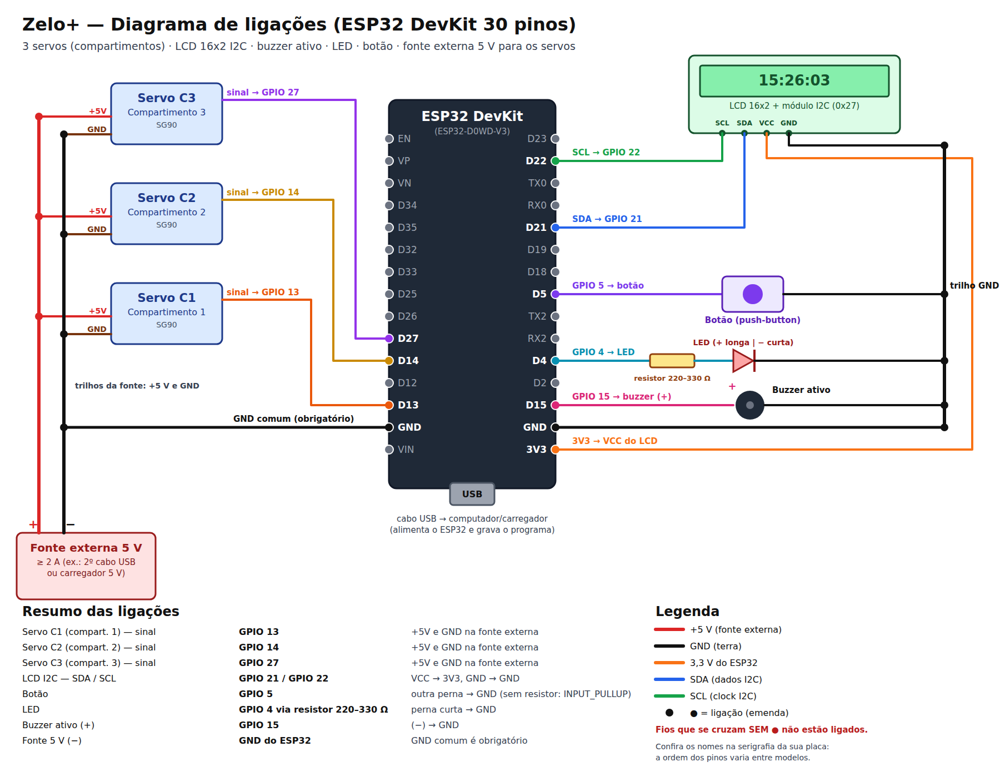

*(versão vetorial, que pode ser ampliada sem perder qualidade: [`docs/ligacoes.svg`](docs/ligacoes.svg))*

| Ligação | Pino do ESP32 | Detalhe |
|---|---|---|
| Servo compartimento 1 (sinal) | GPIO 13 | +5 V e GND na **fonte externa** |
| Servo compartimento 2 (sinal) | GPIO 14 | +5 V e GND na **fonte externa** |
| Servo compartimento 3 (sinal) | GPIO 27 | +5 V e GND na **fonte externa** |
| LCD — SDA / SCL | GPIO 21 / GPIO 22 | VCC → 3V3, GND → GND |
| Botão | GPIO 5 | outra perna → GND (sem resistor) |
| LED | GPIO 4 | via resistor; perna curta → GND |
| Buzzer (+) | GPIO 15 | (−) → GND |
| Fonte externa (−) | GND do ESP32 | **GND comum obrigatório** |

**Por que uma fonte separada para os servos?** Um servo puxa muita corrente no
momento em que começa a girar. Se ele for ligado no 3V3 do ESP32, a tensão cai e a
placa reinicia. Por isso os servos usam uma fonte de 5 V própria, e o **GND da fonte
é ligado ao GND do ESP32**: sem essa referência comum, o sinal do pino não é
entendido pelo servo.

**Por que o GPIO 12 não foi usado?** Ele é um pino de "configuração de
inicialização" do ESP32; se estiver com algo ligado na hora de ligar a placa, ela
pode não iniciar.

## A3. Ambiente de desenvolvimento

- **VSCode** com a extensão **PlatformIO**.
- Placa `esp32dev`, framework **Arduino** (a mesma linguagem do Arduino, em C++).

O arquivo `platformio.ini` diz ao PlatformIO qual placa usar e quais bibliotecas
baixar:

```ini
[env:esp32dev]
platform = espressif32
board = esp32dev
framework = arduino
upload_port = COM3
monitor_speed = 115200
board_build.partitions = huge_app.csv
lib_deps = 
    marcoschwartz/LiquidCrystal_I2C@^1.1.4
    madhephaestus/ESP32Servo@^3.0.5
    bblanchon/ArduinoJson@^7.0.4
```

- `upload_port`: porta USB onde a placa aparece no Windows (varia de PC para PC).
- `monitor_speed`: velocidade do **Serial Monitor**, onde a placa escreve mensagens.
- `huge_app.csv`: reserva mais espaço para o programa (a parte de internet segura,
  HTTPS, deixa o firmware grande).
- `lib_deps`: bibliotecas do LCD, dos servos e de leitura de JSON (usada no Telegram).

**Para gravar:** ✓ (Build) → → (Upload) → 🔌 (Serial Monitor), na barra azul do
rodapé do VSCode.

## A4. Cinco conceitos antes de começar

1. **`setup()` e `loop()`** — todo programa Arduino tem essas duas funções. O
   `setup()` roda **uma vez** quando a placa liga; o `loop()` roda **para sempre**,
   milhares de vezes por segundo.

2. **`millis()` em vez de `delay()`** — `delay(1000)` congela a placa por 1 segundo
   (ela não lê o botão nem atende a página). Por isso o Zelo+ quase sempre usa
   `millis()`, que devolve "há quantos milissegundos a placa está ligada", e compara
   tempos:
   ```cpp
   if (millis() - ultimaAtualizacao < 1000) return;
   ```
   (se ainda não passou 1 segundo desde a última atualização, sai e tenta de novo
   na próxima volta do `loop()`, sem travar nada).

3. **Máquina de estados** — o dispenser está sempre em **um** estado (aguardando,
   tocando, porta aberta, abastecendo). Em cada estado ele faz coisas diferentes e,
   quando algo acontece, **muda de estado**. Isso deixa o comportamento previsível.

4. **Máscara de bits** — para dizer "compartimentos 1 e 3", o código usa um número
   em que cada **bit** representa um compartimento:
   ```text
   compartimento:   3 2 1
   bits:            1 0 1   = 5  →  compartimentos 1 e 3
   ```
   Assim uma única variável (`uint8_t`) guarda qualquer combinação de compartimentos.

5. **Memória permanente (Preferences/NVS)** — a variável comum some quando a energia
   cai. A biblioteca `Preferences` grava dados na **memória flash** da placa, que não
   se apaga ao desligar (como um pen drive).

## A5. A página do Zelo+ (tela completa)

É a página que o cuidador abre no celular, digitando o IP que aparece no LCD (ex.:
`192.168.15.152`). As imagens abaixo foram geradas **pelo próprio firmware** (a função
`handleRoot()` do Passo 7) com um cadastro de exemplo completo.

O visual segue três ideias, pensando em cuidadores e familiares com pouca
familiaridade com tecnologia:

- **Letras e botões grandes**, com bom contraste.
- **Uma cor por compartimento** — 1 **azul**, 2 **verde**, 3 **roxo** — no cartão do
  remédio, na dica de abastecimento, na reposição e no histórico.
- **Menos informação na tela:** remédios, paciente, cuidador e familiares aparecem
  **recolhidos** (só a faixa com o nome); um toque abre os detalhes.

| ① Falta configurar o Telegram | ② Tudo configurado | ③ Blocos abertos |
|:---:|:---:|:---:|
| 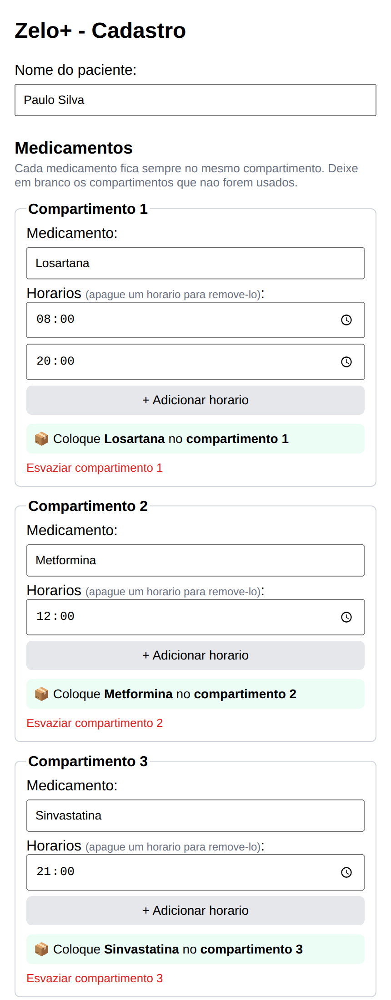 | 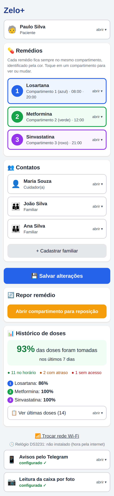 | 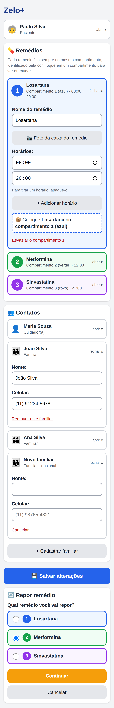 |

- **①** A familiar Ana ainda não tem ID do Telegram: aparece um **aviso amarelo no
  topo** e o bloco do Telegram (no fim da página) vem **aberto**, marcando quem falta.
- **②** Com tudo configurado, a página fica curta: o Telegram vira uma linha
  "configurado ✓" no rodapé.
- **③** O que aparece ao tocar: compartimento 1 em edição (nome, horários, dica
  "coloque no compartimento 1 (azul)"), o familiar João aberto, o formulário de um
  **familiar novo** e a **reposição**, com a escolha do remédio pelas cores.

**O que tem em cada bloco:**

| Bloco | Fechado mostra | Aberto mostra | Passo |
|---|---|---|---|
| **Aviso amarelo** (só se faltar algo) | Quem ainda não recebe avisos + "Configurar agora" | — | 7 |
| **Paciente** | Nome do paciente | Campo para editar o nome | 7 |
| **Remédios 1, 2 e 3** | Número, cor, remédio e horários | Nome, horários (até 6), dica de onde colocar, "Esvaziar" | 7, 14 |
| **Cuidador(a)** | Nome | Nome e celular | 7, 8 |
| **Familiares** | Nome de cada um | Nome, celular, "Remover"; "+ Cadastrar familiar" no fim | 7 |
| **Salvar alterações** | Botão azul grande | — | 8 |
| **Repor remédio** | Botão laranja | Escolha do remédio (por cor) e confirmação | 14 |
| **Histórico de doses** | % de adesão, contagem e adesão por remédio | "Ver últimas doses": tabela, planilha, apagar | 16 |
| **Trocar rede Wi-Fi** | Link (pede confirmação) | — | 4 |
| **Avisos pelo Telegram** | "configurado ✓" ou "falta configurar" | Token, "Buscar IDs", ID de cada pessoa, teste | 15 |

---

# Parte B — O código, passo a passo

## Passo 1 — Bibliotecas e pinos

**O que faz:** carrega as bibliotecas e dá nome aos pinos, para o resto do código
falar em `BUTTON_PIN` em vez de "5".

```cpp
#include <Arduino.h>
#include <WiFi.h>
#include <WiFiClientSecure.h>
#include <HTTPClient.h>
#include <ArduinoJson.h>
#include <WebServer.h>
#include <DNSServer.h>
#include <Preferences.h>
#include <time.h>
#include <Wire.h>
#include <LiquidCrystal_I2C.h>
#include <ESP32Servo.h>

#define BUZZER_PIN 15
#define LED_PIN 4
#define BUTTON_PIN 5
#define NUM_COMPARTIMENTOS 3
#define MAX_HORARIOS 6       // horarios por medicamento
#define MAX_FAMILIARES 5
#define MAX_HISTORICO 60
```

| Biblioteca | Para quê |
|---|---|
| `WiFi`, `WebServer`, `DNSServer` | Conectar à internet e servir a página de cadastro |
| `WiFiClientSecure`, `HTTPClient`, `ArduinoJson` | Falar com o Telegram (HTTPS + JSON) |
| `Preferences` | Memória permanente |
| `time.h` | Relógio (hora certa pela internet) |
| `Wire`, `LiquidCrystal_I2C` | LCD pelo barramento I2C |
| `ESP32Servo` | Controlar os servos |

Os pinos e ângulos de cada servo ficam em **vetores** (listas), um item por
compartimento:

```cpp
const int PINOS_SERVO[NUM_COMPARTIMENTOS] = {13, 14, 27};
// Angulos de cada porta (ajuste aqui se algum mecanismo precisar de outro valor).
const int ANGULO_FECHADO[NUM_COMPARTIMENTOS] = {0, 0, 0};
const int ANGULO_ABERTO[NUM_COMPARTIMENTOS] = {90, 90, 90};
```

> 💡 `PINOS_SERVO[0]` é o compartimento **1** (em programação, a contagem começa
> em zero). Esse detalhe aparece no código inteiro: índice `c` = compartimento `c + 1`.

Por fim, os **objetos** que representam cada peça:

```cpp
LiquidCrystal_I2C lcd(0x27, 16, 2);
Servo servos[NUM_COMPARTIMENTOS];
WebServer server(80);
DNSServer dnsServer;
Preferences preferences;
Preferences prefsCadastro;
Preferences prefsHistorico;
```

- `lcd(0x27, 16, 2)`: LCD no endereço I2C `0x27`, 16 colunas, 2 linhas.
- `server(80)`: servidor web na porta 80 (a porta padrão dos navegadores).
- Três `Preferences`, uma para cada "gaveta" da memória: Wi-Fi, cadastro e histórico.

## Passo 2 — Estruturas de dados

**O que faz:** define como o programa guarda um **contato** e um **medicamento**.

```cpp
struct Contato {
  String nome;
  String telefone;
  String chatId;
};

// Medicamento guardado num compartimento fixo (indice 0..2 = compartimento 1..3).
struct Medicamento {
  String nome;
  int totalHorarios = 0;
  int hora[MAX_HORARIOS];
  int minuto[MAX_HORARIOS];
  bool jaDisparado[MAX_HORARIOS];
};

String nomePaciente = "";
Medicamento medicamentos[NUM_COMPARTIMENTOS];
Contato cuidador;
Contato familiares[MAX_FAMILIARES];
```

- `struct` agrupa várias informações sob um nome só — como uma ficha.
- `medicamentos[3]`: a **posição no vetor é o compartimento**. O remédio em
  `medicamentos[1]` está sempre no compartimento 2. É isso que "prende" cada
  remédio ao seu compartimento.
- `jaDisparado[]`: impede que o mesmo horário toque duas vezes no mesmo minuto.
- `chatId`: número que o Telegram usa para identificar cada pessoa (Passo 15).

Os **estados** da máquina de estados:

```cpp
enum Estado { AGUARDANDO, TOCANDO, PORTA_ABERTA_ESTADO, ABASTECENDO };
Estado estadoAtual = AGUARDANDO;
```

E as variáveis da **dose atual** (usam máscara de bits, conceito 4):

```cpp
uint8_t doseMascara = 0;
String horarioDose = "";
String nomesDose = "";
unsigned long alarmeIniciadoEm = 0;
int nivelAvisoEnviado = 0;   // 0 = nenhum, 1 = cuidador avisado, 2 = todos alertados
bool dosePendente = false;   // alarme terminou sem acesso; botao ainda abre os compartimentos
```

Duas funções pequenas ajudam a trabalhar com isso:

```cpp
bool temBit(uint8_t mascara, int i) {
  return (mascara >> i) & 1;
}

bool medicamentoAtivo(int c) {
  return medicamentos[c].nome != "" && medicamentos[c].totalHorarios > 0;
}
```

- `temBit(5, 0)` → verdadeiro (compartimento 1 está na máscara `101`).
- `medicamentoAtivo(c)`: um compartimento só conta se tiver nome **e** horário.

## Passo 3 — `setup()`: ligando tudo

**O que faz:** roda uma vez ao ligar. Configura pinos, posiciona as portas,
liga o LCD, **lê a memória** e tenta conectar no Wi-Fi.

```cpp
  pinMode(BUZZER_PIN, OUTPUT);
  pinMode(LED_PIN, OUTPUT);
  pinMode(BUTTON_PIN, INPUT_PULLUP);
  digitalWrite(BUZZER_PIN, LOW);
  digitalWrite(LED_PIN, LOW);

  for (int c = 0; c < NUM_COMPARTIMENTOS; c++) {
    servos[c].attach(PINOS_SERVO[c]);
    servos[c].write(ANGULO_FECHADO[c]);
  }
```

- `OUTPUT`: o ESP32 **manda** energia no pino (buzzer, LED).
- `INPUT_PULLUP`: o pino fica "puxado" para 3,3 V por um resistor **interno**. Quando
  o botão é apertado, ele liga o pino ao GND e a leitura vira `LOW`. Por isso o botão
  não precisa de resistor externo, e "apertado" é `digitalRead(BUTTON_PIN) == LOW`.
- O `for` percorre os 3 servos, liga cada um no seu pino e fecha a porta.

Depois, carrega a memória e decide o modo de Wi-Fi:

```cpp
  prefsCadastro.begin("cadastro", false);
  carregarCadastro();
  prefsHistorico.begin("historico", false);
  carregarHistorico();

  preferences.begin("wifi", false);
  String ssidSalvo = preferences.getString("ssid", "");
  String senhaSalva = preferences.getString("pass", "");
```

```cpp
  if (WiFi.status() == WL_CONNECTED) {
    iniciarModoNormal();
  } else {
    iniciarModoConfig();
  }
```

- Se existe rede salva e a conexão funciona → **modo normal** (Passo 5).
- Se não → **modo de configuração** (Passo 4).

## Passo 4 — Wi-Fi sem senha no código (captive portal)

**O que faz:** quando a placa não sabe em qual Wi-Fi entrar, ela **cria a sua
própria rede** chamada `ZeloPlus-Config`. Ao conectar o celular nela, a página de
configuração abre sozinha (igual ao Wi-Fi de aeroporto).

```cpp
void iniciarModoConfig() {
  modoConfig = true;

  WiFi.mode(WIFI_AP_STA);
  WiFi.softAPConfig(apIP, apIP, IPAddress(255, 255, 255, 0));
  WiFi.softAP("ZeloPlus-Config");

  dnsServer.start(DNS_PORT, "*", apIP);
```

- `softAP`: transforma o ESP32 em um **ponto de acesso** (roteador).
- `dnsServer.start(..., "*", apIP)`: responde **qualquer** endereço digitado com o IP
  da placa (`192.168.4.1`). É esse "truque" que faz o celular abrir a página sozinho.

Quando o cuidador escolhe a rede e digita a senha, a placa testa e, se der certo,
**grava** e reinicia:

```cpp
  if (WiFi.status() == WL_CONNECTED) {
    preferences.putString("ssid", ssid);
    preferences.putString("pass", senha);
```

```cpp
    delay(3000);
    ESP.restart();
```

Da próxima vez que ligar, o `setup()` encontra a rede salva e vai direto para o
modo normal. O link "Trocar rede Wi-Fi" da página apaga essa rede
(`preferences.remove("ssid")`) e reinicia no modo de configuração.

## Passo 5 — Modo normal: relógio pela internet e rotas da página

**O que faz:** acerta o relógio pela internet, mostra o IP no LCD e diz ao servidor
qual função atende cada endereço da página.

```cpp
const char* ntpServer = "pool.ntp.org";
const long gmtOffset_sec = -10800; // Brasília (GMT-3)
const int daylightOffset_sec = 0;
```

```cpp
  configTime(gmtOffset_sec, daylightOffset_sec, ntpServer);
```

- **NTP** é um serviço da internet que informa a hora exata. `-10800` segundos =
  3 horas a menos que o horário mundial (UTC) = horário de Brasília.

As **rotas** ligam um endereço a uma função:

```cpp
  server.on("/", handleRoot);
  server.on("/salvar", HTTP_POST, handleSalvar);
  server.on("/abrir-manual", HTTP_POST, handleAbrirManual);
  server.on("/esvaziar", HTTP_POST, handleEsvaziar);
  server.on("/testar-mensagens", HTTP_POST, handleTestarMensagens);
  server.on("/telegram-ids", HTTP_POST, handleTelegramIds);
  server.on("/historico.csv", handleHistoricoCSV);
  server.on("/limpar-historico", HTTP_POST, handleLimparHistorico);
  server.on("/trocar-wifi", handleTrocarWifi);
  server.begin();
```

| Endereço | O que acontece |
|---|---|
| `/` | Mostra a página de cadastro (Passo 7) |
| `/salvar` | Recebe o formulário e grava (Passo 8) |
| `/abrir-manual` | Abre um compartimento para reposição (Passo 14) |
| `/esvaziar` | Esvazia um compartimento (Passo 14) |
| `/testar-mensagens`, `/telegram-ids` | Telegram (Passo 15) |
| `/historico.csv`, `/limpar-historico` | Histórico (Passo 16) |

## Passo 6 — Memória permanente (Preferences)

**O que faz:** grava e lê o cadastro na memória flash, para ele sobreviver a
quedas de energia.

Cada compartimento tem suas chaves: `m0_` (compartimento 1), `m1_`, `m2_`.

```cpp
void salvarMedicamento(int c) {
  const Medicamento& m = medicamentos[c];
  String p = prefixoMedicamento(c);
  uint8_t horas[MAX_HORARIOS];
  uint8_t minutos[MAX_HORARIOS];
  for (int i = 0; i < m.totalHorarios; i++) {
    horas[i] = (uint8_t)m.hora[i];
    minutos[i] = (uint8_t)m.minuto[i];
  }
  prefsCadastro.putString((p + "_nome").c_str(), m.nome);
  prefsCadastro.putUChar((p + "_tot").c_str(), (uint8_t)m.totalHorarios);
  if (m.totalHorarios > 0) {
    prefsCadastro.putBytes((p + "_hr").c_str(), horas, m.totalHorarios);
    prefsCadastro.putBytes((p + "_mn").c_str(), minutos, m.totalHorarios);
  }
}
```

- `putString` grava texto; `putUChar` grava um número pequeno (0–255);
  `putBytes` grava uma lista de bytes (as horas e os minutos).
- Exemplo do que fica gravado para "Losartana às 08:00 e 20:00" no compartimento 1:
  `m0_nome = "Losartana"`, `m0_tot = 2`, `m0_hr = [8, 20]`, `m0_mn = [0, 0]`.

Na leitura, o programa **confere** se os dados fazem sentido antes de usar:

```cpp
  int validos = 0;
  for (int i = 0; i < total; i++) {
    if (horas[i] > 23 || minutos[i] > 59) continue;
    horaDestino[validos] = horas[i];
    minutoDestino[validos] = minutos[i];
    disparadoDestino[validos] = false;
    validos++;
  }
  return validos;
```

**Migração:** a versão anterior (um compartimento só) gravava o remédio em chaves
diferentes. Na primeira vez que a versão nova liga, ela copia esse remédio para o
compartimento 1 e apaga as chaves antigas:

```cpp
void migrarCadastroAntigo() {
  if (prefsCadastro.isKey("m0_nome") || !prefsCadastro.isKey("remedio")) return;

  Medicamento& m = medicamentos[0];
  m.nome = prefsCadastro.getString("remedio", "");
  m.nome.trim();
  m.totalHorarios = lerHorarios("total", "horas", "minutos", m.hora, m.minuto, m.jaDisparado);
  salvarMedicamento(0);
```

- `trim()` tira espaços do começo e do fim do nome. Versões antigas podiam gravar
  "Losartana " (com espaço), e sem essa limpeza o sistema achava que o remédio tinha
  mudado e abria o compartimento sem necessidade.

## Passo 7 — A página de cadastro

**O que faz:** quando o navegador abre o IP da placa, a função `handleRoot()`
**monta o HTML** (o texto da página) e envia. O visual foi pensado para quem tem
pouca familiaridade com tecnologia: **letras e botões grandes**, **uma cor por
compartimento** e **blocos recolhidos** — só o essencial aparece; um toque abre os
detalhes.

**1) Uma cor por compartimento.** Três listas guardam a cor de cada um (use
etiquetas das mesmas cores na caixa do dispenser):

```cpp
const char* COR_COMPARTIMENTO[NUM_COMPARTIMENTOS] = {"#2563eb", "#16a34a", "#9333ea"};
const char* FUNDO_COMPARTIMENTO[NUM_COMPARTIMENTOS] = {"#eff6ff", "#f0fdf4", "#faf5ff"};
const char* NOME_COR[NUM_COMPARTIMENTOS] = {"azul", "verde", "roxo"};
```

**2) Blocos recolhidos.** O HTML tem um elemento pronto para isso: `<details>`
mostra só o `<summary>` (a "faixa") e esconde o resto até alguém tocar. Cada
compartimento é um `<details>` com a sua cor; na faixa aparecem número, remédio e
horários:

```cpp
  String html = "<details class='comp' style='--cor:" + String(COR_COMPARTIMENTO[c]) + ";--fundo:" +
                String(FUNDO_COMPARTIMENTO[c]) + "'" + (aberto ? " open" : "") + "><summary>";
  html += marcaCompartimento(c, 44);
  if (medicamentoAtivo(c)) {
    html += "<span><b>" + escaparHTML(m.nome) + "</b><small>Compartimento " + n + " (" + NOME_COR[c] + ") &middot; " +
            horariosTexto(m) + "</small></span>";
  } else {
    html += "<span><b>Compartimento " + n + "</b><small>" + NOME_COR[c] + " &middot; vazio &middot; toque para cadastrar</small></span>";
  }
```

- `--cor` e `--fundo` são **variáveis de CSS**: o mesmo estilo (`.comp`) pinta a
  borda e o fundo de cada cartão com a cor do seu compartimento.
- `marcaCompartimento()` desenha a bolinha colorida com o número (ela também aparece
  na reposição e no histórico).
- O compartimento 1 só vem aberto no primeiro uso (nenhum remédio cadastrado).

Dentro do cartão, a **dica de onde colocar o remédio** repete número e cor:

```cpp
  html += "&#128230; Coloque <b>" + escaparHTML(m.nome) + "</b> no <b>compartimento " + n + " (" + NOME_COR[c] + ")</b></div>";
```

Resultado: 📦 Coloque **Losartana** no **compartimento 1 (azul)**. A dica muda
**enquanto o cuidador digita**, com um pequeno código JavaScript que roda no
navegador:

```cpp
  html += "function atualizarDica(c) {";
  html += "  var nome = document.getElementById('m' + c + '_nome').value.trim();";
  html += "  var dica = document.getElementById('dica-' + c);";
  html += "  dica.style.display = nome ? 'block' : 'none';";
```

**3) Pessoas recolhidas.** Cuidador e familiares aparecem **só pelo nome**; tocando,
abrem nome e celular. O familiar novo fica atrás do botão "+ Cadastrar familiar":

```cpp
  html += "<summary><span style='font-size:28px'>" + String(icone) + "</span><span><b>";
  html += contato.nome != "" ? escaparHTML(contato.nome) : String(familiar ? "Novo familiar" : "Cuidador(a)");
```

Cada familiar ocupa uma "vaga" (`fam0` a `fam4`). Ao cadastrar, o navegador procura a
primeira vaga livre; ao remover, apaga o ID do Telegram daquela vaga — assim um
familiar novo nunca herda o ID de quem saiu:

```cpp
  html += "    if (usados.indexOf('fam' + i) >= 0) continue;";
  html += "    var modelo = document.getElementById('modelo-familiar').innerHTML.split('famX').join('fam' + i);";
```

**4) Telegram só quando precisa.** O bloco do Telegram fica no **fim da página**,
depois de "Trocar rede Wi-Fi". Ele só aparece **aberto** (e com um aviso no topo)
enquanto faltar o token ou o ID de alguém — por exemplo, logo depois de cadastrar um
familiar novo. Configurado, vira uma linha discreta "configurado ✓":

```cpp
bool telegramPendente(String* faltando) {
  bool pendente = (tokenTelegram == "");
  if (cuidador.nome != "" && cuidador.chatId == "") {
    pendente = true;
```

Os campos desse bloco ficam **fora** do formulário principal, mas são enviados junto
graças ao atributo `form='cadastro'`:

```cpp
  html += "</label><input type='text' inputmode='numeric' form='cadastro' name='" + prefixo + "_chat' id='chat-" + prefixo +
```

**5) Troca de remédio num compartimento já usado** — antes de enviar, o navegador
compara o nome antigo (guardado em `data-original`) com o novo e pede confirmação:

```cpp
  html += "    if (antigo && novo && antigo.toLowerCase() != novo.toLowerCase()) {";
  html += "      if (!confirm('O compartimento ' + (c + 1) + ' (' + CORES[c] + ') tinha ' + antigo + '. Retire todos os comprimidos antigos antes de colocar ' + novo + '. Confirmar troca?')) return false;";
```

> 🔒 **Segurança:** todo texto digitado passa por `escaparHTML()` antes de entrar na
> página. Assim, um nome como `D'Ávila` ou `<b>` não quebra o HTML.
>
> ```cpp
> case '<': saida += "&lt;"; break;
> ```

## Passo 8 — Salvando o cadastro

**O que faz:** `handleSalvar()` recebe o formulário, **valida** tudo e só então grava.

1. **Cuidador é obrigatório:**

```cpp
  if (novoCuidador.nome == "" || novoCuidador.telefone == "") {
    server.send(400, "text/plain; charset=utf-8", "O cuidador é obrigatório: preencha nome e celular.");
    return;
  }
```

2. **Cada remédio precisa de horário, e ao menos um remédio precisa existir:**

```cpp
    if (novos[c].nome != "" && novos[c].totalHorarios == 0) {
```

```cpp
  if (ativos == 0) {
    server.send(400, "text/plain; charset=utf-8", "Cadastre ao menos um medicamento. Volte e corrija.");
    return;
  }
```

3. **Descobre quais compartimentos receberam remédio novo** e os coloca numa
   **fila de abastecimento** (máscara de bits):

```cpp
    if (novo != "" && novo != antigo) filaAbastecimento |= (uint8_t)(1 << c);
    if (novo == "") filaAbastecimento &= (uint8_t)~(1 << c);
    medicamentos[c] = novos[c];
```

- `|= (1 << c)` **liga** o bit do compartimento `c` ("este precisa abrir").
- `&= ~(1 << c)` **desliga** o bit.
- Se só os horários mudaram, `novo == antigo` e nada entra na fila → a porta não abre.

4. **Grava tudo** e devolve o navegador para a página:

```cpp
  salvarCadastro();

  server.sendHeader("Location", "/");
  server.send(303);
```

A abertura das portas **não** acontece aqui: quem cuida disso é o `loop()` (Passo 10),
um compartimento de cada vez.

## Passo 9 — Movendo as portas (servos)

**O que faz:** abre e fecha as portas **devagar** (1 grau a cada 15 ms), para não
dar tranco no mecanismo.

```cpp
void abrirCompartimento(int c) {
  for (int angulo = ANGULO_FECHADO[c]; angulo <= ANGULO_ABERTO[c]; angulo++) {
    servos[c].write(angulo);
    delay(15);
  }
}
```

- 90 passos × 15 ms ≈ **1,4 s** para abrir.

Para abrir **vários** compartimentos com um único toque, sem que dois servos se
movam juntos (o que sobrecarregaria a fonte), eles abrem **um depois do outro**:

```cpp
// Abre os compartimentos marcados, um logo apos o outro.
void abrirCompartimentos(uint8_t mascara) {
  for (int c = 0; c < NUM_COMPARTIMENTOS; c++) {
    if (temBit(mascara, c)) abrirCompartimento(c);
  }
}
```

Como `abrirCompartimento()` só termina depois que a porta chegou em 90°, o próximo
servo só começa quando o anterior parou.

## Passo 10 — O coração: `loop()` e a máquina de estados

**O que faz:** a cada volta, atende a página web, confere os horários e executa o
que o **estado atual** manda.

```cpp
void loop() {
  if (modoConfig) {
    dnsServer.processNextRequest();
  }
  server.handleClient();

  if (modoConfig) {
    return;
  }

  verificarHorarios();

  switch (estadoAtual) {
```

**Mapa dos estados:**

```text
                    horário chegou
   ┌────────────┐ ───────────────────► ┌──────────┐
   │ AGUARDANDO │                      │ TOCANDO  │
   │  (relógio) │ ◄─── 12 min sem ──── │ (alarme) │
   └────────────┘      acesso          └──────────┘
     │   ▲   ▲    (dose pendente)            │ botão
     │   │   │                               ▼
     │   │   │  fechou              ┌──────────────────────┐
     │   │   └───────────────────── │ PORTA_ABERTA_ESTADO  │
     │   │                          │ (paciente retirando) │
     │   │ fechou                   └──────────────────────┘
     ▼   │
   ┌─────────────┐
   │ ABASTECENDO │  remédio novo, reposição ou esvaziar
   └─────────────┘
```

No estado **AGUARDANDO**, a ordem de prioridade é:

```cpp
    case AGUARDANDO:
      if (dosePendente && digitalRead(BUTTON_PIN) == LOW) {
        abrirParaPaciente();
        break;
      }
      // Prioridade: alarme em espera; depois abastecimento de compartimento novo.
      if (mascaraEmEspera != 0) {
        uint8_t mascara = mascaraEmEspera;
        mascaraEmEspera = 0;
        iniciarAlarme(mascara, horarioEmEspera);
        break;
      }
      if (filaAbastecimento != 0) {
```

1. Dose pendente + botão → abre para o paciente.
2. Algum horário esperando → começa o alarme.
3. Algum compartimento novo na fila → abre para abastecer.
4. Nada disso → mostra o relógio.

## Passo 11 — Conferindo os horários

**O que faz:** uma vez por segundo, compara a hora atual com os horários de cada
remédio. Funciona **em qualquer estado**.

```cpp
  for (int c = 0; c < NUM_COMPARTIMENTOS; c++) {
    if (!medicamentoAtivo(c)) continue;
    Medicamento& m = medicamentos[c];
    for (int i = 0; i < m.totalHorarios; i++) {
      if (m.jaDisparado[i] || timeinfo.tm_hour != m.hora[i] || timeinfo.tm_min != m.minuto[i]) continue;
      m.jaDisparado[i] = true;
      if (mascaraEmEspera == 0) horarioEmEspera = formatarHorario(m.hora[i], m.minuto[i]);
      mascaraEmEspera |= (uint8_t)(1 << c);
    }
  }
```

- Quando bate o horário, o compartimento entra na **máscara de espera**.
- **Dois remédios no mesmo horário** entram na mesma máscara → viram **um único
  alarme**.
- Se o dispenser estiver ocupado (ex.: cuidador repondo outro compartimento), o
  horário **fica esperando** e toca assim que ele voltar a `AGUARDANDO`.
- `jaDisparado` impede de tocar de novo no mesmo minuto; ele é "rearmado" quando o
  minuto muda:

```cpp
        if (timeinfo.tm_min != medicamentos[c].minuto[i]) medicamentos[c].jaDisparado[i] = false;
```

## Passo 12 — O alarme tocando

**O que faz:** `iniciarAlarme()` prepara a dose e muda para `TOCANDO`.

```cpp
void iniciarAlarme(uint8_t mascara, const String& horario) {
  estadoAtual = TOCANDO;
  doseMascara = mascara;
  horarioDose = horario;
  nomesDose = juntarNomes(mascara);
  alarmeIniciadoEm = millis();
  nivelAvisoEnviado = 0;
  dosePendente = false;
```

- `nomesDose` guarda o texto "Losartana e Metformina" para as mensagens.
- `alarmeIniciadoEm` marca o instante do início: todos os tempos são contados a
  partir dele.

**Ciclo do som** — 1 minuto tocando, 1 minuto em silêncio:

```cpp
      bool minutoDeSom = ((decorrido / CICLO_ALARME) % 2) == 0;
      if (!minutoDeSom) {
        if (ledBuzzerLigado) desligarLedBuzzer();
        break;
      }

      if (millis() - ultimoToggleAlarme >= 150) {
        ultimoToggleAlarme = millis();
        ledBuzzerLigado = !ledBuzzerLigado;
        digitalWrite(LED_PIN, ledBuzzerLigado ? HIGH : LOW);
        digitalWrite(BUZZER_PIN, ledBuzzerLigado ? HIGH : LOW);
      }
```

- `decorrido / CICLO_ALARME` = quantos minutos se passaram (0, 1, 2, …).
- `% 2 == 0` → minutos pares (0, 2, 4…) tocam; ímpares ficam em silêncio.
- Dentro do minuto de som, LED e buzzer **invertem a cada 150 ms** (bip-bip-bip).

**Avisos** — aos 6 minutos para o cuidador, aos 12 para todos:

```cpp
      if (decorrido >= TEMPO_PRIMEIRO_AVISO && nivelAvisoEnviado == 0) {
        desligarLedBuzzer();
        escreverLinhaLCD(1, "Avisando cuidad.");
        avisarPrimeiroAtraso();
        nivelAvisoEnviado = 1;
      }
```

```cpp
      if (decorrido >= TEMPO_ALERTA_FINAL) {
        desligarLedBuzzer();
        lcd.clear();
        escreverLinhaLCD(0, "Avisando familia");
        atualizarDose(DOSE_SEM_ACESSO, decorrido);
        alertarSemAcesso();
        nivelAvisoEnviado = 2;
```

```cpp
        dosePendente = true;
        lcd.clear();
        estadoAtual = AGUARDANDO;
```

- `nivelAvisoEnviado` evita mandar o mesmo aviso duas vezes.
- Depois dos 12 minutos o alarme **para**, mas a dose fica **pendente**: se o
  paciente aparecer mais tarde, o botão ainda abre os compartimentos.

## Passo 13 — O paciente aperta o botão

**O que faz:** registra o acesso, desliga o alarme e **abre todos os
compartimentos da dose**, um após o outro.

```cpp
void abrirParaPaciente() {
  unsigned long decorrido = millis() - alarmeIniciadoEm;
  atualizarDose(decorrido < TEMPO_PRIMEIRO_AVISO ? DOSE_NO_HORARIO : DOSE_ATRASADA, decorrido);
  esquecerRegistrosDose();

  desligarLedBuzzer();
  dosePendente = false;

  lcd.clear();
  escreverLinhaLCD(0, "Retire: " + listaCompartimentos(doseMascara));
  escreverLinhaLCD(1, "Abrindo...");
  abrirCompartimentos(doseMascara);

  mascaraAberta = doseMascara;
  estadoAtual = PORTA_ABERTA_ESTADO;
  portaAbertaEm = millis();

  avisarAcessoAposAviso();
}
```

- Antes do 1º aviso → "tomada no horário"; depois → "tomada com atraso" (Passo 16).
- Se já tinha avisado alguém, `avisarAcessoAposAviso()` manda "Paulo acessou o
  dispenser às 15:27", para a família ficar tranquila.

**Fechando — trava de 7 segundos:** logo depois de abrir, o dedo do paciente
ainda pode estar no botão. Para não fechar sem querer, o botão só vale depois de 7 s.
Se ninguém apertar, fecha sozinho após 3 minutos:

```cpp
      bool travaLiberada = (millis() - portaAbertaEm >= TRAVA_BOTAO);
      bool fechar = (travaLiberada && digitalRead(BUTTON_PIN) == LOW) ||
                    (millis() - portaAbertaEm >= TEMPO_PORTA_ABERTA);

      if (fechar) {
        lcd.clear();
        escreverLinhaLCD(0, "Fechando porta..");
        fecharCompartimentos(mascaraAberta);
        mascaraAberta = 0;
```

## Passo 14 — Abastecer, repor e esvaziar

Os três casos usam a **mesma função**, que abre **um** compartimento para o cuidador
e só muda o texto do LCD:

```cpp
void iniciarAbastecimento(int c, ModoAbastecimento modo) {
  compartimentoAbastecendo = c;
  modoAbastecimento = modo;

  String titulo;
  if (modo == ABAST_REPOR) titulo = "Repor compart." + String(c + 1);
  else if (modo == ABAST_ESVAZIAR) titulo = "Esvaziar comp." + String(c + 1);
  else titulo = "Abast. compart." + String(c + 1);
```

**a) Abastecimento guiado (remédio novo):** o `loop()` pega o **primeiro**
compartimento da fila, tira ele da fila e abre. Quando a porta fecha, o estado volta
para `AGUARDANDO` e o próximo da fila abre — um de cada vez:

```cpp
        for (int c = 0; c < NUM_COMPARTIMENTOS; c++) {
          if (!temBit(filaAbastecimento, c)) continue;
          filaAbastecimento &= (uint8_t)~(1 << c);
          iniciarAbastecimento(c, ABAST_NOVO);
          break;
        }
```

**b) Reposição:** na página, o cuidador **escolhe o remédio** (os botões de opção só
mostram os cadastrados), confirma, e o navegador envia o número do compartimento:

```cpp
  html += "  var corpo = new URLSearchParams(); corpo.append('c', reporEscolhido);";
  html += "  fetch('/abrir-manual', {method:'POST', body: corpo}).then(function(r){";
```

A placa confere se o pedido é válido e se está livre, e abre **só aquele**:

```cpp
void handleAbrirManual() {
  int c = server.arg("c").toInt();
  if (!server.hasArg("c") || c < 0 || c >= NUM_COMPARTIMENTOS || !medicamentoAtivo(c)) {
    server.send(400, "text/plain", "Compartimento invalido");
    return;
  }
  if (!dispenserLivre()) {
    server.send(409, "text/plain", "Sistema ocupado no momento");
    return;
  }

  server.send(200, "text/plain", "OK");
  iniciarAbastecimento(c, ABAST_REPOR);
}
```

**c) Esvaziar:** apaga o remédio do compartimento e, se o cuidador pediu, abre para
retirar as sobras:

```cpp
  medicamentos[c].nome = "";
  medicamentos[c].totalHorarios = 0;
  filaAbastecimento &= (uint8_t)~(1 << c);
  salvarMedicamento(c);
```

## Passo 15 — Avisos pelo Telegram

**Por que Telegram?** É gratuito, oficial e funciona com uma simples requisição pela
internet. (O WhatsApp gratuito via CallMeBot ficou sem vagas; o WhatsApp oficial é
pago e exige aprovação da Meta.)

**Configuração (uma vez):** o cuidador cria um bot no **@BotFather**, cola o **token**
na página; cada pessoa abre o bot e toca em **Iniciar**; o botão "Buscar IDs" mostra
o `chatId` de cada uma.

**Enviar uma mensagem** é fazer um pedido HTTPS para a API do Telegram:

```cpp
  String url = "https://api.telegram.org/bot" + token + "/" + metodo;
  if (!http.begin(cliente, url)) {
    Serial.println("Telegram: falha ao iniciar conexao");
    return -1;
  }
  http.addHeader("Content-Type", "application/x-www-form-urlencoded");
  int codigo = http.POST(corpo);
```

```cpp
  String corpo = "chat_id=" + codificarURL(contato.chatId) + "&text=" + codificarURL(texto);
  int codigo = chamarTelegram(tokenTelegram, "sendMessage", corpo);
```

- `codificarURL()` troca espaços e acentos por códigos (`%20`, `%C3%A3`…), porque o
  endereço/corpo do pedido só aceita alguns caracteres.
- A resposta `200` significa "entregue ao Telegram".

**As mensagens:**

```cpp
void avisarPrimeiroAtraso() {
  enviarParaCuidador("Zelo+: Paciente “" + nomePaciente + "” não acessou o medicamento das “" +
                     horarioDose + "” horas (" + nomesDose + ").");
}

void alertarSemAcesso() {
  enviarParaTodos("Zelo+: Paciente “" + nomePaciente + "” não foi até o dispenser no horário das “" +
                  horarioDose + "” (" + nomesDose + ").");
}
```

| Momento | Quem recebe | Exemplo |
|---|---|---|
| 6 min sem acesso | Cuidador | Zelo+: Paciente "Paulo" não acessou o medicamento das "15:26" horas (Losartana). |
| 12 min sem acesso | Cuidador + familiares | Zelo+: Paciente "Paulo" não foi até o dispenser no horário das "15:26" (Losartana e Metformina). |
| Acesso depois de um aviso | Quem foi avisado | Zelo+: Paulo acessou o dispenser às 15:27 (dose de Losartana das 15:26). |

**Buscar IDs:** a função `handleTelegramIds()` pede ao Telegram as últimas mensagens
recebidas pelo bot (`getUpdates`) e usa a **ArduinoJson** para ler só o que
interessa (id e nome de cada pessoa):

```cpp
  JsonDocument filtro;
  JsonObject chatFiltro = filtro["result"][0]["message"]["chat"].to<JsonObject>();
  chatFiltro["id"] = true;
  chatFiltro["first_name"] = true;
  chatFiltro["last_name"] = true;
  chatFiltro["username"] = true;
```

O **filtro** economiza memória: a resposta do Telegram tem muitos campos, mas a placa
guarda apenas esses quatro.

## Passo 16 — Histórico de doses

**O que faz:** cada remédio de cada alarme vira um **registro** com data, situação e
atraso. Serve para calcular a **adesão ao tratamento**.

```cpp
struct RegistroDose {
  uint32_t inicio;         // horario do disparo (segundos desde 1970)
  uint16_t atrasoSeg;      // tempo ate o acesso
  uint8_t status;
  uint8_t compartimento;   // 0..2
  char remedio[20];        // nome do medicamento no momento da dose
};
```

```cpp
enum StatusDose : uint8_t {
  DOSE_PENDENTE = 0,    // alarme tocando (ou placa reiniciou antes de concluir)
  DOSE_NO_HORARIO = 1,  // acesso antes do primeiro aviso ao cuidador
  DOSE_ATRASADA = 2,    // acesso depois do primeiro aviso (inclusive apos o alerta final)
  DOSE_SEM_ACESSO = 3   // alerta final enviado e ninguem acessou
};
```

**Buffer circular:** a placa guarda as **60 doses mais recentes**. Quando enche, a
próxima sobrescreve a mais antiga — como uma fila que dá a volta:

```cpp
int registrarInicioDose(int compartimento) {
  int idx = proximoHistorico;
```

```cpp
  proximoHistorico = (proximoHistorico + 1) % MAX_HISTORICO;
  if (totalHistorico < MAX_HISTORICO) totalHistorico++;
  return idx;
}
```

- `% MAX_HISTORICO` (resto da divisão) faz a posição voltar a 0 depois da 59.

Para ler do mais recente para o mais antigo:

```cpp
int indiceHistorico(int k) {
  return (proximoHistorico - 1 - k + 2 * MAX_HISTORICO) % MAX_HISTORICO;
}
```

**Adesão** = doses tomadas (no horário + com atraso) ÷ doses concluídas, nos últimos
7 dias. O arredondamento é feito somando metade do divisor:

```cpp
int percentual(int parte, int total) {
  return (parte * 100 + total / 2) / total;
}
```

A página mostra a adesão geral e por remédio, a tabela das 20 doses mais recentes e
o link **Baixar histórico (CSV)**, que abre no Excel/Google Planilhas:

```cpp
  String csv = "data;horario;medicamento;compartimento;situacao;atraso_minutos\r\n";
```

## Passo 17 — Escrevendo no LCD

**O problema:** o LCD 16x2 não tem acentos. "Potássica" apareceria com símbolos
estranhos. **A solução:** converter para maiúsculas sem acento.

Em UTF-8 (o formato do texto), letras acentuadas usam **2 bytes**, e o primeiro é
sempre `0xC3`. O segundo byte diz qual é a letra:

```cpp
    if (c == 0xC3 && i + 1 < texto.length()) {
      uint8_t d = (uint8_t)texto[++i] | 0x20; // 0x80-0x9F (maiusculas) -> minusculas
      char base = '?';
      if (d >= 0xA0 && d <= 0xA5) base = 'A';
      else if (d == 0xA7) base = 'C';
      else if (d >= 0xA8 && d <= 0xAB) base = 'E';
```

Resultado: `"Losartana Potássica"` → `"LOSARTANA POTASS"` (cortado em 16 colunas).

E uma função que **sempre preenche a linha inteira**, apagando restos de textos
anteriores:

```cpp
void escreverLinhaLCD(int linha, const String& texto) {
  String t = textoLCD(texto);
  while (t.length() < 16) t += ' ';
  lcd.setCursor(0, linha);
  lcd.print(t);
}
```

| Situação | Linha 1 | Linha 2 |
|---|---|---|
| Aguardando | `15:26:03` | `3 remedios` |
| Alarme | `Hora do remedio!` | `LOSARTANA (C1)` (alterna a cada 2 s) |
| Retirada | `Retire: C1 C2` | `Fecha em: 170s` |
| Abastecer / Repor | `Abast. compart.2` / `Repor compart.2` | `METFORMINA` |
| Dose pendente | `15:40:10` | `Dose pendente!` |

## Passo 18 — Modo de teste

Esperar 12 minutos a cada teste seria lento. Uma única linha troca todos os tempos:

```cpp
#define MODO_TESTE 1

#if MODO_TESTE
const unsigned long CICLO_ALARME = 5UL * 1000UL;
const unsigned long TEMPO_PRIMEIRO_AVISO = 30UL * 1000UL;
const unsigned long TEMPO_ALERTA_FINAL = 60UL * 1000UL;
#else
const unsigned long CICLO_ALARME = 60UL * 1000UL;
const unsigned long TEMPO_PRIMEIRO_AVISO = 6UL * 60UL * 1000UL;
const unsigned long TEMPO_ALERTA_FINAL = 12UL * 60UL * 1000UL;
#endif
```

- `#if` é resolvido **na compilação**: só um dos blocos vai para a placa.
- Com `MODO_TESTE 1`: aviso aos 30 s, alerta aos 60 s, som 5 s / silêncio 5 s.
- **Antes do uso real**, trocar para `#define MODO_TESTE 0` e gravar de novo.
- O `UL` ("unsigned long") evita que a conta estoure: `12 * 60 * 1000` passa do
  limite de um `int` em algumas placas.

---

# Parte C — Juntando tudo

## C1. Linha do tempo de uma dose

Exemplo: **Losartana (compartimento 1)** e **Metformina (compartimento 2)** às
**15:26**, modo real.

| Hora | O que acontece | Onde no código |
|---|---|---|
| 15:26:00 | `verificarHorarios()` coloca C1 e C2 na máscara de espera | Passo 11 |
| 15:26:00 | `loop()` em `AGUARDANDO` chama `iniciarAlarme(0b011, "15:26")`; cria 2 registros "tocando" | Passos 10, 12, 16 |
| 15:26–15:27 | Buzzer e LED bip-bip; LCD alterna `LOSARTANA (C1)` / `METFORMINA (C2)` | Passos 12, 17 |
| 15:27–15:28 | Silêncio (botão continua valendo) | Passo 12 |
| 15:32 | Sem acesso → Telegram para o cuidador | Passos 12, 15 |
| 15:33 | Paciente aperta o botão → registros "com atraso (7 min)"; abre C1, depois C2 | Passo 13 |
| 15:33 | Telegram "Paulo acessou o dispenser às 15:33" para o cuidador | Passo 15 |
| 15:33:07 | Trava liberada; LCD `Fecha em: 173s` | Passo 13 |
| 15:34 | Paciente aperta → fecha C1, depois C2 → `AGUARDANDO` | Passo 13 |

Se o paciente **não** aparecer até 15:38 (12 min): alerta para todos, registros "sem
acesso", LCD `Dose pendente!`, e o botão ainda abre os dois compartimentos depois.

## C2. Referência rápida

**Tempos**

| Constante | Modo real | Modo teste |
|---|---|---|
| `CICLO_ALARME` | 1 min | 5 s |
| `TEMPO_PRIMEIRO_AVISO` | 6 min | 30 s |
| `TEMPO_ALERTA_FINAL` | 12 min | 60 s |
| `TRAVA_BOTAO` | 7 s | 7 s |
| `TEMPO_PORTA_ABERTA` / `TEMPO_ABASTECIMENTO` | 3 min | 3 min |

**Memória (Preferences)**

| Gaveta (namespace) | Chaves |
|---|---|
| `wifi` | `ssid`, `pass` |
| `cadastro` | `nome` (paciente), `m0_*`/`m1_*`/`m2_*` (remédios), `cuid_*`, `fam0_*`…`fam4_*`, `tg_token` |
| `historico` | `regs2` (registros), `total`, `prox` |

**Limites**

| O quê | Máximo |
|---|---|
| Compartimentos/remédios | 3 |
| Horários por remédio | 6 |
| Familiares | 5 |
| Doses no histórico | 60 |

## C3. Para praticar

Sugestões de exercícios, do mais simples ao mais desafiador:

1. **Mudar o tempo da trava** de 7 s para 5 s (Passo 13: `TRAVA_BOTAO`).
2. **Trocar o bip**: fazer o buzzer inverter a cada 300 ms em vez de 150 ms (Passo 12).
3. **Mensagem no LCD**: mostrar `Bom dia!` na linha 2 entre 6h e 12h quando não houver
   dose pendente (Passo 17, `atualizarLCDRelogio()`).
4. **Ângulo diferente**: o compartimento 3 abre só até 70° (Passo 1: `ANGULO_ABERTO`).
5. **Quarto compartimento**: o que precisaria mudar? (Dica: `NUM_COMPARTIMENTOS`,
   `PINOS_SERVO`, os ângulos… e a página já se adapta sozinha.)
6. **Desafio:** enviar pelo Telegram um resumo diário de adesão às 21h (Passos 11, 15 e 16).

---

# Parte D — Uso autônomo, sem o laptop (condicional)

> ⚠️ **Esta parte é condicional.** Ela descreve a montagem para o dispenser funcionar
> sozinho, na tomada e com bateria para faltas de energia. **Só deve ser aplicada depois
> que os testes forem concluídos e a versão final for gravada** (ver D1). Até lá,
> continua valendo a **montagem de bancada** da seção
> [A2](#a2-materiais-e-ligações): ESP32 no USB do laptop e servos na fonte de 5 V
> separada.

## D1. Condição para aplicar

Marque tudo antes de passar para a montagem autônoma:

- [ ] **Testes da bancada aprovados:** histórico (no horário, com atraso, sem acesso e
  planilha), alerta de 60 s no Telegram para cuidador e familiares, abastecimento
  guiado, reposição por remédio, dois remédios no mesmo horário, migração do cadastro
  e o novo visual da página no celular.
- [ ] **Tempos reais ligados:** no `src/main.cpp`, trocar `#define MODO_TESTE 1` por
  `#define MODO_TESTE 0` (Passo 18), fazer **Build** e **Upload** e conferir no Serial
  Monitor que a linha `ATENCAO: MODO_TESTE ativo` **não** aparece mais.
- [ ] **Um dia inteiro de uso assistido**, ainda no laptop, com os horários reais do
  paciente, sem falhas.
- [ ] **IP fixo:** no roteador, reservar o IP do dispenser ("reserva de DHCP"), para o
  endereço da página não mudar quando o roteador reiniciar.
- [ ] **Etiquetas coloridas** nas portas: 1 azul, 2 verde, 3 roxo (as mesmas cores da
  página).

## D2. Por que o laptop não é necessário

O programa fica **gravado na memória flash** do ESP32 e roda sozinho sempre que a placa
recebe energia. Durante os testes, o laptop faz só duas coisas:

1. **Fornece energia** pela porta USB.
2. **Mostra as mensagens** da placa no Serial Monitor (útil para testar, dispensável no
   uso).

Para funcionar sem o laptop, basta trocar a **fonte de energia**. O código não muda.

## D3. A solução: fonte 5 V/3 A + IP5306 + bateria 18650

Esta é a **única montagem recomendada** para o uso autônomo do Zelo+:

```text
 Tomada ─► Fonte 5 V / 3 A ─(cabo USB-C)─► IP5306 (IN) ◄──► Bateria 18650
                                              │
                                      OUT: 5 V estáveis
                                              │
                ┌─────────────────────────────┼──────────────────────┐
           VIN do ESP32                  3 servos          capacitor 1000 µF
                └──────────────── GND comum em tudo ──────────────────┘
```

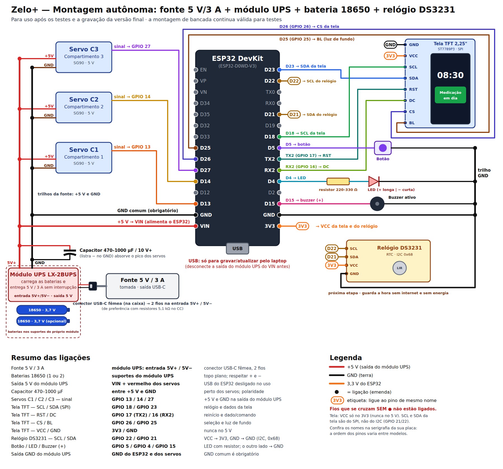

*(versão vetorial: [`docs/ligacoes-autonomo.svg`](docs/ligacoes-autonomo.svg))*

**Como funciona:** o **IP5306** é um módulo de *power bank* que faz três coisas numa
placa só.

| Situação | O que o IP5306 faz |
|---|---|
| **Com energia da rua** | Passa os 5 V da fonte para o dispenser e, ao mesmo tempo, **carrega a bateria** |
| **Falta energia** | Passa a usar a bateria e **eleva de 3,7 V para 5 V** — o dispenser continua ligado |
| **Energia volta** | Volta a usar a fonte e recarrega a bateria |

- A bateria 18650 fica entre 3,0 V (vazia) e 4,2 V (cheia). **Quem entrega os 5 V** ao
  ESP32 e aos servos é o próprio IP5306 — por isso a tensão da saída não varia com a
  carga da bateria.
- Use **uma bateria só**, ligada direto em **B+ / B−** do módulo. O IP5306 é feito para
  **uma célula**: nunca ligue baterias em série (a tensão somaria 6–8,4 V e queimaria o
  módulo).
- A fonte de **3 A** tem folga: o IP5306 carrega a bateria com até ~2 A e o dispenser
  consome no pico ~0,6 A.

**O cabo USB-C "com fios" (atenção):** fontes USB-C só liberam os 5 V quando o aparelho
ligado a elas se identifica, por meio de um **resistor de 5,1 kΩ no pino CC**. Por isso,
o cabo que tem **ponta USB-C de um lado e fios soldados no IP5306 do outro** precisa ser
um cabo **com esse resistor embutido** (vendido como "cabo USB-C macho com resistor
5.1k" ou "pigtail USB-C 5V"). Um cabo sem o resistor deixa a fonte **sem entregar
energia nenhuma** — o dispenser simplesmente não liga.

## D4. Lista de compras

> 🛒 Esta é a lista **só da parte de energia**. A lista **completa do dispenser**, com
> ilustrações e preços estimados, está na [Parte E](#parte-e--lista-completa-de-componentes-com-preços).

| # | Item | Qtd | Especificação / observação |
|---|---|---|---|
| 1 | **Fonte de tomada 5 V / 3 A** | 1 | Saída **USB-C**, 5 V, 3 A (15 W). Preferir marca conhecida, com certificação Inmetro. |
| 2 | **Módulo IP5306** | 1 | "Módulo carregador power bank IP5306 5V 2.1A 18650", com **pads de solda** de entrada (5V/GND), de bateria (B+/B−) e de saída (OUT). |
| 3 | **Bateria 18650** | 1 | Li-ion 3,7 V, **2.500–3.000 mAh reais** (Samsung, LG, Sony/Murata, Panasonic). Desconfiar de "9.800 mAh". *Você já tem.* |
| 4 | **Suporte (case) para 1× 18650** | 1 | Com fios vermelho/preto. Evita soldar direto na bateria. |
| 5 | **Cabo USB-C macho com fios (pigtail)** | 1 | Ponta **USB-C** de um lado, **2 fios** (vermelho/preto) do outro, **com resistor 5,1 kΩ no CC**. Os fios são **soldados** nos pads de entrada do IP5306. |
| 6 | **Capacitor eletrolítico 1000 µF / 16 V** | 1 | Entre +5 V e GND, perto dos servos. Tem polaridade (faixa "−" no GND). |
| 7 | **Fio 22 AWG** vermelho e preto | ~1 m cada | Saída do IP5306 → VIN do ESP32 e servos. |
| 8 | **Placa perfurada** ou barramento de bornes | 1 | Para fazer os "trilhos" de +5 V e GND com solda (mais firme que protoboard para uso contínuo). |
| 9 | **Termo-retrátil** sortido | 1 kit | Isolar as emendas soldadas. |
| 10 | **Multímetro** | 1 | Conferir polaridade e os 5 V da saída **antes** de ligar o ESP32. |
| 11 | Ferro de solda + estanho | — | Para os pads do IP5306 e as emendas. |
| 12 | *Módulo relógio DS3231 + bateria LIR2032* (sugerido) | 1 | Ver [D9](#d9-sugestão-módulo-de-relógio-ds3231): mantém a hora certa sem internet. |

> 💡 Módulos IP5306 costumam vir também com uma **saída USB-A**. Ela entrega os mesmos
> 5 V, mas para o dispenser use os **pads de saída soldados**: a ligação fica firme e não
> depende de um conector que pode se soltar.

## D5. Montagem passo a passo

> ⚡ Monte **sem a bateria e sem a fonte ligadas**. Só energize nas etapas indicadas.

1. **Cabo de entrada:** solde os fios do cabo USB-C nos pads de **entrada** do IP5306:
   **vermelho → 5V (IN+)** e **preto → GND (IN−)**. Isole com termo-retrátil.
2. **Bateria:** solde os fios do suporte da 18650 nos pads **B+** (vermelho) e **B−**
   (preto). Confira a polaridade com o multímetro antes de encaixar a bateria.
3. **Saída:** solde um fio vermelho em **OUT+ (5V)** e um preto em **OUT− (GND)** e leve
   até a placa perfurada, formando os **trilhos de +5 V e GND**.
4. **Teste sem o ESP32:** encaixe a bateria e ligue a fonte na tomada. Com o multímetro,
   meça os trilhos: devem marcar **entre 4,9 V e 5,2 V**. Desligue tudo.
5. **Capacitor:** solde o capacitor de 1000 µF entre os trilhos, **perto dos servos**
   (faixa "−" no GND).
6. **Servos:** fio **vermelho** de cada servo no trilho de +5 V, **marrom** no GND. Os
   fios de sinal continuam nos GPIO 13, 14 e 27.
7. **ESP32:** trilho de +5 V → pino **VIN**; trilho de GND → pino **GND** do ESP32.
   **Não ligue o cabo USB do ESP32** — a energia entra só pelo VIN.
8. **Resto da montagem** (LCD, botão, LED, buzzer): igual à bancada.
9. **Ligar:** fonte na tomada. O LCD deve mostrar "Iniciando...", depois o IP, depois o
   relógio.

## D6. Teste de falta de energia

Com o dispenser funcionando (relógio no LCD):

1. **Tire a fonte da tomada.** O dispenser deve **continuar ligado**, agora pela bateria.
2. Observe o LCD:
   - Se o relógio **continua normal**, a troca foi perfeita. ✅
   - Se aparecer **"Iniciando..."**, o ESP32 reiniciou no instante da troca. Nada se
     perde (cadastro, horários e histórico ficam salvos) e ele volta sozinho em poucos
     segundos. Para evitar, confira se o capacitor está perto dos servos e firme.
3. **Recoloque a fonte.** O dispenser segue ligado e a bateria volta a carregar (os LEDs
   do módulo indicam a carga).
4. Faça um **alarme de teste** com o dispenser na bateria (servo abrindo e fechando),
   para confirmar que a bateria aguenta o pico dos servos.

**Outros cuidados com o IP5306:**

- No modo bateria, ele **se desliga sozinho se o consumo ficar abaixo de ~50 mA**. O
  dispenser com Wi-Fi consome mais que isso, então não deve acontecer — mas se a bateria
  **zerar**, algumas placas só religam a saída ao **apertar o botãozinho** do módulo ou
  quando a energia da rua volta.
- Carregando e alimentando ao mesmo tempo, o módulo **esquenta um pouco**: deixe-o com
  ventilação e sem encostar na bateria.

## D7. Autonomia da bateria

Conta para **uma 18650 real de 2.500–3.000 mAh**:

| Etapa | Valor |
|---|---|
| Energia da bateria | 2.500 mAh × 3,7 V ≈ **9,3 Wh** |
| Perda na elevação para 5 V (~85%) | sobram ≈ **7,9 Wh** |
| Consumo médio do dispenser (ESP32 com Wi-Fi, LCD, servos parados) | ≈ **0,75 a 1 W** |
| **Autonomia sem energia da rua** | **≈ 8 a 10 horas** |

Os servos se mexem só alguns segundos por dia e quase não pesam na conta. Para saber
o número real da sua bateria: carregue até o fim, tire da tomada e anote quanto tempo o
dispenser fica ligado.

## D8. Falta de energia e de internet

| Situação | O que acontece |
|---|---|
| **Falta energia (até ~8–10 h)** | O dispenser **continua funcionando pela bateria**. Os alarmes tocam; o Telegram depende de a internet (roteador) também estar ligada. |
| **Falta energia por mais tempo** (bateria acaba) | O dispenser desliga. Cadastro, horários e histórico **ficam salvos**; horários que passarem desligado **não tocam** depois. |
| **Energia volta, com internet** | Liga sozinho, conecta no Wi-Fi, acerta a hora e volta ao normal; a bateria recarrega. |
| **Energia volta, sem internet** | ⚠️ **Sem hora certa, os alarmes não tocam** até a internet voltar (resolvido com o DS3231, abaixo). |
| **Internet cai, energia ok** | O relógio interno continua contando: **os alarmes tocam normalmente**. Só as mensagens do Telegram não saem. |

## D9. Sugestão: módulo de relógio DS3231

> 💡 **Recomendação para a próxima versão:** incluir um **módulo de relógio de tempo
> real (RTC) DS3231**, para que o dispenser **saiba a hora mesmo sem internet**, inclusive
> depois de a bateria acabar e a energia voltar.

**O que é:** uma plaquinha com um relógio de alta precisão e uma **bateria tipo moeda**.
Ela continua contando o tempo por anos, mesmo com o dispenser desligado.

| Característica | Valor |
|---|---|
| Precisão | ±2 ppm (cerca de 1 minuto por ano) |
| Comunicação | I2C, endereço `0x68` (não conflita com o LCD, que usa `0x27`) |
| Alimentação | 3,3 V (pino 3V3 do ESP32) |
| Bateria | LIR2032 (recarregável) — ver aviso abaixo |
| Preço aproximado | R$ 15 a R$ 30 |

**Ligação:** no **mesmo barramento I2C do LCD**, em paralelo (caixa tracejada no
diagrama da seção D3).

| DS3231 | ESP32 |
|---|---|
| VCC | 3V3 |
| GND | GND |
| SDA | GPIO 21 (junto com o SDA do LCD) |
| SCL | GPIO 22 (junto com o SCL do LCD) |

> ⚠️ Muitos módulos DS3231 vêm com um circuito que tenta **recarregar** a bateria. Com
> uma **CR2032 comum (não recarregável)**, isso pode estragar a bateria. Use uma
> **LIR2032** (recarregável) ou peça para alguém retirar o resistor/diodo de carga do
> módulo.

**Como o firmware usaria o módulo** (proposta; **ainda não está no código atual**):

1. **Ao ligar:** lê a hora do DS3231 e acerta o relógio do ESP32 na hora, sem esperar
   a internet. Os alarmes passam a funcionar imediatamente.
2. **Quando a internet estiver disponível:** busca a hora exata (NTP) e **corrige** o
   DS3231, para ele nunca se afastar da hora certa.
3. **Sem internet:** segue pelo DS3231. Os alarmes funcionam normalmente; só o Telegram
   espera a internet voltar.

Esboço, com a biblioteca `RTClib` (Adafruit):

```c++
#include <RTClib.h>
RTC_DS3231 rtc;

// no setup(), antes de conectar o Wi-Fi:
if (rtc.begin() && !rtc.lostPower()) {
  struct timeval agora = { (time_t)rtc.now().unixtime(), 0 };
  settimeofday(&agora, nullptr);          // relógio certo já ao ligar
}

// depois que o NTP acertar a hora (com internet):
rtc.adjust(DateTime((uint32_t)time(nullptr)));   // mantém o DS3231 corrigido
```

Com o módulo, a linha "Energia volta, sem internet" da seção D8 passa a ser: **os
alarmes tocam normalmente; só o Telegram espera a internet**.

## D10. Atualizar o programa depois de montado

A montagem autônoma não impede atualizações:

1. **Desconecte a saída do IP5306 do VIN** do ESP32 (solte o fio do VIN ou use um borne
   que se possa abrir). **Nunca ligue o USB e o VIN ao mesmo tempo.**
2. Ligue o **USB do ESP32 no laptop** e grave a versão nova (Build → Upload), como na
   bancada.
3. Tire o USB, **religue o fio do VIN** e o dispenser volta a funcionar pela fonte e pela
   bateria.

---

# Parte E — Lista completa de componentes, com preços

Tudo o que é preciso comprar para montar o Zelo+ na **versão autônoma** (tomada +
bateria, Parte D). As ilustrações são desenhos simplificados para ajudar a reconhecer
cada peça na loja. A última coluna fica **em branco** para você anotar o preço que
encontrar na hora da compra.

> 💰 **Sobre os preços:** valores pesquisados em lojas brasileiras de eletrônica em
> **setembro de 2026** (fontes no fim desta parte); bateria e suporte com os preços
> levantados pelo responsável do projeto no Mercado Livre. Itens marcados com **\*** não tiveram
> o preço exibido em loja nacional na pesquisa: o valor é uma **estimativa** a partir de
> preços internacionais convertidos. Preços mudam com frequência e **não incluem frete**.
> Ferramentas **não** entram na conta (ver [E5](#e5-ferramentas-necessárias-fora-do-custo)).

## E1. Eletrônica do dispenser

| Componente e códigos | Ilustração | Função | Preço pesquisado | Preço encontrado (anotar) |
|---|:---:|---|---|---|
| **Placa ESP32 DevKit V1 — 30 pinos** · 1 un.<br>ESP32-WROOM-32 · chip ESP32-D0WD-V3 · USB CP2102 |  | O "cérebro": roda o programa, cria a página web, conecta no Wi-Fi e manda os avisos. | R$ 54,90 | R$ \_\_\_\_\_\_\_\_\_ |
| **Micro servo SG90 9 g** · 3 un.<br>TowerPro SG90 · 180° · 1,6 kgf·cm · 4,8–6 V |  | Abre e fecha a porta de cada compartimento (um servo por compartimento). | R$ 13,33–16,90 cada<br>**R$ 40–51** (3 un.) | R$ \_\_\_\_\_\_\_\_\_ |
| **Display LCD 16x2 com módulo I2C** · 1 un.<br>HD44780 + PCF8574 · endereço 0x27 · fundo azul | 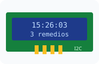 | Mostra o relógio, o nome do remédio e os avisos (abrindo, fechando, dose pendente). | R$ 24,90 | R$ \_\_\_\_\_\_\_\_\_ |
| **Buzzer ativo 5 V** · 1 un.<br>12 mm · "auto-oscilante" · 3,5–5 V |  | Apita no horário do remédio (alarme sonoro). | R$ 2,50 | R$ \_\_\_\_\_\_\_\_\_ |
| **LED difuso 5 mm vermelho** · 1 un. | 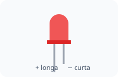 | Pisca junto com o buzzer (alarme visual). | R$ 0,15 | R$ \_\_\_\_\_\_\_\_\_ |
| **Resistor 220 Ω, ¼ W** · pacote com 10<br>faixas: vermelho-vermelho-marrom-dourado | 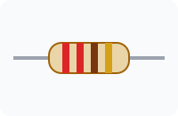 | Limita a corrente do LED para ele não queimar (usa 1; sobram reservas). | R$ 0,90 (10 un.) | R$ \_\_\_\_\_\_\_\_\_ |
| **Chave táctil (push button) 12×12 mm com capa** · kit com 10 |  | O botão que o paciente aperta para abrir e fechar os compartimentos (usa 1). | R$ 10,20 (10 un.) | R$ \_\_\_\_\_\_\_\_\_ |

## E2. Energia autônoma

| Componente e códigos | Ilustração | Função | Preço pesquisado | Preço encontrado (anotar) |
|---|:---:|---|---|---|
| **Fonte de tomada 5 V / 3 A, saída USB-C** · 1 un.<br>bivolt · 15 W · com certificação Inmetro | 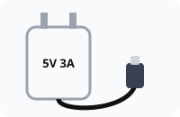 | Energia da rua para o dispenser e para carregar a bateria. | R$ 35,98–50 | R$ \_\_\_\_\_\_\_\_\_ |
| **Módulo IP5306 5 V 2,1 A (power bank)** · 1 un.<br>IP5306 · entrada USB-C · pads IN, B+/B−, OUT | 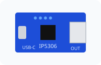 | Carrega a bateria e entrega 5 V estáveis, com ou sem energia da rua. | R$ 15–25 \* | R$ \_\_\_\_\_\_\_\_\_ |
| **Bateria Li-ion 18650** · 1 un.<br>Onistek ON-18650 · 3,7 V · rótulo 3.800 mAh (real provável 1.500–2.500 mAh) | 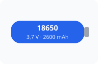 | Mantém o dispenser ligado se faltar energia (~4–10 h, conforme a capacidade real). *(Você já tem.)* | R$ 17,15 | R$ \_\_\_\_\_\_\_\_\_ |
| **Suporte para 1 bateria 18650** · 1 un.<br>com fios vermelho/preto |  | Segura a bateria e evita soldar direto nela. | R$ 9,17 | R$ \_\_\_\_\_\_\_\_\_ |
| **Cabo USB-C macho com fios (pigtail)** · 1 un.<br>2 fios **com resistor 5,1 kΩ** interno, ou 6 fios (CC1/CC2 expostos) · 20–22 AWG | 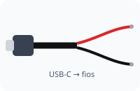 | Leva a energia da fonte até o IP5306; a ponta de fios é **soldada** na entrada do módulo. | R$ 20–30 \* | R$ \_\_\_\_\_\_\_\_\_ |
| **Resistor 5,1 kΩ, ¼ W** · pacote com 10 *(só se o cabo for de 6 fios)*<br>faixas: verde-marrom-vermelho-dourado | 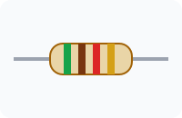 | Um em cada pino CC (CC1 e CC2) até o GND: faz a fonte USB-C liberar os 5 V. | R$ 0,60 (10 un.) | R$ \_\_\_\_\_\_\_\_\_ |
| **Capacitor eletrolítico 1000 µF / 16 V** · 1 un.<br>105 °C · tem polaridade (faixa "−") | 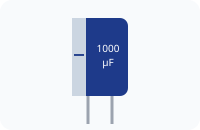 | Absorve o pico de corrente dos servos e evita que o ESP32 reinicie. | R$ 0,73–3 | R$ \_\_\_\_\_\_\_\_\_ |

## E3. Montagem e ligações

| Componente e códigos | Ilustração | Função | Preço pesquisado | Preço encontrado (anotar) |
|---|:---:|---|---|---|
| **Placa perfurada ilhada 7×9 cm** · 1 un.<br>fenolite ou fibra de vidro | 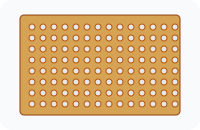 | Base firme, soldada, para os trilhos de +5 V e GND (mais durável que protoboard). | R$ 3,90–12,50 | R$ \_\_\_\_\_\_\_\_\_ |
| **Jumpers macho/fêmea 20 cm** · 1 kit (40 un.) |  | Ligações entre o ESP32, o LCD, os servos e a placa. | R$ 8,90 | R$ \_\_\_\_\_\_\_\_\_ |
| **Fio flexível 22 AWG** · vermelho e preto, ~2 m de cada |  | Ligações de energia: saída do IP5306 → VIN e servos. | R$ 1,20–3 por metro<br>**R$ 5–12** (4 m) | R$ \_\_\_\_\_\_\_\_\_ |
| **Tubo termo-retrátil** · 1 kit sortido |  | Isola as emendas soldadas (evita curto-circuito). | R$ 16,88–43 | R$ \_\_\_\_\_\_\_\_\_ |
| **Cabo USB-A → micro-USB (dados)** · 1 un. | 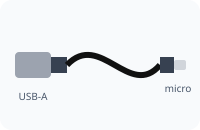 | Gravar e atualizar o programa pelo laptop. | a partir de R$ 11,69 | R$ \_\_\_\_\_\_\_\_\_ |

## E4. Relógio sem internet (sugerido)

| Componente e códigos | Ilustração | Função | Preço pesquisado | Preço encontrado (anotar) |
|---|:---:|---|---|---|
| **Módulo RTC DS3231** · 1 un.<br>DS3231 + EEPROM AT24C32 · I2C 0x68 · 3,3–5 V | 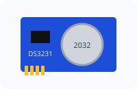 | Guarda a hora certa mesmo sem internet e sem energia (ver D9). | R$ 26–30,91 | R$ \_\_\_\_\_\_\_\_\_ |
| **Bateria LIR2032 (recarregável)** · 1 un.<br>3,6 V · tipo moeda |  | Alimenta o relógio do DS3231 quando o dispenser está desligado. | R$ 11,90–28,50 | R$ \_\_\_\_\_\_\_\_\_ |

## E5. Ferramentas necessárias (fora do custo)

As ferramentas **não entram na soma** do projeto: são de uso geral e costumam ser
emprestadas ou já existir em casa ou no laboratório da escola. Mesmo assim, são
**necessárias** para a montagem autônoma, que tem soldas em peças pequenas.

| Ferramenta | Ilustração | Para quê | Modelo recomendado e ajustes |
|---|:---:|---|---|
| **Ferro de solda com ajuste de temperatura** |  | Soldar os fios nos pads do IP5306, no cabo USB-C e na placa perfurada. | **Estação ou ferro com controle de temperatura**, 50–60 W, faixa ~200–480 °C (ex.: **Hikari HK-936B** ou **Yaxun 936**).<br>• **Temperatura:** **320–350 °C** para os pads pequenos (IP5306, pinos, resistores); até **370 °C** para os fios 22 AWG e os trilhos da placa.<br>• **Ponta:** cônica fina (0,5–1 mm) ou chanfrada pequena (~1,6 mm).<br>• Evite ferros simples **sem ajuste** (ex.: linhas "60 W" comuns, que passam de 500 °C): o excesso de calor pode **soltar os pads** do IP5306 e danificar a bateria se encostar nela. |
| **Estanho (solda) 60/40 com fluxo, 0,5 mm** |  | Material da solda. | Fio **0,5 mm** (fino, próprio para peças pequenas), liga **60/40** com **fluxo resinoso** (ex.: **Cobix 0,5 mm RA T2**, carretel pequeno de 250 g ou tubinho). |
| **Multímetro digital** | 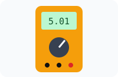 | Conferir os 5 V da saída e a polaridade **antes** de ligar o ESP32. | Modelo básico com **tensão DC** e **teste de continuidade** (bip) (ex.: **Hikari HM-1001** ou **Minipa ET-1002**). |
| **Acessórios de bancada** | — | Preparar fios e corrigir erros. | Suporte com esponja para o ferro (costuma vir com a estação) · **alicate de corte rente** pequeno · **decapador** para fio 22 AWG · **malha dessoldadora** ou sugador · pinça · "terceira mão" com lupa (opcional) · isqueiro ou soprador para o termo-retrátil. |
| **Segurança** | — | — | **Óculos de proteção**, ambiente **ventilado** (fumaça do fluxo) e **lavar as mãos** depois de usar estanho com chumbo. Nunca soldar com a bateria encaixada no suporte. |

## E6. Resumo do investimento

| Grupo | Faixa pesquisada | Total anotado |
|---|---|---|
| E1. Eletrônica do dispenser | R$ 134 – 147 | R$ \_\_\_\_\_\_\_\_\_ |
| E2. Energia autônoma *(com a bateria)* | R$ 98 – 135 | R$ \_\_\_\_\_\_\_\_\_ |
| E3. Montagem e ligações | R$ 46 – 96 | R$ \_\_\_\_\_\_\_\_\_ |
| **Total para montar o dispenser** | **≈ R$ 278 – 378** | **R$ \_\_\_\_\_\_\_\_\_** |
| *Total sem a bateria (que você já tem)* | *≈ R$ 261 – 361* | R$ \_\_\_\_\_\_\_\_\_ |
| E4. Relógio sem internet (sugerido, à parte) | + R$ 38 – 60 | R$ \_\_\_\_\_\_\_\_\_ |

**Não inclui:** ferramentas (E5), frete e a estrutura física do dispenser (caixa, portas e
divisórias dos compartimentos), que depende do material escolhido (MDF, acrílico ou
impressão 3D).

**Dicas de compra:**

- Prefira lojas de eletrônica conhecidas para o **ESP32, a bateria e a fonte**: são as
  peças em que imitações dão mais problema.
- Bateria 18650 com "9.800 mAh" ou "12.000 mAh" no rótulo é **falsa**; uma 18650 real tem
  no máximo cerca de 3.500 mAh.
- Resistores, botões e termo-retrátil saem em pacotes: o preço por unidade cai e sobram
  peças de reserva.
- Comprar tudo numa mesma loja costuma compensar o frete.

**Fontes dos preços e modelos** (pesquisa de setembro de 2026):
[Eletrogate — ESP32 30 pinos](https://www.eletrogate.com/modulo-wifi-esp32-bluetooth-30-pinos) ·
[WJ Componentes — Servo SG90](https://www.wjcomponentes.com.br/micro-servo-sg90-9g/) ·
[Curto Circuito — Servo SG90](https://curtocircuito.com.br/servo-motor-9g-sg90.html) ·
[Eletrogate — módulo I2C / LCD](https://www.eletrogate.com/modulo-serial-i2c-para-display-lcd-para-arduino) ·
[Amazon.com.br — LCD 16x2 I2C](https://www.amazon.com.br/Display-PCF8574-Endere%C3%A7o-Controlador-80x35mm/dp/B0H346LHKM) ·
[Vamuino — buzzer ativo](https://lojinha.vamuino.com.br/produto/buzzer-ativo-5v/) ·
[Eletrogate — LED difuso 5 mm vermelho](https://www.eletrogate.com/led-difuso-5mm-vermelho) ·
[Eletrogate — resistor 220R](https://www.eletrogate.com/resistor-220r-1-4w-10-unidades) ·
[Eletrogate — resistor 5K1](https://www.eletrogate.com/resistor-5k1-1-4w-10-unidades) ·
[MakerHero — chave táctil 12x12](https://www.makerhero.com/produto/capa-para-chave-tactil-push-button-12x12-mm/) ·
[Magazine Luiza — fonte 5 V 3 A USB-C](https://www.magazineluiza.com.br/busca/fonte+5v+3a+usb-c/) ·
[MakerHero — fonte 5 V 3 A USB-C](https://www.makerhero.com/produto/fonte-dc-chaveada-5v-3a-usb-tipo-c/) ·
[Mercado Livre — IP5306](https://www.mercadolivre.com.br/modulo-carga-y-descarga-bateria-18650-ip5306-2a-5v-usb-c/p/MLB2064132227) ·
[eBay — IP5306 (referência internacional)](https://www.ebay.de/itm/134628665112) ·
Mercado Livre — bateria Onistek 18650 e suporte 18650 (preços levantados pelo responsável do projeto) ·
[Amazon.com.br — cabo USB-C pigtail](https://www.amazon.com.br/ELNONE-alimenta%C3%A7%C3%A3o-Pigtail-r%C3%A1pida-pigtail/dp/B0CGVNG7Y4) ·
[eBay — cabo USB-C pigtail (referência internacional)](https://www.ebay.de/itm/226762117675) ·
[Nova Trida — capacitor 1000 µF](https://www.novatridaeletronica.com.br/capacitor-eletrolitico-1000uf-x-16v) ·
[Fermarc — placa perfurada 7x9](https://www.fermarc.com/placa-de-circuito-perfurada-face-simples-7x9) ·
[SmartProjects — placa perfurada 7x9](https://www.smartprojectsbrasil.com.br/placa-fenolite-perfurada-ilhada-fibra-de-vidro-7x9-cm) ·
[Eletrogate — jumpers M/F](https://www.eletrogate.com/jumpers-macho-femea-40-unidades-de-20-cm) ·
[Multcomercial — cabinho 22 AWG](https://www.multcomercial.com.br/fios-e-cabos/cabinho-flexivel/flex-0-32mm-22-awg.html) ·
[Termotubos — kit termo-retrátil](https://loja.termotubos.com.br/kits/termo-retrateis-variados) ·
[Submarino — cabo micro-USB](https://www.submarino.com.br/busca/cabo-micro-usb-1-metro) ·
[Mercado Livre — RTC DS3231](https://www.mercadolivre.com.br/modulo-rtc-real-time-clock-ds3231-arduino-esp8266-esp32-rasp/p/MLB42966007) ·
[Orielec — bateria LIR2032](https://www.lojaorielec.com.br/acessorios/baterias-e-suportes/bateria-de-litio-lir2032) ·
[Ferro de Solda Profissional — modelos com controle de temperatura (HK-936B, Yaxun 936)](https://ferrodesoldaprofissional.com.br/ferro-de-solda/) ·
[Casa da Robótica — Hikari SC-60 (sem ajuste de temperatura)](https://www.casadarobotica.com/prototipagem-e-ferramentas/prototipagem/soldas/ferro-de-solda-hk-plus-hikari-profissional-sc-60w-220v) ·
[Baú da Eletrônica — estanho Cobix 0,5 mm](https://www.baudaeletronica.com.br/produto/rolo-de-solda-estanho-500g-05mm-cobix.html) ·
[Loja do Mecânico — multímetro Hikari HM-1001](https://www.lojadomecanico.com.br/produto/123563/3/47/multimetro-digital-hm-1001-hikari-21n240) ·
[LC Ferragens — multímetros (Minipa ET-1002)](https://www.lcferragens.com.br/produto/multimetro-hikari-digital-hm-1000/)
