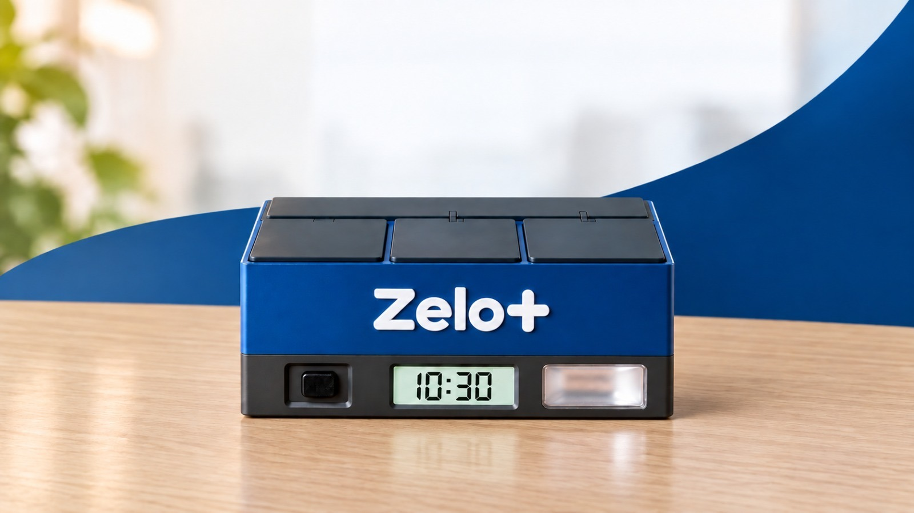

# Zelo+ — Dispenser Inteligente de Medicamentos (firmware ESP32)

Protótipo de hardware/firmware do dispenser automático de medicamentos para idosos (pacientes)
do projeto acadêmico Zelo+. Projeto PlatformIO (framework Arduino, placa `esp32dev`).



*Imagem de referência — conceito visual do produto final (ilustrativo); não é o protótipo atual.*

Versão atual: **3 compartimentos** — até 3 medicamentos diferentes para o mesmo
paciente, cada um fixo no seu compartimento (detalhes em
[`docs/compartimentos.md`](docs/compartimentos.md)).

> 🛒 **Lista completa de componentes, com ilustrações e preços estimados:** Parte F do
> guia do produto.
> 📏 **Gabinete — 210 × 130 × 100 mm:** desenho técnico e imagens do produto na Parte B do
> guia do produto; vistas em escala em [`docs/gabinete.png`](docs/gabinete.png)
> ([SVG](docs/gabinete.svg)).
> 🏭 **Custo de produção em série (estimativa de viabilidade, set/2026):** Parte G do
> guia do produto — impressão 3D × plástico injetado, componentes no atacado e custo por
> unidade em 100, 1.000 e 10.000 unidades.
> 📘 **Guia do produto:** [`GUIA-DO-PRODUTO.md`](GUIA-DO-PRODUTO.md) explica o
> funcionamento passo a passo, com o trecho de código de cada etapa.
> Versão para impressão: [`docs/Zelo-Guia-do-Produto.pdf`](docs/Zelo-Guia-do-Produto.pdf).
> 🔌 **Ligações (bancada/testes):** [`docs/ligacoes.png`](docs/ligacoes.png) ([SVG](docs/ligacoes.svg)).
> 🔋 **Uso autônomo, após testes e atualização** — fonte 5 V/3 A + módulo **IP5306** +
> bateria **18650** (lista de compras, montagem e teste) e relógio **DS3231**
> (opcional): Parte E do guia do produto e
> [`docs/ligacoes-autonomo.png`](docs/ligacoes-autonomo.png) ([SVG](docs/ligacoes-autonomo.svg)).

```
zelo-plus/
├── platformio.ini          # ambiente esp32dev + dependências
├── GUIA-DO-PRODUTO.md      # guia do produto
├── docs/compartimentos.md  # especificação aprovada dos 3 compartimentos
├── docs/ligacoes.png/.svg  # diagrama de todas as ligações (bancada)
├── docs/ligacoes-autonomo.*# montagem autônoma: fonte + IP5306 + 18650 + DS3231
└── src/main.cpp            # firmware completo (máquina de estados + web + captive portal)
```

## Como compilar e gravar

1. Abra a pasta `zelo-plus/` no VSCode com a extensão PlatformIO.
2. Ajuste `upload_port` no `platformio.ini` (no Windows: Gerenciador de Dispositivos →
   "Silicon Labs CP210x USB to UART Bridge"), ou remova a linha para autodetecção.
3. `PlatformIO: Upload` e depois `PlatformIO: Monitor` (115200 baud).

## Fluxo de funcionamento

1. Cuidador acessa a página web servida pelo ESP32 e cadastra o paciente, até **3
   medicamentos** (um por compartimento, até 6 horários cada), cuidador, até 5
   familiares (opcionais) e o bot do Telegram.
2. A página indica onde colocar cada remédio ("Coloque LOSARTANA no compartimento 1").
   Cada compartimento que recebe um medicamento **novo** abre para abastecimento, **um
   de cada vez**; só mudar horários não abre nada.
3. O compartimento fecha pelo botão físico (trava de 7 s contra toque duplo) ou
   sozinho após 3 minutos.
4. No horário: buzzer + LED piscando e, no LCD, nome e compartimento do remédio
   (alternando se houver mais de um).
5. Paciente aperta o botão **uma vez** → alarme para e **todos os compartimentos daquela
   dose abrem**, um servo logo após o outro (nunca dois ao mesmo tempo).
   Se não aparecer, o alarme segue o ciclo de avisos (ver abaixo).
6. Paciente retira os remédios e fecha pelo botão (um toque fecha todos, após a trava
   de 7 s) ou timeout de 3 min.
7. Repete todo dia nos mesmos horários. Um horário que chega com algum compartimento
   aberto espera ele fechar e toca em seguida.
8. **Reposição:** a página pergunta qual medicamento será reposto, confirma e abre
   **só o compartimento dele**.
9. **Esvaziar compartimento:** apaga o cadastro daquele medicamento e, se o cuidador
   quiser, abre o compartimento para retirar as sobras.

## Hardware e pinagem

| Função | GPIO |
|---|---|
| Buzzer (ativo) | 15 |
| LED (+ resistor 220–330 Ω) | 4 |
| Botão (INPUT_PULLUP, outra perna no GND) | 5 |
| Servo compartimento 1 (sinal) | 13 |
| Servo compartimento 2 (sinal) | 14 |
| Servo compartimento 3 (sinal) | 27 |
| LCD I2C 16x2 (PCF8574, `0x27`) — SDA | 21 |
| LCD I2C — SCL | 22 |

- Servos: 0° = fechado, 90° = aberto (ajustáveis por compartimento em
  `ANGULO_FECHADO` / `ANGULO_ABERTO`). **Alimentação externa de 5 V (≥ 2 A)**, com GND
  compartilhado com o ESP32; o firmware nunca move dois servos ao mesmo tempo.
- O GPIO 12 foi evitado: ele interfere na inicialização do ESP32.
- Etiquetas **1, 2 e 3** na caixa, na mesma ordem da página.
- LCD: GND→GND, VCC→3V3, SDA→21, SCL→22.

## Relógio DS3231 (opcional)

Módulo RTC no mesmo I2C do LCD, em paralelo (`0x68`): VCC→3V3, GND→GND, SDA→21,
SCL→22, bateria **LIR2032**. Biblioteca `adafruit/RTClib`.

- **Sem o módulo:** `rtc.begin()` falha ao ligar e tudo segue pela hora da internet
  (NTP), como antes. O módulo pode ser instalado depois, sem regravar o firmware
  (com o dispenser desligado).
- **Ao ligar:** se o módulo tem hora válida (`!lostPower()` e data ≥ 2024), acerta o
  relógio do ESP32 com `settimeofday()` antes do Wi-Fi.
- **Com internet:** a cada sincronização do NTP (callback do SNTP) a hora é gravada no
  módulo pelo `loop()`, sem disputar o I2C com o LCD. O módulo guarda UTC.
- **Sem internet ao ligar:** com rede salva e hora do módulo, entra no modo normal
  (LCD `Sem internet` / `Hora do relogio`), os alarmes funcionam e o Wi-Fi é tentado a
  cada 30 s. Sem o módulo, o comportamento continua o de antes (portal de configuração).
- O rodapé da página mostra "Relógio DS3231: conectado" ou "não instalado".

## Wi-Fi (captive portal)

Não há credenciais fixas no código. Sem rede salva (ou se a conexão falhar), o ESP32
cria a rede aberta **ZeloPlus-Config**; ao conectar, o celular abre a página em
`192.168.4.1`, onde o cuidador escolhe a rede e digita a senha. A rede fica salva em
`Preferences` (namespace `wifi`). O link "Trocar rede Wi-Fi" apaga a rede e reinicia no
modo de configuração.

## Persistência do cadastro

Tudo fica em `Preferences` (namespace `cadastro`) e é recarregado no `setup()`:

- `nome` — paciente;
- `m0_*`, `m1_*`, `m2_*` — medicamento de cada compartimento (`_nome`, `_tot`,
  `_hr`, `_mn`), ou seja, a ligação medicamento ↔ compartimento;
- `cuid_*` / `fam0_*` … `fam4_*` — contatos; `tg_token` — bot do Telegram.

O cadastro da versão de um compartimento (`remedio`, `total`, `horas`, `minutos`)
migra sozinho para o compartimento 1 na primeira vez que esta versão liga.

## Ciclo do alarme e avisos pelo Telegram

| Tempo desde o horário | O que acontece |
|---|---|
| 0–1 min, 2–3, 4–5, 6–7, 8–9, 10–11 | Buzzer + LED tocando |
| 1–2 min, 3–4, 5–6, 7–8, 9–10, 11–12 | Silêncio (o botão continua funcionando) |
| 6 min sem acesso | Telegram para o **cuidador**: Zelo+: Paciente “Nome” não acessou o medicamento das “HH:MM” horas (Losartana). |
| 12 min sem acesso | Alarme para; Telegram para **cuidador e familiares**: Zelo+: Paciente “Nome” não foi até o dispenser no horário das “HH:MM” (Losartana e Metformina). |
| Depois dos 12 min | LCD mostra "Dose pendente!"; o botão ainda abre os compartimentos da dose |
| Paciente acessa após um aviso | Quem foi avisado recebe "paciente acessou o dispenser às HH:MM" |

### Por que Telegram

Comparação das opções para o ESP32 enviar avisos:

- **Bot do Telegram (escolhido)** — gratuito, API oficial, sem limite de vagas,
  uma requisição HTTPS direto do ESP32. Cada pessoa só precisa abrir o bot e tocar
  em "Iniciar".
- **CallMeBot (WhatsApp)** — foi a primeira escolha, mas o serviço ficou lotado
  (sem vagas para novos números) e o plano gratuito é só para uso pessoal.
- **Twilio WhatsApp** — oficial e confiável, mas pago, exige número aprovado e
  modelos de mensagem aprovados pela Meta.
- **WhatsApp Cloud API (Meta)** — oficial, exige conta Business verificada,
  modelos aprovados e token que expira; complexo para rodar só no ESP32.

Para um produto real com WhatsApp, o caminho recomendado é o ESP32 avisar um
backend, e o backend enviar pela API oficial (Twilio ou Meta).

### Como configurar

1. **Uma vez só (cuidador):** no Telegram, abrir o **@BotFather**, enviar `/newbot`,
   escolher um nome e um usuário terminado em `bot` (ex.: `zelo_maria_bot`).
   Copiar o **token** e colar no campo "Token do bot" da página de cadastro.
2. **Cada pessoa** (cuidador e familiares) procura o bot no Telegram e toca em
   **Iniciar**.
3. Na página, tocar em **Buscar IDs do Telegram**: aparecem o nome e o ID de quem
   iniciou o bot nas últimas 24 horas. Copiar cada ID para o campo da pessoa e salvar.
4. Usar **Enviar mensagem de teste no Telegram** para conferir.

O token fica salvo na placa (Preferences, chave `tg_token`) e não é mostrado de
volta na página; deixar o campo em branco ao salvar mantém o token atual. A conexão
HTTPS não valida o certificado (`setInsecure`), o que é aceitável no protótipo, mas
deve ser revisto num produto.

## Histórico de doses

Cada vez que um alarme dispara, o Zelo+ cria **um registro por medicamento** com data,
horário, medicamento, compartimento e situação, guardado na placa (`Preferences`,
namespace `historico`, últimas 60 doses):

| Situação | Quando |
|---|---|
| Tomada no horário | Paciente apertou o botão antes do primeiro aviso (6 min; 30 s no modo teste) |
| Tomada com atraso | Apertou depois do primeiro aviso, inclusive depois do alerta final (o tempo de atraso é registrado) |
| Sem acesso | Alerta final enviado e ninguém apertou o botão |
| Tocando agora | Alarme em andamento |

Na página aparecem o **resumo dos últimos 7 dias** (percentual de adesão geral e por
medicamento, e contagem por situação), as **20 doses mais recentes** e o link **Baixar histórico completo
(planilha CSV)**, que abre no Excel/Google Planilhas (separador `;`, colunas
data, horário, medicamento, compartimento, situação e atraso). O botão
"Apagar histórico" limpa todos os registros.

Adesão = (doses tomadas no horário + com atraso) ÷ doses concluídas no período.

## Máquina de estados (`loop()`)

Os horários são conferidos a cada segundo em qualquer estado; se o dispenser estiver
ocupado, ficam em espera (`mascaraEmEspera`) e tocam quando ele voltar a `AGUARDANDO`.

- `AGUARDANDO` — relógio no LCD; inicia alarmes em espera e, depois, o abastecimento
  de compartimentos novos (`filaAbastecimento`, um de cada vez).
- `TOCANDO` — ciclo 1 min tocando / 1 min silêncio por até 12 min, com avisos aos 6 e 12 min.
- `PORTA_ABERTA_ESTADO` — compartimentos da dose abertos; botão (após 7 s) ou timeout
  de 3 min fecha todos.
- `ABASTECENDO` — um compartimento aberto para o cuidador (abastecer, repor ou esvaziar).

`modoConfig` separa o modo de configuração de Wi-Fi do modo normal.

## Limitações conhecidas

1. Um paciente e até 3 medicamentos (`NUM_COMPARTIMENTOS`).
2. Máximo de 6 horários por medicamento (`MAX_HORARIOS`).
3. O captive portal pode não abrir sozinho em alguns celulares (abrir o navegador
   manualmente funciona).
4. Sem HTTPS/autenticação: qualquer pessoa na mesma rede pode alterar o cadastro.
5. Envio de mensagens trava o dispenser por alguns segundos (até ~10 s por
   contato se a internet estiver lenta).
6. Se a placa reiniciar dentro do minuto de um alarme que já tocou, ele pode tocar de
   novo (o controle "já disparado" fica só em RAM).

## Decisões de projeto

- Página web no próprio ESP32, para o cuidador não mexer no firmware.
- Trava de 7 s no botão contra fechamento acidental por toque duplo.
- Abertura automática só quando um compartimento recebe medicamento novo.
- Cada medicamento fica fixo no seu compartimento; reposição escolhe o medicamento
  e abre só o compartimento dele, com confirmação.
- Dose com mais de um remédio: um único toque abre todos, servos em sequência.
- Wi-Fi configurável por portal, para replicar o dispositivo em outros locais.

## Próximos passos sugeridos

- Autenticação simples na página web.
- Integração com backend/app do cuidador para monitoramento remoto.
- Testar o captive portal em mais modelos de celular.
- Validar fiação/protoboard para uso contínuo (certificação, testes com ILPIs).
